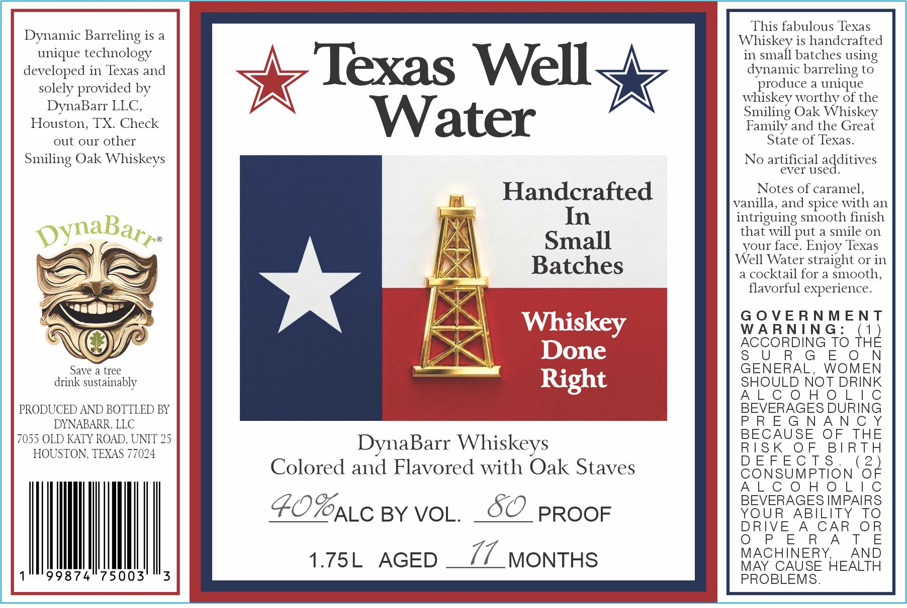

# TTB COLA Label Images - TTBID 26146001000564

**Brand Name:** TEXAS WELL WATER

**Issue Date:** 06/12/2026

**Origin Code:** 43

**Product Class/Type:** 140

**Source:** [TTB Public COLA Registry](https://ttbonline.gov/colasonline/viewColaDetails.do?action=publicFormDisplay&ttbid=26146001000564)

## Label Images

### Label 1

## Extracted Label Text

*Text extracted via OCR - may contain errors*

### Label 1

=

This fabulous Texas

Dynamic Barreling is a

f\

Whiskey is handcrafted

unique technology

in small batches using

developed in Texas and

dynamic barreling to

Texas Well

produce a uniqu e

solely provided by

whiskey worthy of the

DynaBarr LLC,

\

*

Houston, TX. Check

Smiling Oak Whiskey

Water

Family and the Great

out our other

State of Texas.

Smiling Oak Whiskeys

No artificial additives

Handcrafted

Notes of caramel,

{od

vanilla, and spice with an

W

In

intriguing smooth finish

that will put a smile on

Small

your face. Enjoy Texas

SV,

Well Water straight or in

CS

N

Batches

a cocktail for a smooth,

=)

i

Zy

AY

flavorful experience.

»&

a |

=|,

leg

GOVERNMENT

WARNING:

1

ACCORDING TO TH

é

l

>

=

G

N

Save a tree

GENERAL, WOMEN

drink sustainably

\

t

SHOULD NOT DRIN

Pear

ALCOHOLIC

PRODUCED AND BOTTLED BY

BEVERAGES DURING

DYNABARR, LLC

PREGNANCY

7055 OLD KATY ROAD, UNIT 25

BECAUSE OF THE

DynaBarr Whiskeys

RIS

OF

BIRTH

HOUSTON, TEXAS 77024

DEFECT S$.

2

Colored and Flavored with Oak Staves

CONSUMPTION O

ALCOHOLIC

BEVERAGES IMPAIRS

YOUR _ ABILITY TO

FOC BY VOL. SO PROOF

DRIVE A CAR_OR

OPERATE

MACHINERY, _ AND

|

1.75L AGED _// MONTHS

1°" 99874 75003

MAY CAUSE HEALTH

PROBLEMS.
