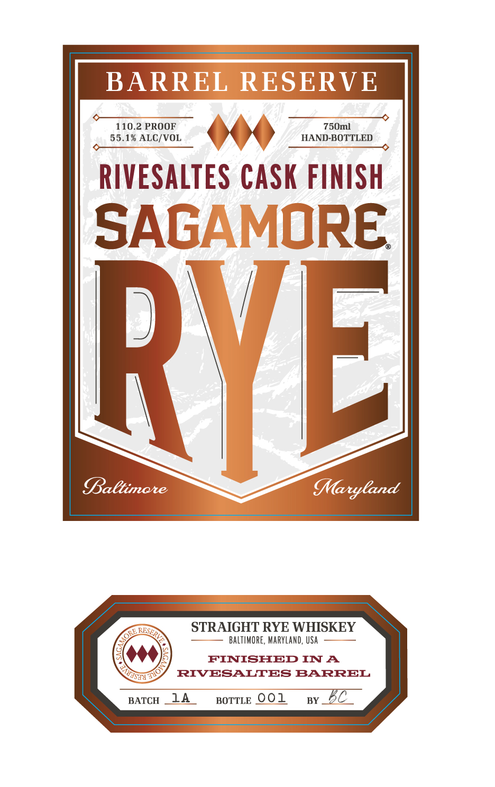
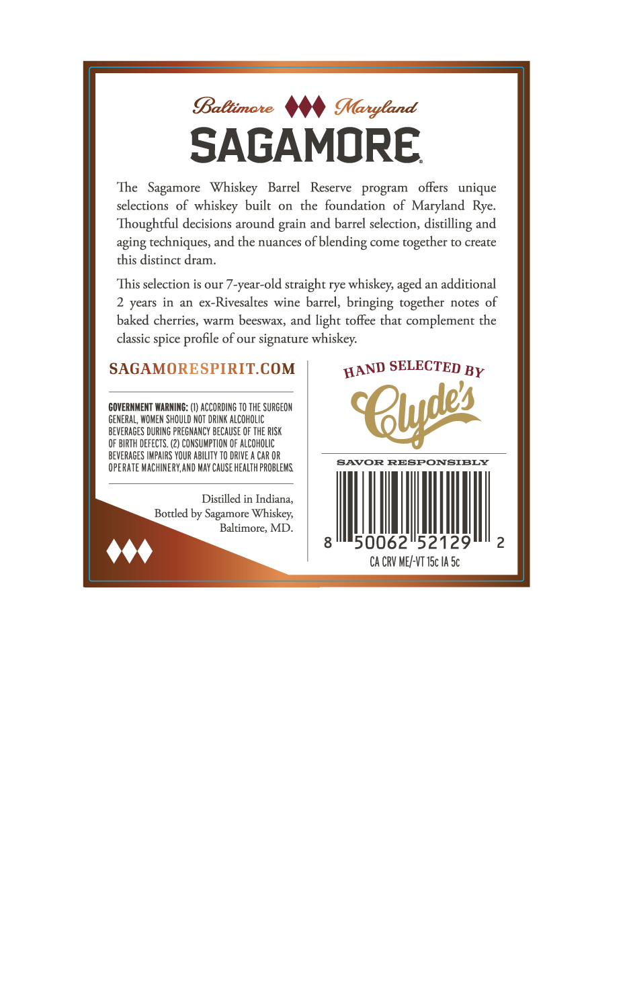

# TTB COLA Label Images - TTBID 26146001000569

**Brand Name:** SAGAMORE

**Fanciful Name:** BARREL RESERVE RIVESALTES CASK FINISH

**Issue Date:** 05/29/2026

**Origin Code:** 25

**Product Class/Type:** 102

**Source:** [TTB Public COLA Registry](https://ttbonline.gov/colasonline/viewColaDetails.do?action=publicFormDisplay&ttbid=26146001000569)

## Label Images

### Label 1

### Label 2

## Extracted Label Text

*Text extracted via OCR - may contain errors*

**Detected Proof:** 110.2
**Detected Age:** 2 Years

### Label 1

BARREL RESERVE
110.2 PROOF
750ml
55.1% ALC/VOL
HAND-BOTTLED
RIVESALTES CASK FINISH
SAGAMORE
RVEL
Baltimare
MMaryCand
STRAIGHT RYE WHISKEY
BALTIMORE, MARYLaNd, USA
FINISHED IN A
RIVESALTES BARREL
BATCH
14
BOTTLE 001
BY
RSPRVE
ORE ,
T4ol
Rnst

### Label 2

BaBtimate
MMaryland
SAGAMORE
The   Sagamore
Whiskey
Barrel
Reserve
program
offers
unique
selections of whiskey  built
on
the foundation
of Maryland  Rye.
Thoughtful decisions around
and barrel selection,
and
aging rechniques, and the nuances of blending come together to create
this distinct dram:
This selection is our 7-year-old straight rye whiskeys
an additional
2 years in
an
ex-Rivesaltes wine barrel, bringing
together
notes of
baked cherries,
warm
beeswax, and light toffee that complement the
classic spice
of our signature whiskey:
SAGAMORESPIRIT.COM
SELECTED BY
GOVERNMENT WARNING: (I) ACCORDING TO THE SURGEON
GENERAL, WOMEN SHOULD NOT DRINK AlCOhOLIc
SQudea
BEVERAGES DURING PREGMANCY BECAUSE OF THE RISK
OF BIRTH DEFECTS
CONSUMPTION OF ALCOhOLIC
BEVERAGES IMPAIRS YOUR AbILlITY TO DRIVE
CAR OR
OPERATE MACHINERY,AND May CAUSE health PROBLEMS
SAVOR RESPONSIBLY
Distilled in Indiana,
Bottled by Sagamore Whiskey
Baltimore, MD
50062"52129
Ca CRV MEY-VT I5c IA Sc
distilling
grain
aged
profile
HAND
