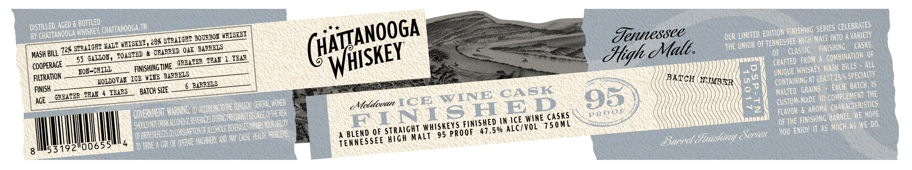
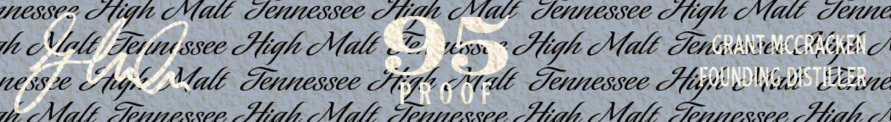

# TTB COLA Label Images - TTBID 26146001000694

**Brand Name:** CHATTANOOGA WHISKEY

**Fanciful Name:** MOLDOVAN ICE WINE CASK FINISHED

**Issue Date:** 05/29/2026

**Origin Code:** 43

**Product Class/Type:** 120

**Source:** [TTB Public COLA Registry](https://ttbonline.gov/colasonline/viewColaDetails.do?action=publicFormDisplay&ttbid=26146001000694)

## Label Images

### Label 1

### Label 2

## Extracted Label Text

*Text extracted via OCR - may contain errors*

**Detected Proof:** 95

### Label 1

DISTILLED:AGED E BOISRED CHattanooga TW
FUNUSHING
CELEBRATES
BY
WhISKEY;,
STRAICHT
WEISKEY
Jennessee
OUR LIMITED EDITHON
HiGH MaLT INTO A VARIETY
@+ SPAICU WntuIsIo) , OEAa2) Qar DAmRnls
(Malt
THE Unok oF TEOFESSCLASSGh MASang
MASH BILL
55 GALLOV, EOASEBD &
THAY 1 YBAR
Jtigh =
OF
FROM A
COMBINATION OF
COOPERAGE
FINISHING TIME
GREATER
CRAFTED
MASH
AlL
FILTRATION
FON-C
WIME_BARRBLS
BATCH
Ul
UMque WWGSKEY
259
 SPECIALTY
6
NJMBER
05
CONTAINING
EACH ; Batch  IS
FINISH
TEAN
BATCH SIZE
CASK
Malted   GRAINS
THE
AGE
GREATER
SURGEON GENERAL WONEN.
coldovan ICE
WINE
95
7
2
au5t04 # RRono COMpLaGeHs Te
GOVERHMENT WRHNG w
SDURNg PregHhcybe_ke OFHhEREK
Maorn[€T Pskgtouxurmhxxn#
ICE WINE_CASKS
OEVAE FIsrong ChnreLSThE Hope
SHUD Nororhr mlcohoucbnverUcESD
SMpars VOUR ABLI^
WHISKEYS FUNISHEB%M
150 ML
OF
IT as Much As WE Do.
OF [
FBrhobeos @ cusuptonorhcovoucp
(NUSE Heah PROBLeVS
A BLEND QF
MALT
95 PRooF " 47.5%
Series
YoU ENOY
Iloo655'
4
T0 DRNE
Gar OR OPERNE HHOHER D H
TENNESSEE
Barret Ginishing
8
53192"
(HATANOOGA
SERIES
'chaTtanOOGA
BOURBON
CaSKS:
WHISKEY
BILLS
'CHILL
LeaST
ICE
MOLDOVAN
BARRELS
YEARS
ACCORDINGTOTHE '
PROOF
THE
'BEVERAGES H
ALC/VOL
StRAight
hiGh

### Label 2

WSEC? Siti CCU SUUC8SCE Stila I ltl! TUHU0CSSCC Slifle Mall Seite

PACA

WZ

te Niele Ter ssee Hight Mile ©, tx. High Mall Tense:

Nhat SHS

MCSSIC Cf

), AAI SE en So I OT I ee Ef IEE I fF occ Io

all Fauessee Aig Sut Feniessee Hes lapis Mend’ $222.0
