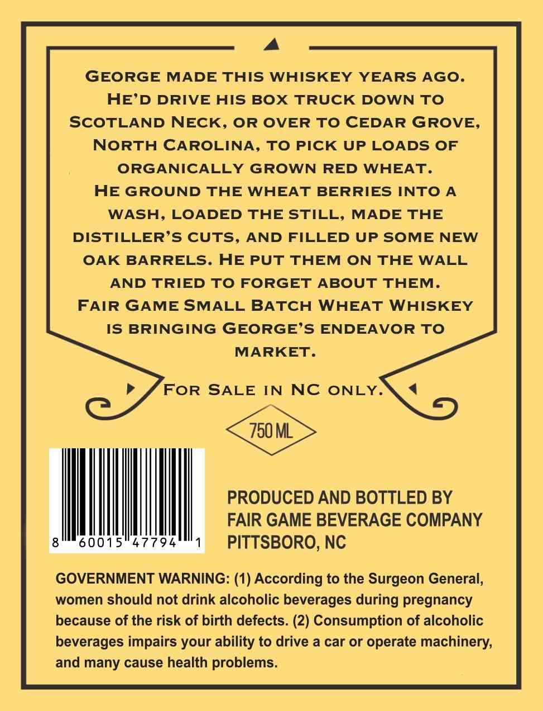
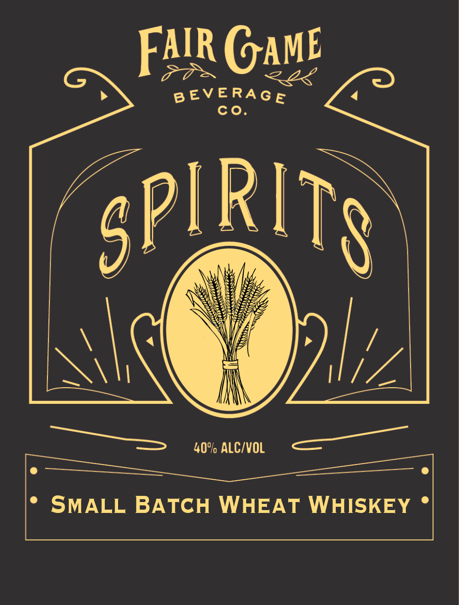

# TTB COLA Label Images - TTBID 26146001000709

**Brand Name:** SMALL BATCH WHEAT WHISKEY

**Issue Date:** 05/29/2026

**Origin Code:** 35

**Product Class/Type:** 140

**Source:** [TTB Public COLA Registry](https://ttbonline.gov/colasonline/viewColaDetails.do?action=publicFormDisplay&ttbid=26146001000709)

## Label Images

### Back Label

### Front Label

## Extracted Label Text

*Text extracted via OCR - may contain errors*

**Detected Proof:** 80

### Back Label

A

GEORGE MADE THIS WHISKEY YEARS AGO.

HE’D DRIVE HIS BOX TRUCK DOWN TO

SCOTLAND NECK, OR OVER TO CEDAR GROVE,

NORTH CAROLINA, TO PICK UP LOADS OF

ORGANICALLY GROWN RED WHEAT.

HE GROUND THE WHEAT BERRIES INTO A

WASH, LOADED THE STILL, MADE THE

DISTILLER’S CUTS, AND FILLED UP SOME NEW

OAK BARRELS. HE PUT THEM ON THE WALL

AND TRIED TO FORGET ABOUT THEM.

FAIR GAME SMALL BATCH WHEAT WHISKEY

IS BRINGING GEORGE’S ENDEAVOR TO

MARKET.

FOR SALE IN NC ONLY.

PRODUCED AND BOTTLED BY

FAIR GAME BEVERAGE COMPANY

Ml

47794

PITTSBORO, NC

GOVERNMENT WARNING: (1) According to the Surgeon General,

women should not drink alcoholic beverages during pregnancy

because of the risk of birth defects. (2) Consumption of alcoholic

beverages impairs your ability to drive a car or operate machinery,

and many cause health problems.

### Front Label

Falr GAME
B EVERAG E
co
SPIRITS
40% ALC/VOL
SMALL BATCH WHEAT WHISKEY
