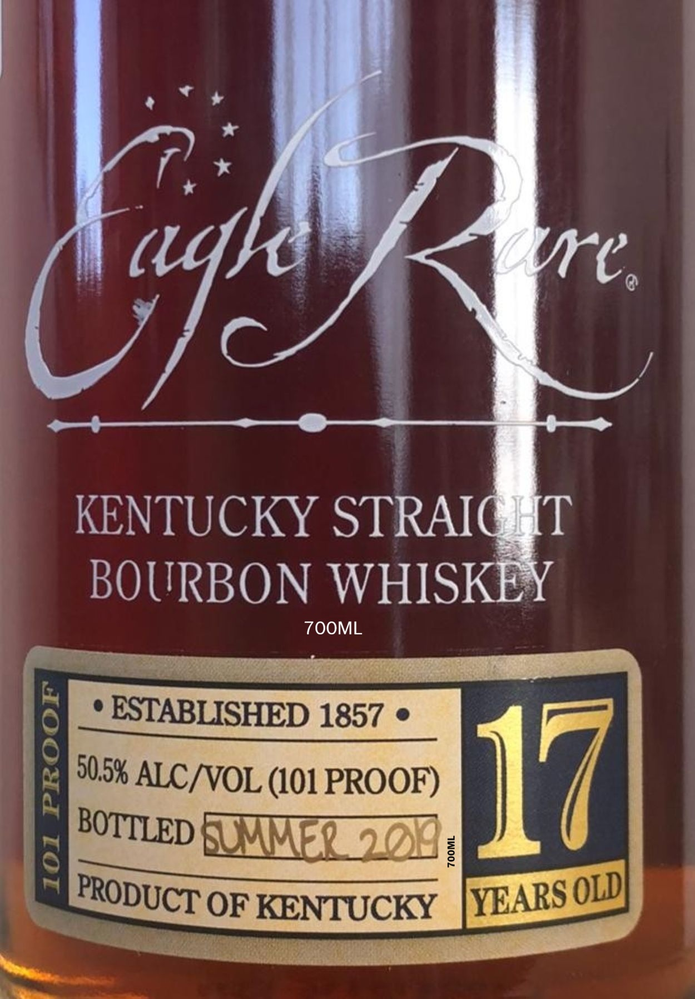

# TTB COLA Label Images - TTBID 26146001000726

**Brand Name:** EAGLE RARE

**Fanciful Name:** 17 YEARS OLD

**Issue Date:** 05/29/2026

**Origin Code:** 22

**Product Class/Type:** 101

**Source:** [TTB Public COLA Registry](https://ttbonline.gov/colasonline/viewColaDetails.do?action=publicFormDisplay&ttbid=26146001000726)

## Label Images

### Label 1

### Label 2

## Extracted Label Text

*Text extracted via OCR - may contain errors*

**Detected Proof:** 101

### Label 1

aghk
ae
KENTUCKY STRAICHT
BOURBON WHISKEY
7OOML
ESTABLISHED 1857
1
ALCNOL (101 PROOF)
117l
3
EMRSOL]
OF KENTUCKY
YEARS
50,5%
BOTTLED
OLD
PRODUCT

### Label 2

RE-IMPORTED BY: CONNOISSEUR WINES & SPIRITS CALIFORNIA NAPA,CA

"OBTAINED FROM A PRIVATE COLLECTION"

CACASHED REFUND CACRV

GOVERNMENT WARNING: (1) ACCORDING TO THE SURGEON GENERAL, WOMEN

SHOULD NOT DRINK ALCOHOLIC BEVERAGES DURING PREGNANCY BECAUSE OF THE

RISK OF BIRTH DEFECTS. (2) CONSUMPTION OF ALCOHOLIC BEVERAGES IMPAIRS YOUR

ABILITY TO DRIVE A CAR OR OPERATE MACHINERY, AND MAY CAUSE HEALTH PROBLEMS.
