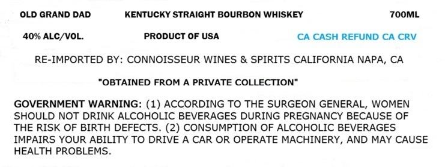
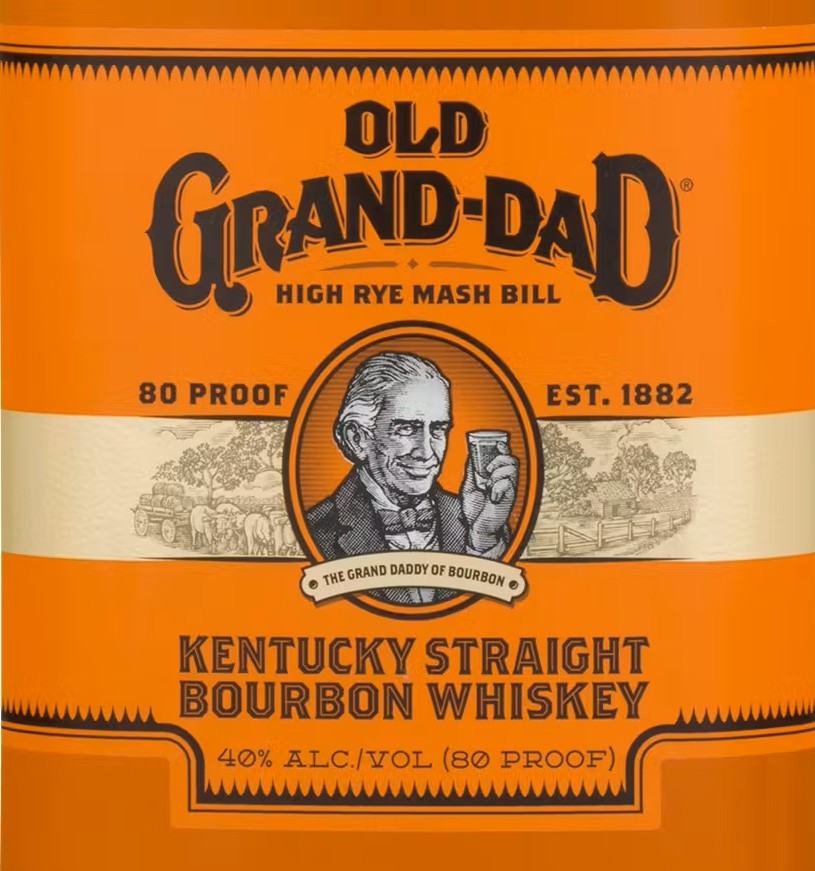

# TTB COLA Label Images - TTBID 26146001000730

**Brand Name:** OLD GRAND-DAD

**Issue Date:** 05/29/2026

**Origin Code:** 22

**Product Class/Type:** 101

**Source:** [TTB Public COLA Registry](https://ttbonline.gov/colasonline/viewColaDetails.do?action=publicFormDisplay&ttbid=26146001000730)

## Label Images

### Label 1

### Label 2

## Extracted Label Text

*Text extracted via OCR - may contain errors*

**Detected Proof:** 80

### Label 1

OLD GRAND DAD
KENTUCKY STRAIGHT BOURBON WHISKEY
ZOOML
40% ALC/VOL.
PRODUCT OF USA
CA CASH REFUND CA CRV
RE-IMPORTED BY: CONNOISSEUR WINES & SPIRITS CALIFORNIA NAPA, CA
"OBTAINED FROM A PRIVATE COLLECTION"
GOVERNMENT WARNING: (1) ACCORDING TO THE SURGEON GENERAL, WOMEN
SHOULD NOT DRINK ALCOHOLIC BEVERAGES DURING PREGNANCY BECAUSE OF
THE RISK OF BIRTH DEFECTS. (2) CONSUMPTION OF ALCOHOLIC BEVERAGES
IMPAIRS YOUR ABILITY TO DRIVE A CAR OR OPERATE MACHINERY, AND MAY CAUSE
HEALTH PROBLEMS

### Label 2

OLD
GRAND%aD
HIGH RYE MASH BILL
80 PROOF
EST: 1882
DADDY OF
ThE
KENTUCKY STRAIGHT
BOURBON WHISKEY
40% ALC ITOL (80 PROOF)
GRAND
 BOURBOM .
