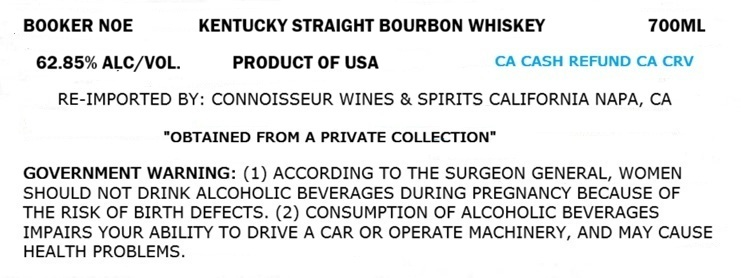
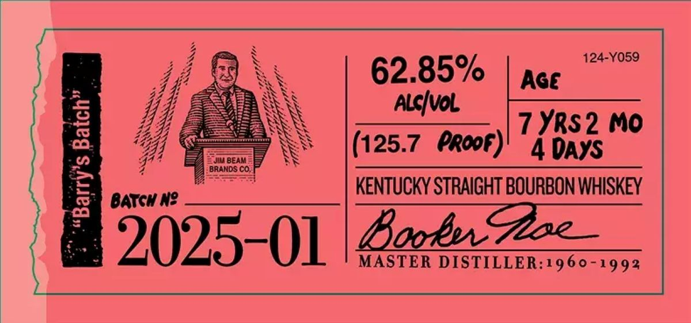

# TTB COLA Label Images - TTBID 26146001000734

**Brand Name:** BOOKER NOE

**Fanciful Name:** "BARRY'S BATCH"

**Issue Date:** 05/29/2026

**Origin Code:** 22

**Product Class/Type:** 101

**Source:** [TTB Public COLA Registry](https://ttbonline.gov/colasonline/viewColaDetails.do?action=publicFormDisplay&ttbid=26146001000734)

## Label Images

### Label 1

### Label 2

## Extracted Label Text

*Text extracted via OCR - may contain errors*

**Detected Proof:** 125.7
**Detected Age:** 7 Years

### Label 1

BOOKER NOE
KENTUCKY STRAIGHT BOURBON WHISKEY
7OOML
62.85% ALC/VOL.
PRODUCT OF USA
CA CASH REFUND CA CRV
RE-IMPORTED BY: CONNOISSEUR WINES & SPIRITS CALIFORNIA NAPA, CA
"OBTAINED FROM A PRIVATE COLLECTION"
GOVERNMENT WARNING: (1) ACCORDING TO THE SURGEON GENERAL, WOMEN
SHOULD NOT DRINK ALCOHOLIC BEVERAGES DURING PREGNANCY BECAUSE OF
THE RISK OF BIRTH DEFECTS. (2) CONSUMPTION OF ALCOHOLIC BEVERAGES
IMPAIRS YOUR ABILITY TO DRIVE A CAR OR OPERATE MACHINERY, AND MAY CAUSE
HEALTH PROBLEMS

### Label 2

124-Y059
62.85%
Age
5
Alcivol
1
7 YRS 2 Mo
(125.7
propf)
4 DAYS
0
JIU BEAM
brahds co
2
BATGM N?
KENTUCKY STRAIGHT BOURBON WHISKEY
2025-01
BoobuCee
MASTER DISTILLER:1960-1992
