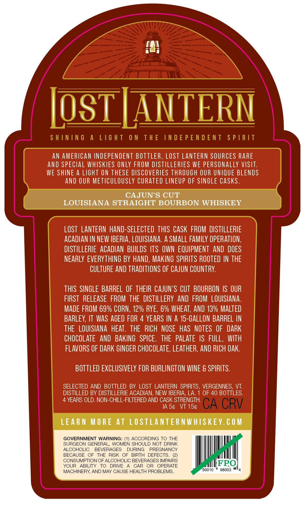
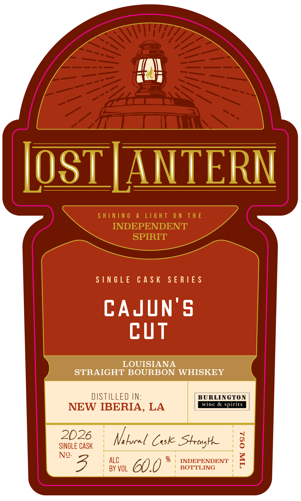

# TTB COLA Label Images - TTBID 26146001000814

**Brand Name:** LOST LANTERN

**Issue Date:** 06/09/2026

**Origin Code:** 46

**Product Class/Type:** 101

**Source:** [TTB Public COLA Registry](https://ttbonline.gov/colasonline/viewColaDetails.do?action=publicFormDisplay&ttbid=26146001000814)

## Label Images

### Back Label

### Front Label

### Label 2

## Extracted Label Text

*Text extracted via OCR - may contain errors*

**Detected Age:** 4 Years

### Back Label

Los LANTERN
S H ININ 6
A
L16 H T
0 N
T H E
IN D E P E N D E N T
S P |R IT
AN AMERICAN INDEPENDENT BOTTLER, LOSt LANTeRN SOURCES RARE
and SPECLAL WHISKIES ONLY FROM DISTILLERLES WE PERSONALLY VISIT:
WE SHINE A LIGHT ON THESE DISCOVERIES THROUGH OUR UNIQUE BLENDS
AND OUR METICULOUSLY CURATED LINEUP OF SINGLE CASks.
CAJUNS CUT
LOUISIANA STRAIGHT BOURBON WHISKEY
LOST   LANTERN hand-SELECTED THIS  CASK FROM DISTILLERIE
ACadLan IN NEW IBERIA, LOUISLANA: a SMalL familY OPERATION,
DISTILLERIE   ACAdian BUILDS ITS  OWN  EQUIPMENT  AnD DOES
NEARLY EVERYTHING BY HAND, MAKING SPIRITS ROOTED IN THE
CULTURE AND TRADITLONS OF CAJUN COUNTRY:
THIS  SINGLE BARREL OF  THEIR CAJUN'S CUT BOURBON IS OUR
FIRST   RELEASE   FROM THE   DISTILLERY AND FROM  LOUISIANA:
MADE FROM 69% CORN , 12% RYE, 6% WHEAT, AND 13% MALTED
BARLEY, IT WaS AGED FOR 4 YEARS IN A 15-GALLON BARREL IN
THE   LOUISIANA HEAT . THE   RICH  NOSE   HaS  NOTES  OF   DARK
CHOCOLATE
AND  BAKING   SPICE.
THE   pALATe IS FuLL, WITH
FLAVORS OF DARK GINGER CHOCOLATE, LEATHER, AND RICH Oak
BOTTLED EXCLUSIVELY FOR BURLINGTON WINE & SPIRITS.
SELECTED AND
BOTTLED BY LOST LANTERN   SPIRITS, VERGENNES;
VT:
DISTILLED BY DISTILLERIE ACADIAN; NEW IBERIA; LA.
OF 40 BOTTLES.
YEARS OLD. NON-CHILL-FILTERED AND CASK STRENGTH
IA 54
VT 154
CA CRV
LEARN MORE At LOSTLANTER NWHISKEY. € 0 M
GOVERNMENT WARNING: (1) ACCORDING TO THE
SURGEON GENERAL, WOMEN SHOULD NOT DRINK
ALCOHOLIC
BEVERAGES
DURING
PREGNANCY
BECAUSE
OF
THE RISK OF
BIRTH
DEFECTS_
CONSUMPTION OF ALCOHOLIC BEVERAGES IMPAIRS
YOUR
ABILITY
TO
DRIVE
CAR
OR
OPERATE
FPO
MACHINERY AND MAY CAUSE HEALTH PROBLEMS
50010
98003

### Front Label

in

D |

\NIERN

it

SINGLE CASK SERIES

CAJUNS

CUT

LOUISIANA

STRAIGHT BOURBON WHISKEY

DISTILLED IN:

BURLINGTON

wine & spirit

NEW IBERIA, LA

2026

SINGLE CASK

i

Vi locel Cok Strong

| ALC

i INDEPENDENT

“3B

| BY VOL

60.0"

| BOTTLING

'

### Label 2

SHINING A LIGHT ON THE INDEPENDENT SPIRIT —— ene ~~ Li¥idS LNJON3Jd SONI JHL NO LHSIT V SNINIHS
camel
ci =
Se
