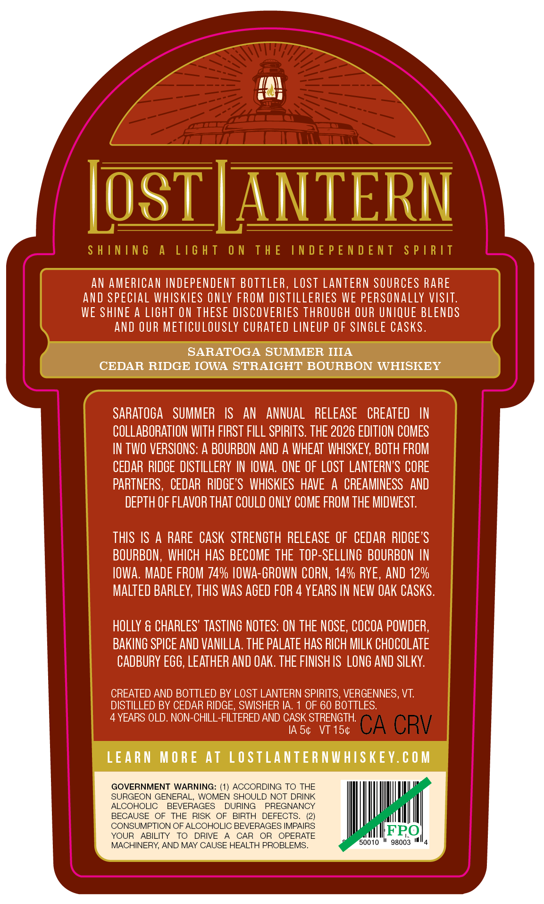
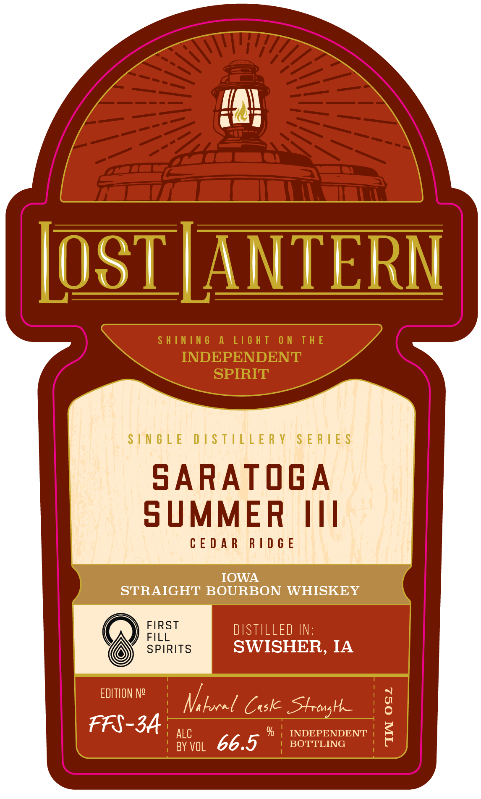
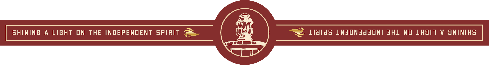

# TTB COLA Label Images - TTBID 26146001000815

**Brand Name:** LOST LANTERN

**Issue Date:** 06/09/2026

**Origin Code:** 46

**Product Class/Type:** 101

**Source:** [TTB Public COLA Registry](https://ttbonline.gov/colasonline/viewColaDetails.do?action=publicFormDisplay&ttbid=26146001000815)

## Label Images

### Back Label

### Front Label

### Label 3

## Extracted Label Text

*Text extracted via OCR - may contain errors*

**Detected Age:** 4 Years

### Back Label

Ip\
if
lol JAN |
| 5 \

AN AMERICAN INDEPENDENT BOTTLER, LOST LANTERN SOURCES RARE
AND SPECIAL WHISKIES ONLY FROM DISTILLERIES WE PERSONALLY VISIT.
WE SHINE A LIGHT ON THESE DISCOVERIES THROUGH OUR UNIQUE BLENDS

AND OUR METICULOUSLY CURATED LINEUP OF SINGLE CASKS.

SARATOGA SUMMER IIIA
CEDAR RIDGE IOWA STRAIGHT BOURBON WHISKEY
SARATOGA SUMMER IS AN ANNUAL RELEASE CREATED IN
COLLABORATION WITH FIRST FILL SPIRITS. THE 2026 EDITION COMES
IN TWO VERSIONS: A BOURBON AND A WHEAT WHISKEY, BOTH FROM
CEDAR RIDGE DISTILLERY IN IOWA. ONE OF LOST LANTERN’S CORE
PARTNERS, CEDAR RIDGE'S WHISKIES HAVE A CREAMINESS AND
DEPTH OF FLAVOR THAT COULD ONLY COME FROM THE MIDWEST.

THIS IS A RARE CASK STRENGTH RELEASE OF CEDAR RIDGE’S
BOURBON, WHICH HAS BECOME THE TOP-SELLING BOURBON IN
IOWA. MADE FROM 74% IOWA-GROWN CORN, 14% RYE, AND 12%
MALTED BARLEY, THIS WAS AGED FOR 4 YEARS IN NEW OAK CASKS.
HOLLY & CHARLES’ TASTING NOTES: ON THE NOSE, COCOA POWDER,
BAKING SPICE AND VANILLA. THE PALATE HAS RICH MILK CHOCOLATE
CADBURY EGG, LEATHER AND OAK. THE FINISHIS LONG AND SILKY.
CREATED AND BOTTLED BY LOST LANTERN SPIRITS, VERGENNES, VT.
DISTILLED BY CEDAR RIDGE, SWISHER IA. 1 OF 60 BOTTLES.

4 YEARS OLD. NON-CHILL-FILTERED AND CASK STRENGTH.

IAS¢ VT 15¢

LEARN MORE AT LOSTLANTERNWHISKEY.COM
GOVERNMENT WARNING: (1) ACCORDING TO THE

SURGEON GENERAL, WOMEN SHOULD NOT DRINK

ALCOHOLIC BEVERAGES DURING PREGNANCY

BECAUSE GF WE Hise (Gr Gln SEREETS @)

ream NEL canes ae Ca peur FEO)
MACHINERY, AND MAY CAUSE HEALTH PROBLEMS. 50010 "98003 "4

### Front Label

ip
aa
)
Jol JANTERN
SINGLE DISTILLERY SERIES
SARATOGA
SUMMER III
CEDAR RIDGE
ONAN
STRAIGHT BOURBON WHISKEY
FIRST :
SPIRITS SWISHER, IA
embyn Ni Laon Cus Strong le g
FAS 3A ns 66.5 * smmuen §

### Label 3

SHINING A LIGHT ON THE INDEPENDENT SPIRIT —— ene ~~ Li¥idS LNJON3Jd SONI JHL NO LHSIT V SNINIHS
camel
ci =
Se
