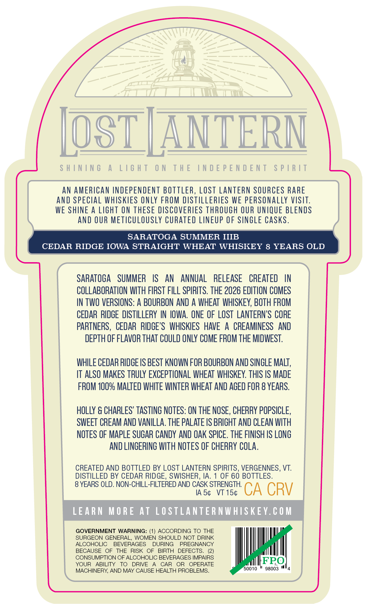
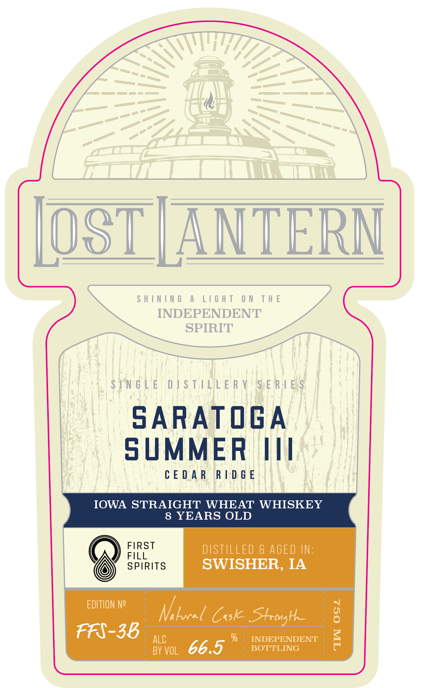
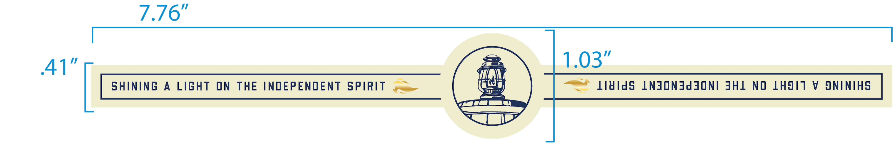

# TTB COLA Label Images - TTBID 26146001000819

**Brand Name:** LOST LANTERN

**Issue Date:** 05/29/2026

**Origin Code:** 46

**Product Class/Type:** 109

**Source:** [TTB Public COLA Registry](https://ttbonline.gov/colasonline/viewColaDetails.do?action=publicFormDisplay&ttbid=26146001000819)

## Label Images

### Back Label

### Front Label

### Label 3

## Extracted Label Text

*Text extracted via OCR - may contain errors*

**Detected Age:** 8 Years

### Back Label

AN AMERICAN INDEPENDENT BOTTLER, LOST LANTERN SOURCES RARE
AND SPECIAL WHISKIES ONLY FROM DISTILLERIES WE PERSONALLY VISIT.
WE SHINE A LIGHT ON THESE DISCOVERIES THROUGH OUR UNIQUE BLENDS

AND OUR METICULOUSLY CURATED LINEUP OF SINGLE CASKS.

SARATOGA SUMMER IIIB
CEDAR RIDGE IOWA STRAIGHT WHEAT WHISKEY 8 YEARS OLD
SARATOGA SUMMER IS AN ANNUAL RELEASE CREATED IN
COLLABORATION WITH FIRST FILL SPIRITS. THE 2026 EDITION COMES
IN TWO VERSIONS: A BOURBON AND A WHEAT WHISKEY, BOTH FROM
CEDAR RIDGE DISTILLERY IN IOWA. ONE OF LOST LANTERN’S CORE
PARTNERS, CEDAR RIDGE’S WHISKIES HAVE A CREAMINESS AND
DEPTH OF FLAVOR THAT COULD ONLY COME FROM THE MIDWEST.
WHILE CEDAR RIDGE IS BEST KNOWN FOR BOURBON AND SINGLE MALT,
IT ALSO MAKES TRULY EXCEPTIONAL WHEAT WHISKEY. THIS IS MADE
FROM 100% MALTED WHITE WINTER WHEAT AND AGED FOR 8 YEARS.
HOLLY & CHARLES’ TASTING NOTES: ON THE NOSE, CHERRY POPSICLE,
SWEET CREAM AND VANILLA. THE PALATE IS BRIGHT AND CLEAN WITH
NOTES OF MAPLE SUGAR CANDY AND OAK SPICE. THE FINISH IS LONG
AND LINGERING WITH NOTES OF CHERRY COLA.
CREATED AND BOTTLED BY LOST LANTERN SPIRITS, VERGENNES, VT.
DISTILLED BY CEDAR RIDGE, SWISHER, IA. 1 OF 60 BOTTLES.
8 YEARS OLD. NON-CHILL-FILTERED AND CASK STRENGTH.
IAS¢ VT 15¢ CA CRV

GOVERNMENT WARNING: (1) ACCORDING TO THE

SURGEON GENERAL, WOMEN SHOULD NOT DRINK

ALCOHOLIC BEVERAGES DURING PREGNANCY

BECAUSE OF THE RISK OF BIRTH DEFECTS. (2)

CONSUMPTION OF ALCOHOLIC BEVERAGES IMPAIRS FPO
YOUR ABILITY TO DRIVE A CAR OR OPERATE fpeedtar|
MACHINERY, AND MAY CAUSE HEALTH PROBLEMS. 0010 * 96003 "4

### Front Label

———

7D

OST | ANTERN

SHINING A LIGHT ON THE

INDEPENDENT

SPIRIT

SINGLE DISTILLERY SERIES

SARATOGA

SUMMER III

CEDAR RIDGE

IOWA STRAIGHT WHEAT WHISKEY

8 YEARS OLD

FIRST

@)

FILL

DISTILLED & AGED IN:

SPIRITS

SWISHER, IA

EDITION N2

Ni Laon Cus Strong e

FFS-38 ,,,

%

BOTTLING

INDEPENDENT

ayvol 66.9

### Label 3

7.376"
41'
103"
ShInIng
A
LIGhT
ON
THE
INDEPENDENT
SpIRIT
lAIds
LNJONJdjoni JHL
NO
LHJIT
V
JNINIHS
