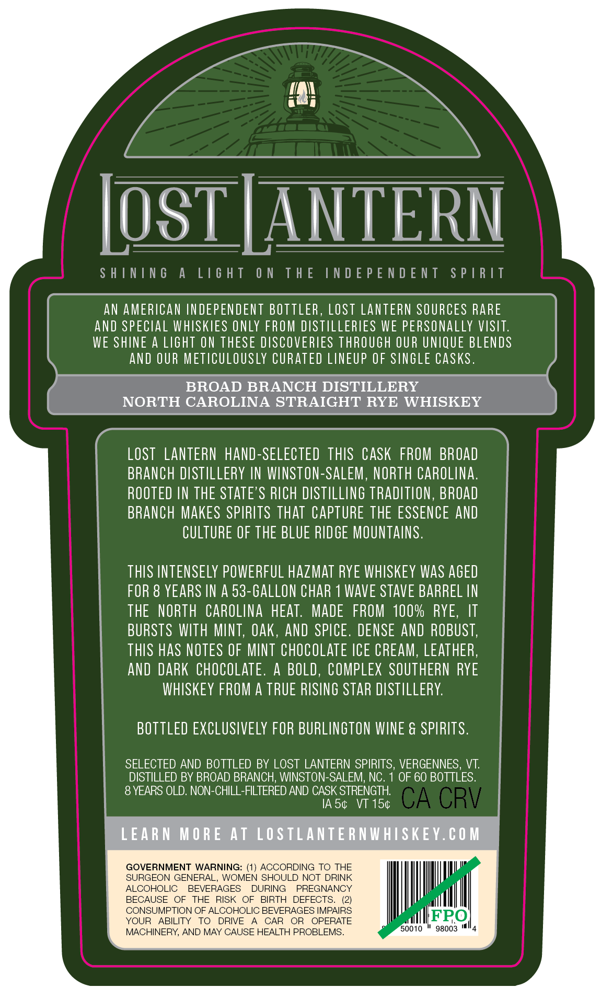
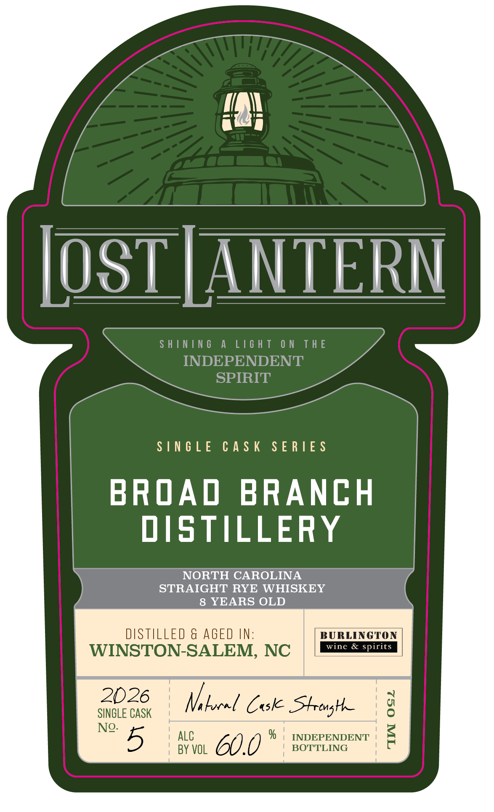
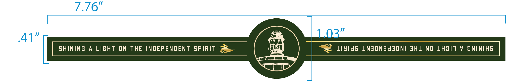

# TTB COLA Label Images - TTBID 26146001000820

**Brand Name:** LOST LANTERN

**Issue Date:** 05/29/2026

**Origin Code:** 46

**Product Class/Type:** 102

**Source:** [TTB Public COLA Registry](https://ttbonline.gov/colasonline/viewColaDetails.do?action=publicFormDisplay&ttbid=26146001000820)

## Label Images

### Back Label

### Front Label

### Label 3

## Extracted Label Text

*Text extracted via OCR - may contain errors*

**Detected Age:** 8 Years

### Back Label

SHINING A LIGHT ON THE INDEPENDENT SPIRIT
AN AMERICAN INDEPENDENT BOTTLER, LOST LANTERN SOURCES RARE
AND SPECIAL WHISKIES ONLY FROM DISTILLERIES WE PERSONALLY VISIT.
WE SHINE A LIGHT ON THESE DISCOVERIES THROUGH OUR UNIQUE BLENDS
AND OUR METICULOUSLY CURATED LINEUP OF SINGLE CASKS.
BROAD BRANCH DISTILLERY
LOST LANTERN HAND-SELECTED THIS CASK FROM BROAD
BRANCH DISTILLERY IN WINSTON-SALEM, NORTH CAROLINA.
ROOTED IN THE STATE’S RICH DISTILLING TRADITION, BROAD
BRANCH MAKES SPIRITS THAT CAPTURE THE ESSENCE AND
CULTURE OF THE BLUE RIDGE MOUNTAINS.

THIS INTENSELY POWERFUL HAZMAT RYE WHISKEY WAS AGED
FOR 8 YEARS IN A 53-GALLON CHAR 1 WAVE STAVE BARREL IN
THE NORTH CAROLINA HEAT. MADE FROM 100% RYE, IT
BURSTS WITH MINT, OAK, AND SPICE. DENSE AND ROBUST,
THIS HAS NOTES OF MINT CHOCOLATE ICE CREAM, LEATHER,
AND DARK CHOCOLATE. A BOLD, COMPLEX SOUTHERN RYE
WHISKEY FROM A TRUE RISING STAR DISTILLERY.

BOTTLED EXCLUSIVELY FOR BURLINGTON WINE & SPIRITS.
SELECTED AND BOTTLED BY LOST LANTERN SPIRITS, VERGENNES, VT.
DISTILLED BY BROAD BRANCH, WINSTON-SALEM, NC. 1 OF 60 BOTTLES.

8 YEARS OLD. NON-CHILL-FILTERED AND CASK STRENGTH.
IAS¢ VT 15¢
GOVERNMENT WARNING: (1) ACCORDING TO THE
SURGEON GENERAL, WOMEN SHOULD NOT DRINK
ALCOHOLIC BEVERAGES DURING PREGNANCY
BECAUSE OF THE RISK OF BIRTH DEFECTS. (2)
CONSUMPTION OF ALCOHOLIC BEVERAGES IMPAIRS FPO
YOUR ABILITY TO DRIVE A CAR OR OPERATE eediter|
MACHINERY, AND MAY CAUSE HEALTH PROBLEMS. 50010 "98003 "4

### Front Label

[OST | ANTERN

SHINING A LIGHT ON THE

INDEPENDENT

SPIRIT

SINGLE CASK SERIES

BROAD BRANCH

DISTILLERY

STRAIGHT RYE WHISKEY

NORTH CAROLINA

8 YEARS OLD

DISTILLED & AGED IN:

BURLINGTON

WINSTON-SALEM, NC

& si

SINGLE CASK Mh heel Cask Ste ng

ALC

% | INDEPENDENT

No. 5

BY VOL

CHU

BOTTLING

### Label 3

| SHINING A LIGHT ON THE INDEPENDENT SPIRIT @& ii V LididS LNJONAddONI JHL NO LHSIT V ONINIHS |
