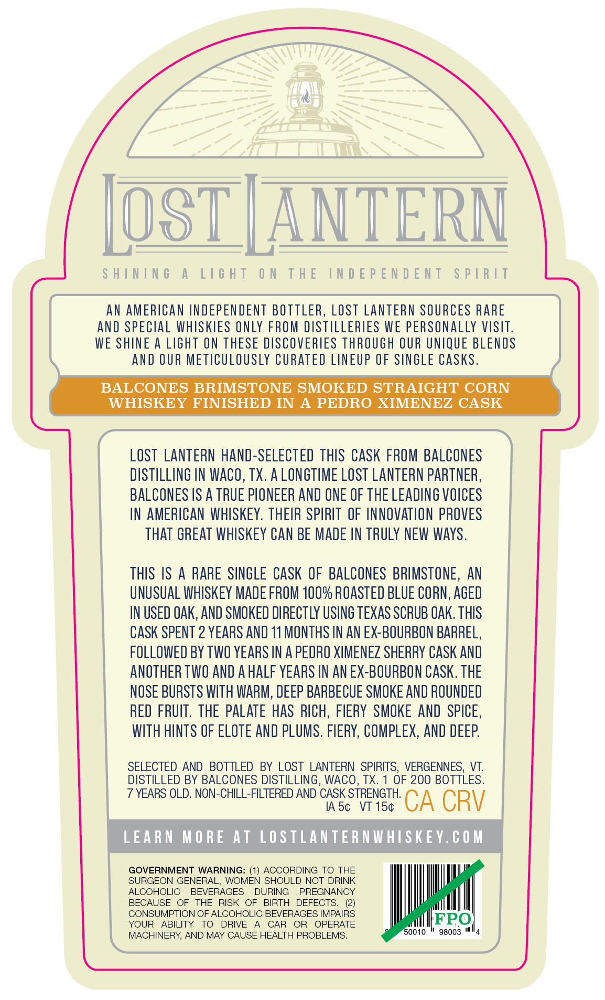
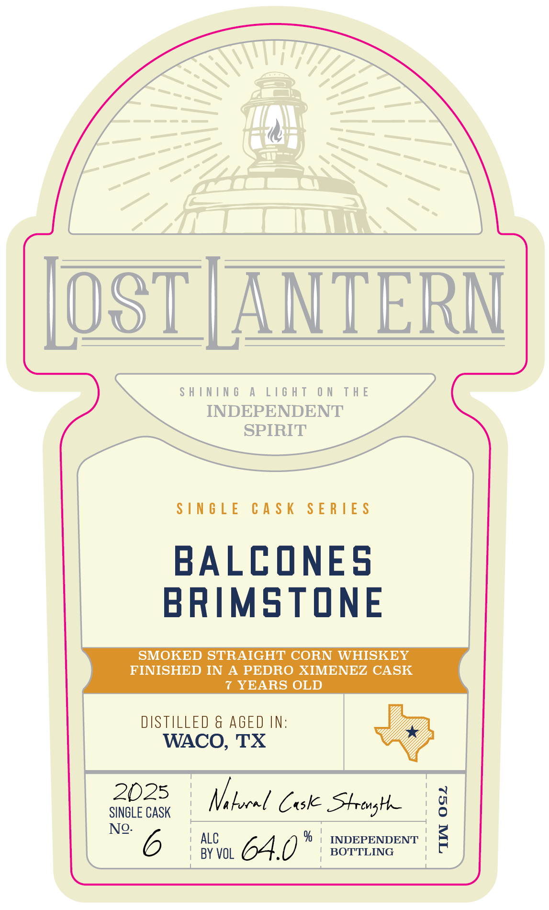

# TTB COLA Label Images - TTBID 26146001000821

**Brand Name:** LOST LANTERN

**Issue Date:** 06/01/2026

**Origin Code:** 46

**Product Class/Type:** 143

**Source:** [TTB Public COLA Registry](https://ttbonline.gov/colasonline/viewColaDetails.do?action=publicFormDisplay&ttbid=26146001000821)

## Label Images

### Back Label

### Front Label

### Label 3

## Extracted Label Text

*Text extracted via OCR - may contain errors*

**Detected Age:** 2 Years

### Back Label

SHINING A LIGHT ON THE INDEPENDENT SPIRIT
AN AMERICAN INDEPENDENT BOTTLER, LOST LANTERN SOURCES RARE
AND SPECIAL WHISKIES ONLY FROM DISTILLERIES WE PERSONALLY VISIT.
WE SHINE A LIGHT ON THESE DISCOVERIES THROUGH OUR UNIQUE BLENDS
AND OUR METICULOUSLY CURATED LINEUP OF SINGLE CASKS.
BALCONES BRIMSTONE SMOKED STRAIGHT CORN
WHISKEY FINISHED IN A PEDRO XIMENEZ CASK
LOST LANTERN HAND-SELECTED THIS CASK FROM BALCONES
DISTILLING IN WACO, TX. A LONGTIME LOST LANTERN PARTNER,
BALCONES IS A TRUE PIONEER AND ONE OF THE LEADING VOICES
IN AMERICAN WHISKEY. THEIR SPIRIT OF INNOVATION PROVES
THAT GREAT WHISKEY CAN BE MADE IN TRULY NEW WAYS.

THIS IS A RARE SINGLE CASK OF BALCONES BRIMSTONE, AN
UNUSUAL WHISKEY MADE FROM 100% ROASTED BLUE CORN, AGED
IN USED OAK, AND SMOKED DIRECTLY USING TEXAS SCRUB OAK. THIS
CASK SPENT 2 YEARS AND 11 MONTHS IN AN EX-BOURBON BARREL,
FOLLOWED BY TWO YEARS IN A PEDRO XIMENEZ SHERRY CASK AND
ANOTHER TWO AND A HALF YEARS IN AN EX-BOURBON CASK. THE
NOSE BURSTS WITH WARM, DEEP BARBECUE SMOKE AND ROUNDED
RED FRUIT. THE PALATE HAS RICH, FIERY SMOKE AND SPICE,
WITH HINTS OF ELOTE AND PLUMS. FIERY, COMPLEX, AND DEEP.
SELECTED AND BOTTLED BY LOST LANTERN SPIRITS, VERGENNES, VT.
DISTILLED BY BALCONES DISTILLING, WACO, TX. 1 OF 200 BOTTLES.

7 YEARS OLD. NON-CHILL-FILTERED AND CASK STRENGTH.

IAS¢ VT 15¢ CA CRV
LEARN MORE AT LOSTLANTERNWHISKEY.COM
GOVERNMENT WARNING: (1) ACCORDING TO THE
SURGEON GENERAL, WOMEN SHOULD NOT DRINK
ALCOHOLIC BEVERAGES DURING PREGNANCY
BECAUSE OF THE RISK OF BIRTH DEFECTS. (2)
CONSUMPTION OF ALCOHOLIC BEVERAGES IMPAIRS IFPO
YOUR ABILITY TO DRIVE A CAR OR OPERATE fetter
MACHINERY, AND MAY CAUSE HEALTH PROBLEMS. 0010 * 96003 "4

### Front Label

OST | ANTERN

SHINING A LIGHT ON THE

INDEPENDENT

SPIRIT

SINGLE CASK SERIES

BALCONES

BRIMSTONE

FINISHED IN A PEDRO XIMENEZ CASK

SMOKED STRAIGHT CORN WHISKEY

7 YEARS OLD

DISTILLED & AGED IN:

WACO, TX

2025

1

'

SINGLE CASK

1

Vi bocel Cuske SHtrenghe

' 0

No- 6

' ALC

: BY VOL

INDEPENDENT <

I

i.

64.0°

' BOTTLING

### Label 3

7.376"
41'
103"
ShInIng
A
LIGhT
ON
THE
INDEPENDENT
SpIRIT
lAIds
LNJONJdjoni JHL
NO
LHJIT
V
JNINIHS
