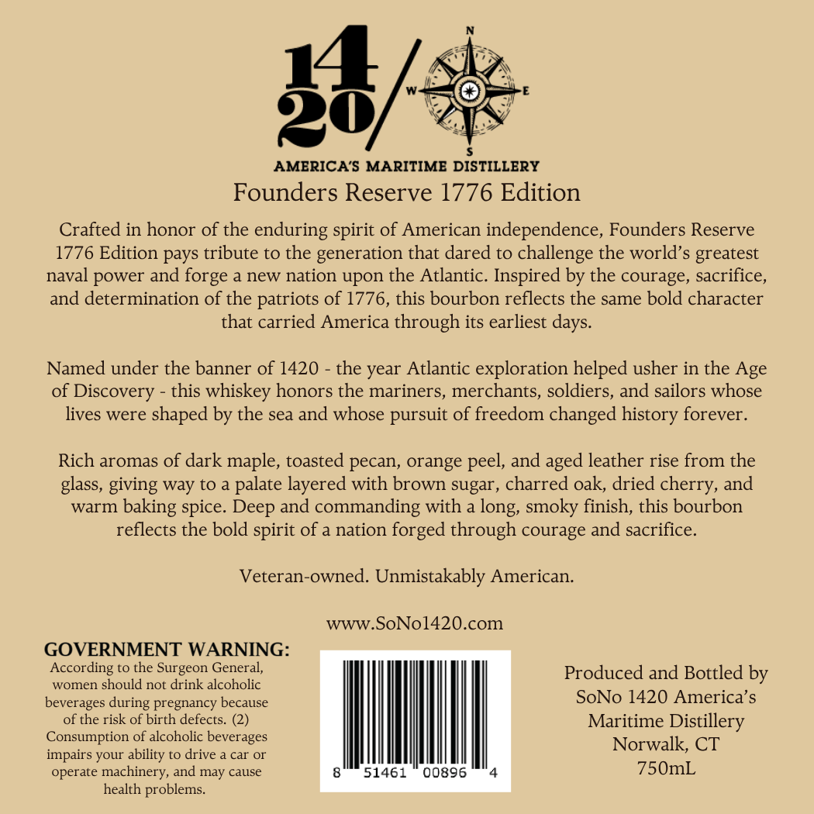
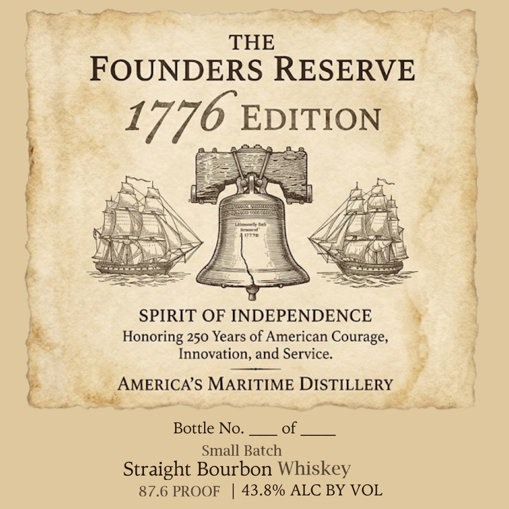

# TTB COLA Label Images - TTBID 26146001000836

**Brand Name:** AMERICA'S MARITIME DISTILLERY

**Issue Date:** 06/09/2026

**Origin Code:** 14

**Product Class/Type:** 101

**Source:** [TTB Public COLA Registry](https://ttbonline.gov/colasonline/viewColaDetails.do?action=publicFormDisplay&ttbid=26146001000836)

## Label Images

### Back Label

### Front Label

## Extracted Label Text

*Text extracted via OCR - may contain errors*

**Detected Proof:** 87.6

### Back Label

28
AMERICA'S MARITIME DISTILLERY
Founders Reserve 1776 Edition
Crafted in honor of the enduring spirit of American independence, Founders Reserve
1776 Edition pays tribute to the generation that dared to challenge the world's greatest
naval power and forge & new nation upon the Atlantic. Inspired by the courage, sacrifice,
and determination of the patriots of 1776, this bourbon reflects the same bold character
that carried America through its earliest days.
Named under the banner of 1420
the year Atlantic exploration helped usher in the Age
of Discovery
this
whiskey honors the mariners, merchants, soldiers, and sailors whose
lives were
shaped by the sea and whose pursuit of freedom changed history forever.
Rich aromas of dark maple, toasted pecan, orange peel, and
leather rise from the
glass, giving way to a palate layered with brown sugar , charred oak, dried
and
warm
baking spice_
and commanding with a long, smoky finish, this bourbon
reflects the bold spirit of a nation forged through courage and sacrifice.
Veteran-owned. Unmistakably American.
wWW.SoNol420.com
GOVERNMENT WARNING:
According to the Surgeon General;
Produced and Bottled by
women should not drink alcoholic
beverages
pregnancy because
SoNo 1420 America' $
of the risk of birth defects. (2)
Maritime
Distillery
Consumption of alcoholic beverages
Norwalk; CT
impairs your ability to drive & car
operate machinery, and
cause
51461
00896
750mL
health problems_
aged
cherry,
Deep
during
may

### Front Label

5 en THE
FOUNDERS RESERVE

17 708 peal

a mg re

—~

SPIRIT OF INDEPENDENCE 3
Honoring 250 Years of American Courage,
Innovation, and Service.

AMERICA’S MARITIME DISTILLERY _
sis Sede mn im jentiitiieas sje ed
Bottle No.of
Small Batch
Straight Bourbon Whiskey
87.6 PROOF | 43.8% ALC BY VOL

‘uaa

4

pais: als cai i
