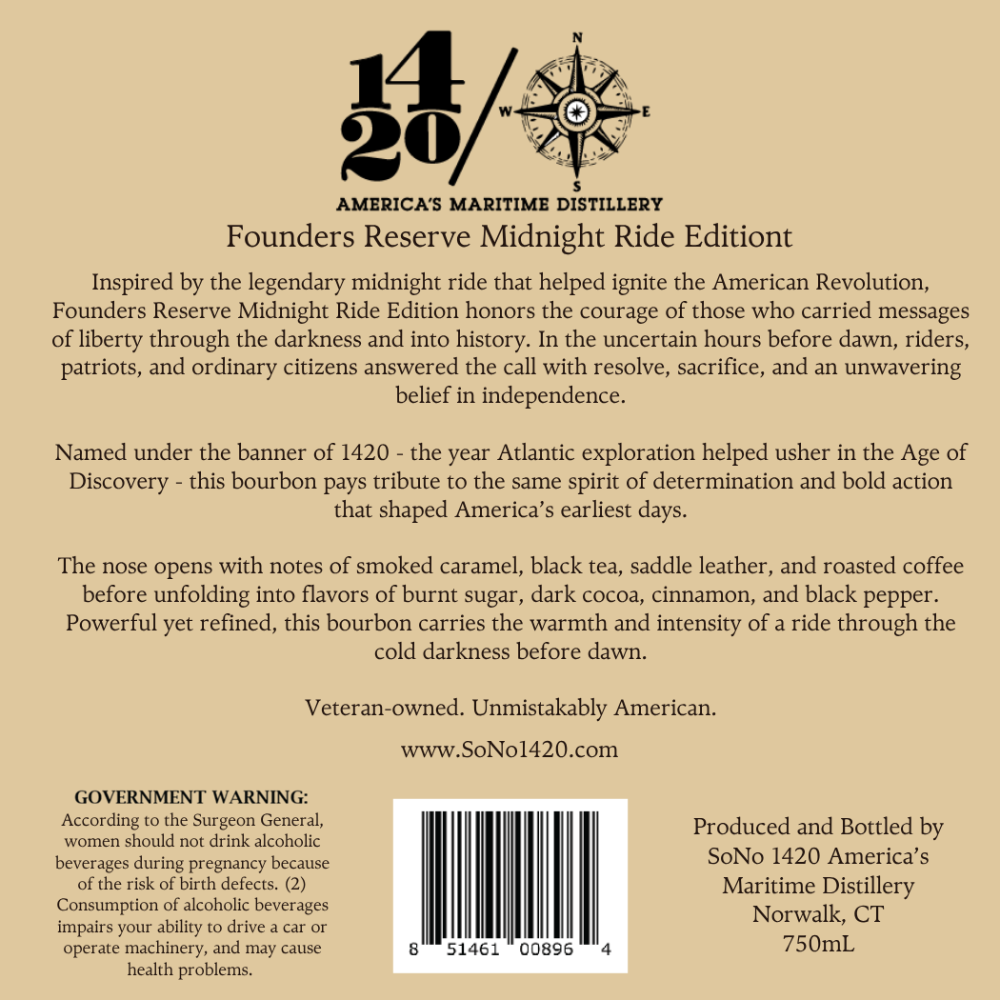
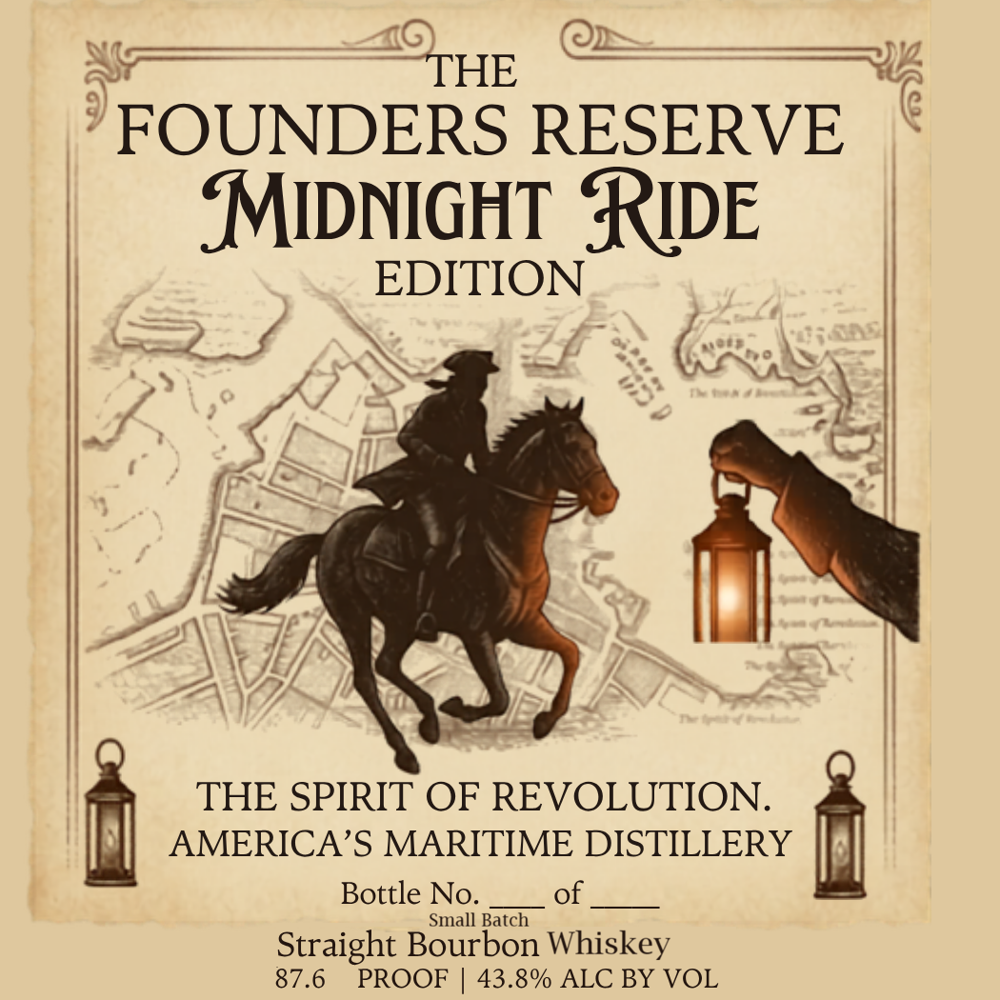

# TTB COLA Label Images - TTBID 26146001000837

**Brand Name:** AMERICA'S MARITIME DISTILLERY

**Issue Date:** 06/08/2026

**Origin Code:** 14

**Product Class/Type:** 101

**Source:** [TTB Public COLA Registry](https://ttbonline.gov/colasonline/viewColaDetails.do?action=publicFormDisplay&ttbid=26146001000837)

## Label Images

### Back Label

### Front Label

## Extracted Label Text

*Text extracted via OCR - may contain errors*

**Detected Proof:** 87.6

### Back Label

14}
AMERICA'S MARITIME DISTILLERY
Founders Reserve Midnight Ride Editiont
Inspired by the legendary midnight ride that helped ignite the American Revolution,
Founders Reserve Midnight Ride Edition honors the courage of those who carried messages
of
through the darkness and into history: In the uncertain hours before dawn, riders,
patriots, and ordinary citizens answered the call with resolve, sacrifice, and an unwavering
belief in independence
Named under the banner of 1420
the year Atlantic exploration helped usher in the
of
Discovery
this bourbon pays tribute to the same spirit of determination and bold action
that shaped America's earliest
The nose opens with notes of smoked caramel, black tea, saddle leather , and roasted coffee
before
unfolding into flavors of burnt sugar, dark cocoa, cinnamon, and black pepper.
Powerful yet refined, this bourbon carries the warmth and intensity of a ride through the
cold darkness before dawn
Veteran-owned. Unmistakably American.
wWW.SoNol420.com
GOVERNMENT WARNING:
According to the Surgeon General
Produced and Bottled by
women should not drink alcoholic
beverages during pregnancy because
SoNo 1420 America' $
of the risk of birth defects. (2)
Maritime
Distillery
Consumption of alcoholic beverages
Norwalk; CT
impairs your ability to drive
car Or
operate machinery, and
cause
51461
00896
750mL
health problems_
liberty
Age
days:
may

### Front Label

THE
FOUNDERS RESERVE
MIDNIGHT RuE
EDITION
THE SPIRIT OF REVOLUTION.
AMERICA'S MARITIME DISTILLERY
Bottle No.
of
Small Batch
Straight Bourbon Whiskey
87.6
PROOF
43.8% ALC BY VOL
