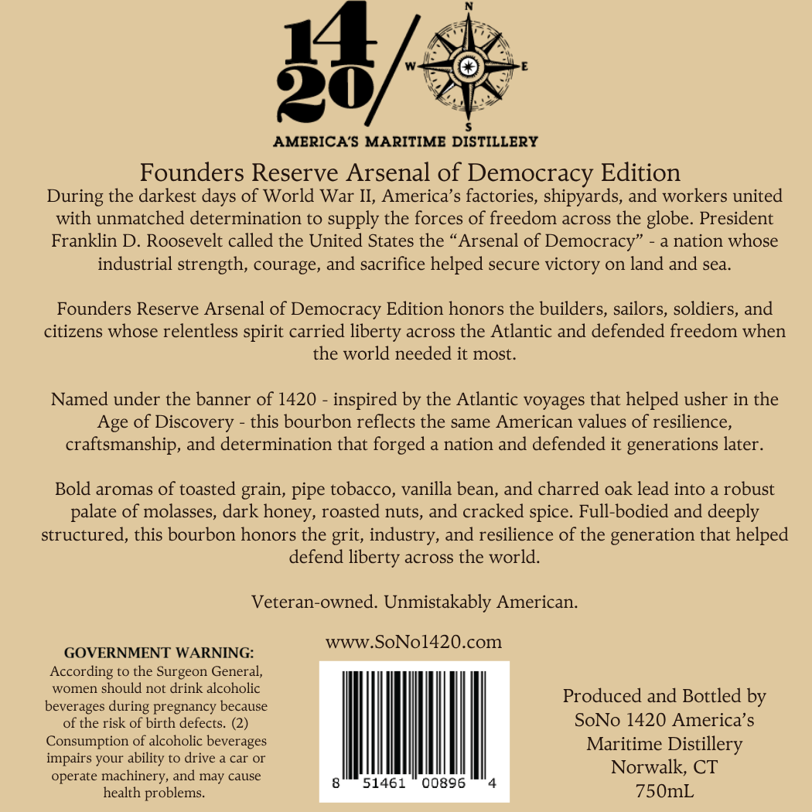
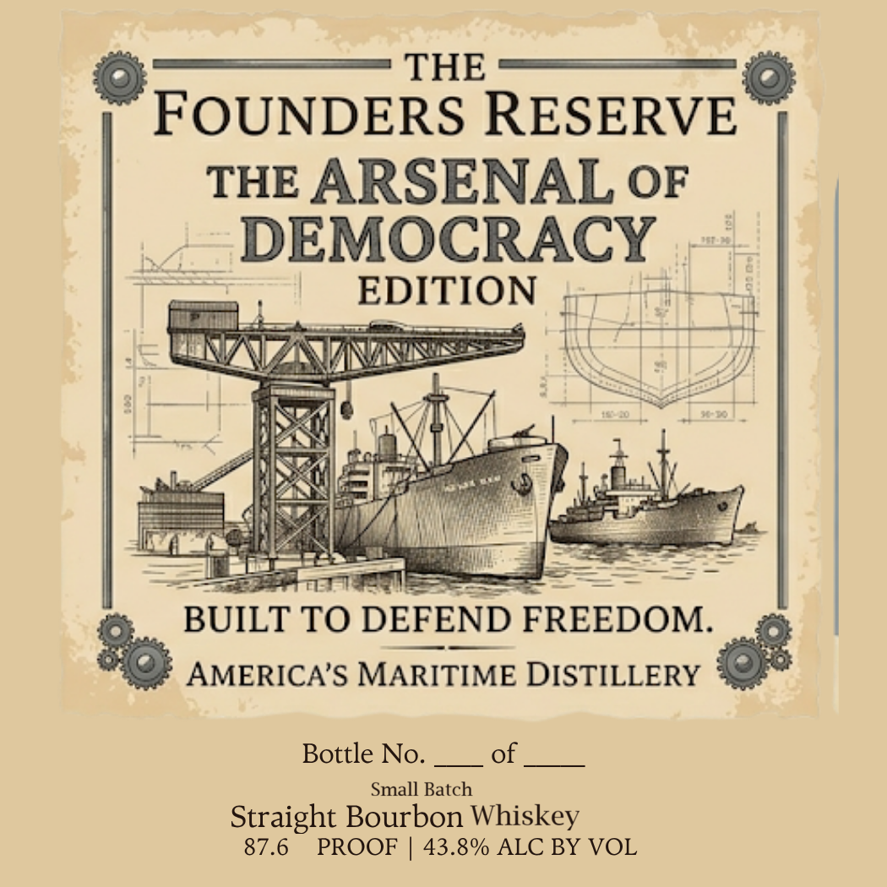

# TTB COLA Label Images - TTBID 26146001000838

**Brand Name:** AMERICA'S MARITIME DISTILLERY

**Issue Date:** 06/08/2026

**Origin Code:** 14

**Product Class/Type:** 101

**Source:** [TTB Public COLA Registry](https://ttbonline.gov/colasonline/viewColaDetails.do?action=publicFormDisplay&ttbid=26146001000838)

## Label Images

### Back Label

### Front Label

## Extracted Label Text

*Text extracted via OCR - may contain errors*

**Detected Proof:** 87.6

### Back Label

14=
AMERICA'S MARITIME DISTILLERY
Founders Reserve Arsenal of Democracy Edition
During the darkest
of World War II, America's factories, shipyards, and workers united
with unmatched determination to supply the forces of freedom across the globe: President
Franklin D Roosevelt called the United States the
Arsenal of Democracy"
nation whose
industrial strength, courage, and sacrifice helped secure victory on land and sea_
Founders Reserve Arsenal of Democracy Edition honors the builders, sailors, soldiers, and
citizens whose relentless spirit carried liberty across the Atlantic and defended freedom when
the world needed it most.
Named under the banner of 1420 - inspired by the Atlantic voyages that helped usher in the
Age of Discovery
this bourbon reflects the same American values of resilience,
craftsmanship, and determination that forged a nation and defended it generations later.
Bold aromas of toasted grain, pipe tobacco, vanilla bean, and charred oak lead into
robust
palate of molasses, dark honey, roasted nuts, and cracked
Full-bodied and deeply
structured, this bourbon honors the grit, industry, and resilience of the generation that helped
defend
across the world.
Veteran-owned. Unmistakably American:
wWW.SoNol420.com
GOVERNMENT WARNING:
According to the Surgeon General,
women
should not drink alcoholic
beverages during pregnancy because
Produced and Bottled by
of the risk of birth defects. (2)
SoNo 1420 America' $
Consumption of alcoholic beverages
Maritime Distillery
impairs your ability to drive
car
Norwalk; CT
operate
machinery, and
cause
51461
00896
health problems_
750mL
days
spice:
liberty
may

### Front Label

THE
FOUNDERS RESERVE
THE ARSENAL OF
DEMOCRACY
EDITION
BUILT TO DEFEND FREEDOM.
AMERICA'S MARITIME DISTILLERY
Bottle No.
of
Small Batch
Straight Bourbon Whiskey
87.6
PROOF
43.8% ALC BY VOL
