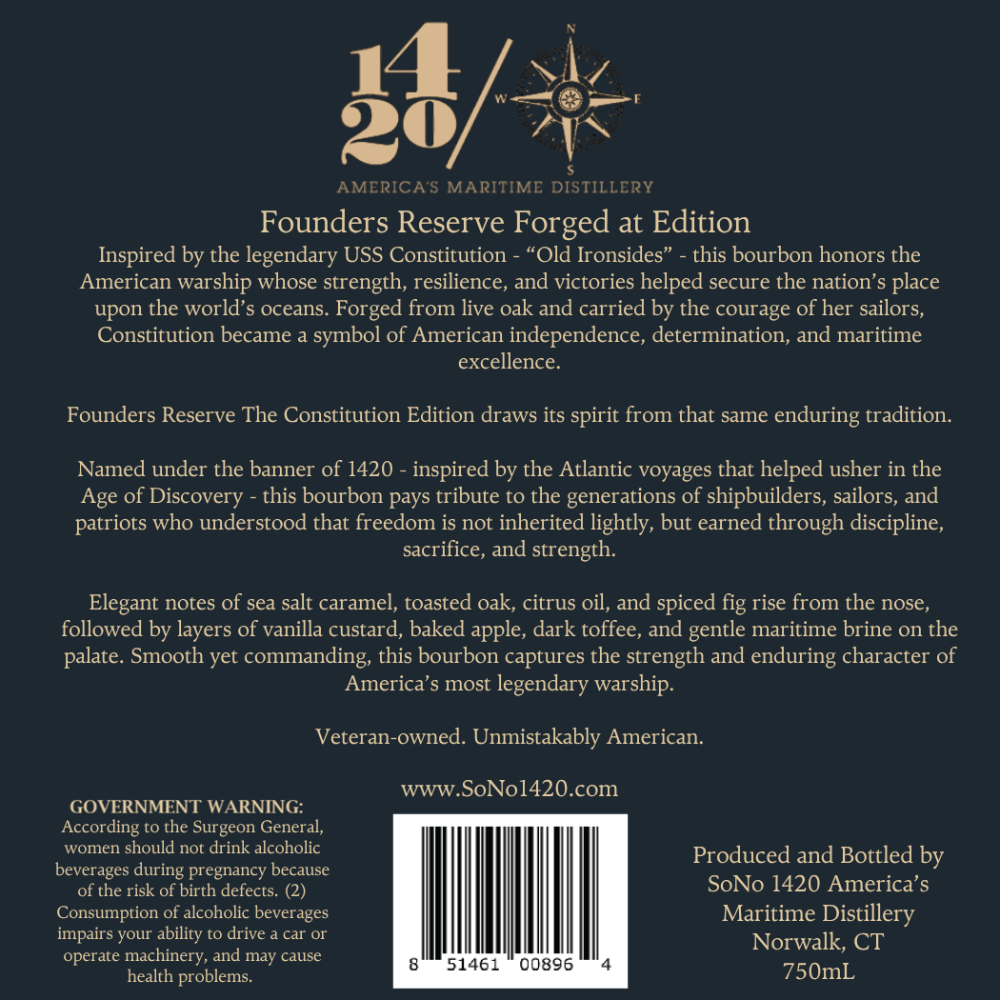
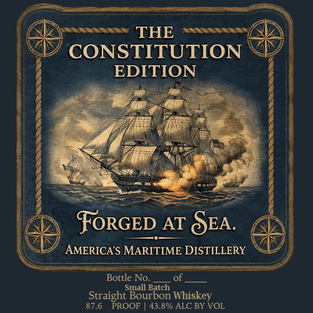

# TTB COLA Label Images - TTBID 26146001000841

**Brand Name:** AMERICA'S MARITIME DISTILLERY

**Issue Date:** 06/08/2026

**Origin Code:** 14

**Product Class/Type:** 101

**Source:** [TTB Public COLA Registry](https://ttbonline.gov/colasonline/viewColaDetails.do?action=publicFormDisplay&ttbid=26146001000841)

## Label Images

### Back Label

### Front Label

## Extracted Label Text

*Text extracted via OCR - may contain errors*

**Detected Proof:** 87.6

### Back Label

S

ie |

_—r

AYN

20

/

AMERICA’S MARITIME DISTILLE

Founders Reserve Forged at Edition

Inspired by the legendary USS Constitution - “Old Ironsides” - this bourbon honors the

American warship whose strength, resilience, and victories helped secure the nation’s place

upon the world’s oceans. Forged from live oak and carried by the courage of her sailors,

Constitution became a symbol of American independence, determination, and maritime

excellence.

Founders Reserve The Constitution Edition draws its spirit from that same enduring tradition.

Named under the banner of 1420 - inspired by the Atlantic voyages that helped usher in the

Age of Discovery - this bourbon pays tribute to the generations of shipbuilders, sailors, and

patriots who understood that freedom is not inherited lightly, but earned through discipline,

sacrifice, and strength.

Elegant notes of sea salt caramel, toasted oak, citrus oil, and spiced fig rise from the nose,

followed by layers of vanilla custard, baked apple, dark toffee, and gentle maritime brine on the

palate. Smooth yet commanding, this bourbon captures the strength and enduring character of

America’s most legendary warship.

Veteran-owned. Unmistakably American.

www.SoNol1420.com

GOVERNMENT WARNING:

According to the Surgeon General,

women should not drink alcoholic

beverages during pregnancy because

Produced and Bottled by

SoNo 1420 America’s

of the risk of birth defects. (2)

Consumption of alcoholic beverages

Maritime Distillery

impairs your ability to drive a car or

operate machinery, and may cause

Norwalk, CT

wih

750mL

health problems.

### Front Label

THE
CONSTITUTION
EDITION
FoRGED AT SEA.
AMERICA'S MARITIME DISTILLERY
Bottle No
Small Batch
Straight Bourbon Whiskey
87.6
PROOF
43.8%0 ALC BY VOL
