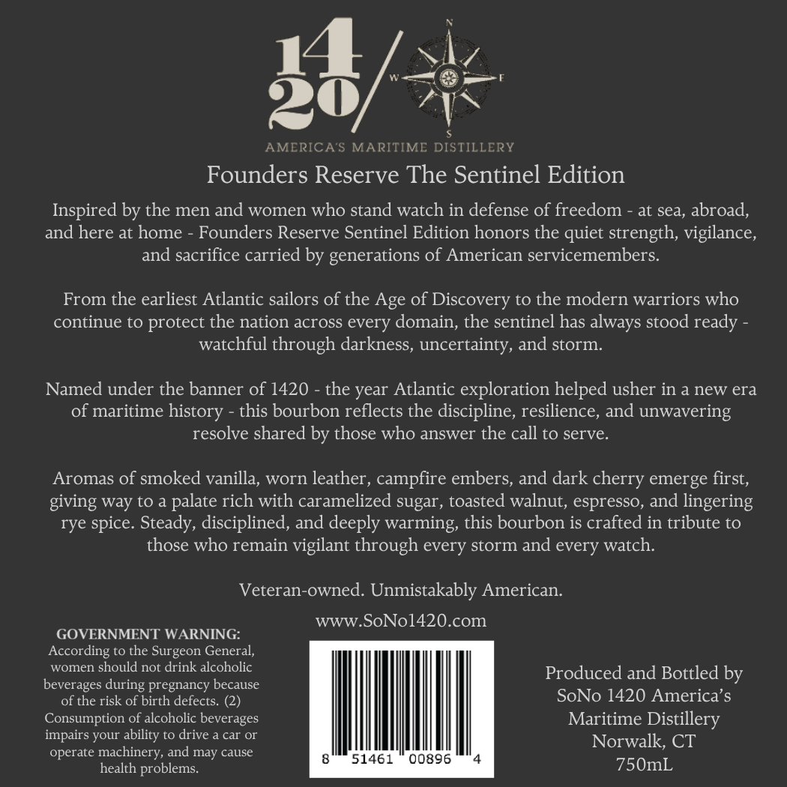
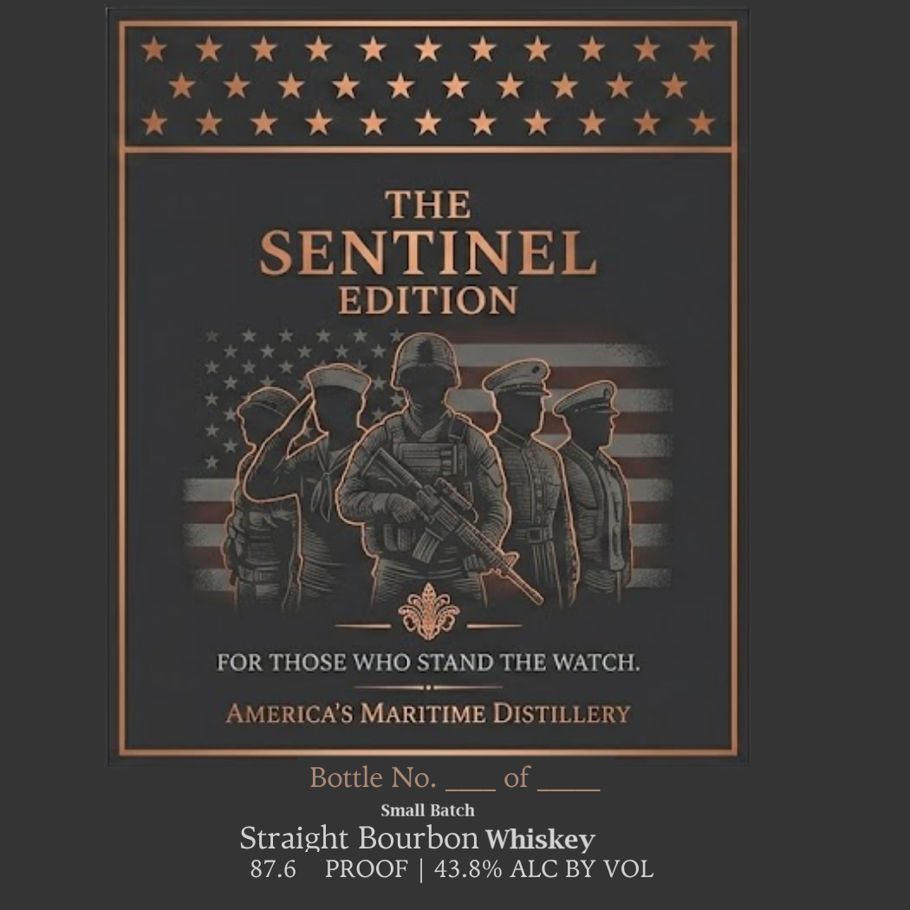

# TTB COLA Label Images - TTBID 26146001000843

**Brand Name:** AMERICA'S MARITIME DISTILLERY

**Issue Date:** 06/08/2026

**Origin Code:** 14

**Product Class/Type:** 101

**Source:** [TTB Public COLA Registry](https://ttbonline.gov/colasonline/viewColaDetails.do?action=publicFormDisplay&ttbid=26146001000843)

## Label Images

### Back Label

### Front Label

## Extracted Label Text

*Text extracted via OCR - may contain errors*

**Detected Proof:** 87.6

### Back Label

2
AMERICA'S MARITIME DISTILLERY
Founders Reserve The Sentinel Edition
Inspired by the men and women who stand watch in defense of freedom
at sea, abroad,
and here at home
Founders Reserve Sentinel Edition honors the quiet strength; vigilance,
and sacrifice carried by generations of American servicemembers:
From the earliest Atlantic sailors of the Age of Discovery to the modern warriors who
continue to protect the nation across every domain; the sentinel has always stood ready
watchful through darkness, uncertainty, and storm
Named under the banner of 1420
the year Atlantic
exploration helped usher in a new era
of maritime history
this bourbon reflects the discipline, resilience, and unwavering
resolve shared by those who answer the call to serve:
Aromas of smoked vanilla, worn leather ,
campfire embers, and dark
emerge first,
giving way to a
palate rich with caramelized sugar, toasted walnut, espresso, and lingering
rye spice. Steady, disciplined, and deeply warming, this bourbon is crafted in tribute to
those who remain vigilant through every storm and every watch:
Veteran-owned: Unmistakably American:
WWW
SoNol420.com
GOVERNMENT WARNING:
According to the Surgeon General,
women
should not drink alcoholic
Produced and Bottled by
beverages during pregnancy because
of the risk of birth defects.
SoNo 1420 America' $
Consumption of alcoholic beverages
Maritime Distillery
impairs your
drive & car Or
Norwalk; CT
operate
machinery, and
cause
51461
00896
health problems.
750mL
cherry
Yability
may

### Front Label

KKK Kok Kw KK Kk
zkKwKeKeKeKe KKK KK
Kaew KK Kw Kh K KKK

THE

SENTINEL

EPI

FOR THOSE WHO SLE THE WATCH.

AMERICA’S MARITIME DISTILLERY

Bottle No. __ of
Small Batch
Straight Bourbon Whiskey
87.6 PROOF | 43.8% ALC BY VOL
