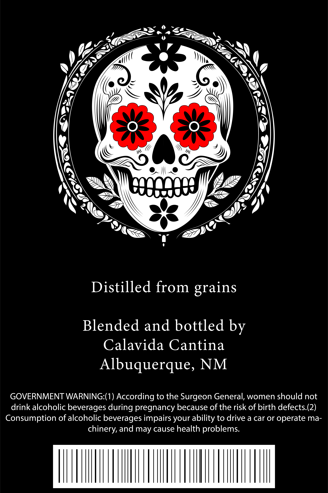
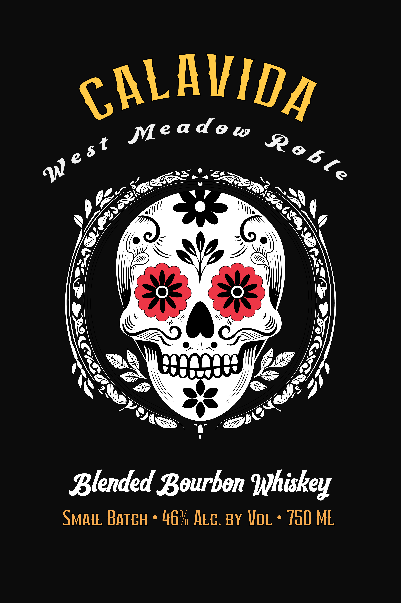

# TTB COLA Label Images - TTBID 26147001000007

**Brand Name:** WEST MEADOW ROBLE

**Issue Date:** 06/17/2026

**Origin Code:** 34

**Product Class/Type:** 131

**Source:** [TTB Public COLA Registry](https://ttbonline.gov/colasonline/viewColaDetails.do?action=publicFormDisplay&ttbid=26147001000007)

## Label Images

### Back Label

### Front Label

## Extracted Label Text

*Text extracted via OCR - may contain errors*

### Back Label

Distilled from grains

Blended and bottled by
Calavida Cantina
Albuquerque, NM

GOVERNMENT WARNING:(1) According to the Surgeon General, women should not
drink alcoholic beverages during pregnancy because of the risk of birth defects.(2)
Consumption of alcoholic beverages impairs your ability to drive a car or operate ma-
chinery, and may cause health problems.

### Front Label

cALAVIDA
Me a d e W
Blended Bourbon Ihiskey
SmalL Batch
469 Alc. BY HoL
750 ML
Reb [e
W e st
Desavi

1
