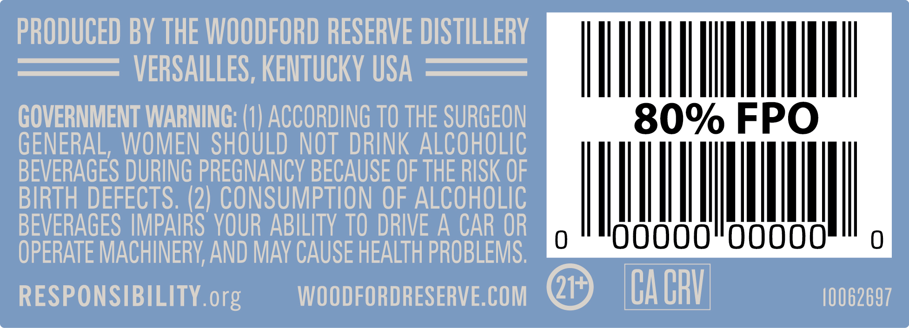
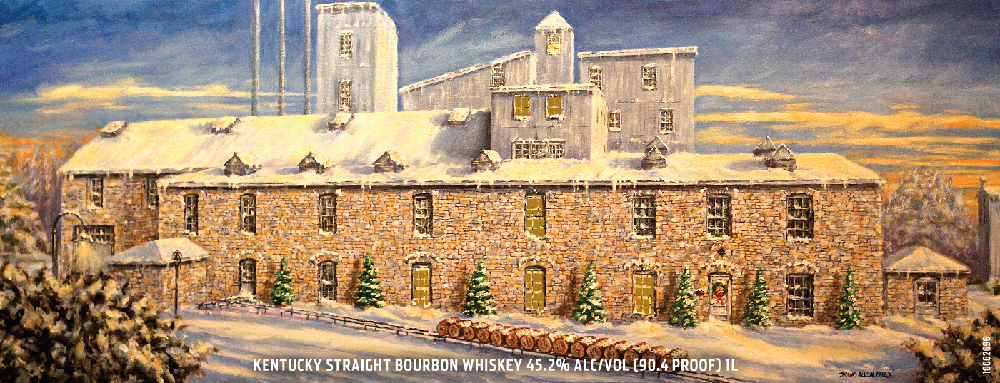
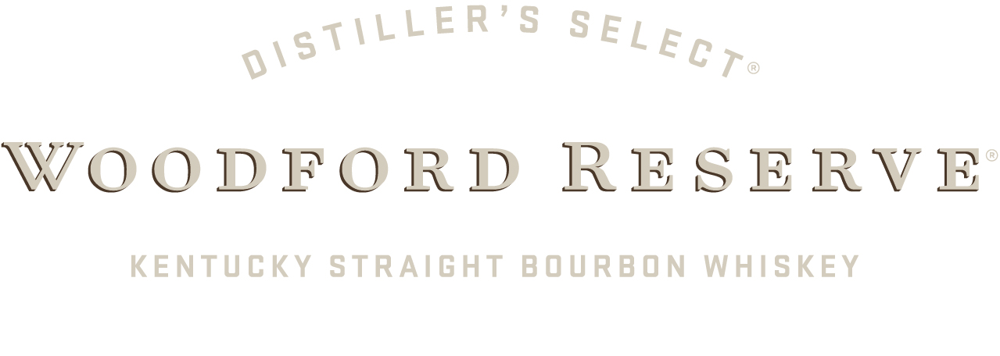

# TTB COLA Label Images - TTBID 26147001000129

**Brand Name:** WOODFORD RESERVE

**Fanciful Name:** HOLIDAY 2026

**Issue Date:** 06/01/2026

**Origin Code:** 22

**Product Class/Type:** 101

**Source:** [TTB Public COLA Registry](https://ttbonline.gov/colasonline/viewColaDetails.do?action=publicFormDisplay&ttbid=26147001000129)

## Label Images

### Back Label

### Front Label

### Label 1

### Label 4

### Label 5

## Extracted Label Text

*Text extracted via OCR - may contain errors*

*3 image(s) excluded: text did not meet readability threshold*

### Back Label

PRODUCED BY THE WOODFORD RESERVE DISTILLERY
VERSAILLES, KENTUCKY USA
GOVERNMENT WARNING: (1| ACCORDING TO THE SURGEON
80% FPO
GENERAL,  WOMEN  SHOULD NOT  DRINK ALCOHOLIC
BEVERAGES DURING PREGNANCY BECAUSE OF THE RISK OF
BIRTH DEFECTS. (2) CONSUMPTION OF ALCOHOLIC
BEVERAGES IMPAIRS YOUR ABILITY TO DRIVE A CAR OR
Joooo"ooooo
OPERATE MACHINERV AND MAv CAUSE HEALTH PROBLEMS;
RESPONSIBILITY.org
WOODFORDRESERVE.COM
21+
Ca CRV
10062697

### Label 1

WOODFORD RESERVE

KENTUCKY STRAIGHT BOURBON WHISKEY
