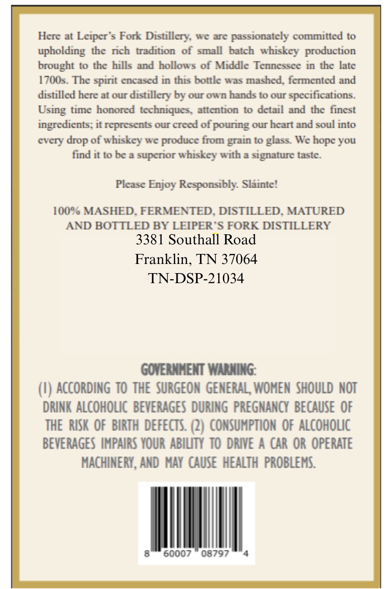
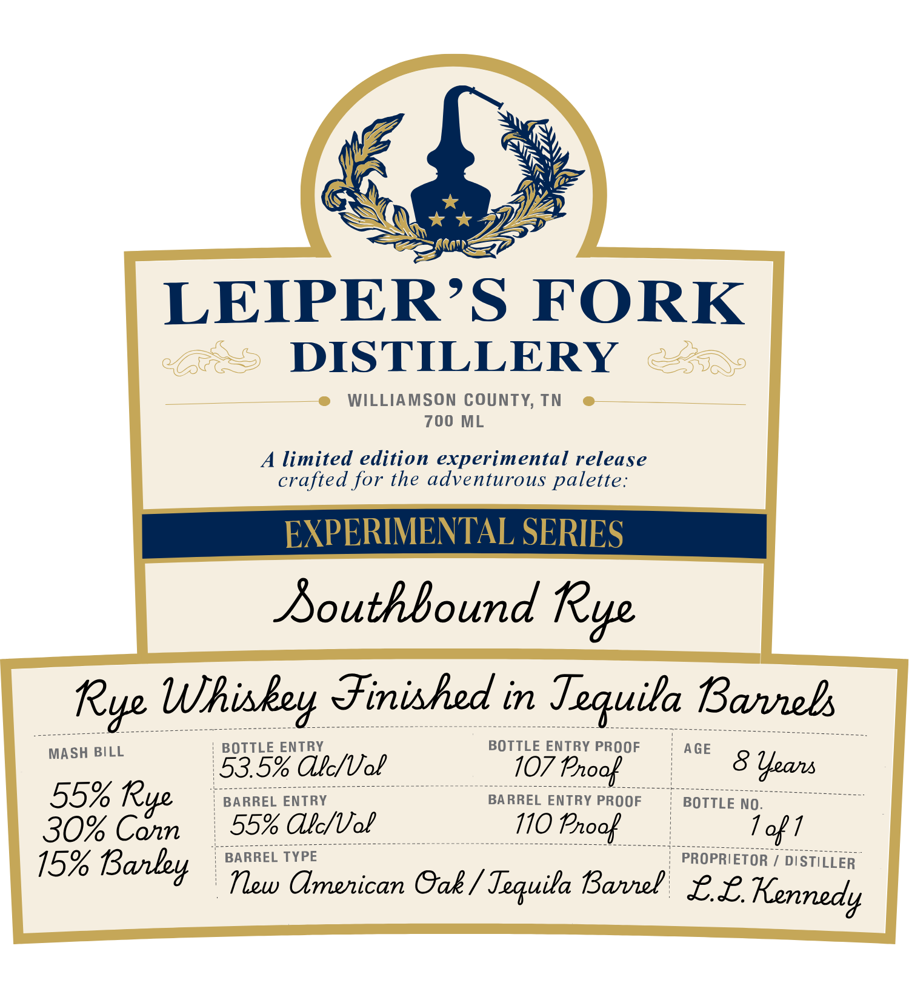

# TTB COLA Label Images - TTBID 26147001000393

**Brand Name:** LEIPER'S FORK DISTILLERY

**Fanciful Name:** SOUTHBOUND RYE

**Issue Date:** 06/05/2026

**Origin Code:** 43

**Product Class/Type:** 142

**Source:** [TTB Public COLA Registry](https://ttbonline.gov/colasonline/viewColaDetails.do?action=publicFormDisplay&ttbid=26147001000393)

## Label Images

### Back Label

### Label 1

## Extracted Label Text

*Text extracted via OCR - may contain errors*

**Detected Proof:** 110

### Back Label

Here at Leiper $ Fork Distillery We are passionately committed to
upholding the rich tradition of small
batch
whiskcy production
brought to thc hills and hollows of Middle Tennesscc in the late
1700s. The spint encased in this bottle was mashed fenented and
distilled here at our distillery by our own hands t0 our spccifications:
timc honorcd
techniques. attcntion to dctail and the finest
ingredicnts; it represcnts our crecd of pouring our hcart and soul into
cvcry
of whiskey we produce
t0 glass. We
you
find it t0 bc a
whiskcy with & signature taste.
Please Enjoy Responsibly Slainte!
100% MASHED. FERMENTED. DISTILLED. MATURED
AND BOTTLED BY LEIPER "$ FORK DISTILLERY
3381 Southall Road
Franklin, TN 37064
TN-DSP-21034
GOVERNHENT WARHING:
ACCORDING TO THE SURGEON GENERAL WOMEN  ShOULD NOT
DRINK ALCOHOLIC  BEVERAGES DURING  PREGNANCY  BECAUSE OF
THE  RISK OF   BIRTH  defeCTS: (2) CONSUMPTION OF alcohOLIC
BEVERAGES IMPAIRS YOUR ABIUTY  TO DRIVE A CAR OR OPERATE
MACHINERY, AND  MaY  cause heaLTh  PROBLEMS
60007
08797
Using
grain
hope
drop
from
supenor

### Label 1

XS

SX

SSN

LEIPER’S FORK

> DISTILLERY —=-..

WILLIAMSON COUNTY, TN

700

L

A limited edition experimental release

crafted for the adventurous palette:

ceeeeecennnee=

Rye Whiskey Finished in Tequila Barrebs

woecoceceeeaonessaeess eee (/ Sennen neennrnenanan

ne

BOTTLE ENTRY PROOF

MASH BILL

BOTTLE ENTRY

3.5% Ale/Vol

SLO

AGE

S Years

55% R

ee eee eee eee eee ee eee a a _ 7

BARREL ENTRY

BARREL ENTRY PROOF

BOTTLE NO.

ao

30% Cann

55% Ake/Vol

110 Proof

Boece ene ence eee eee nee en ene nen ene nen een en enenenenene cc ec enone

BARREL TYPE

es Y 7

PROPRIETOR / DISTILLER

15% Barley

Tew American Cak/ Tequila Bavel £L Kennedy
