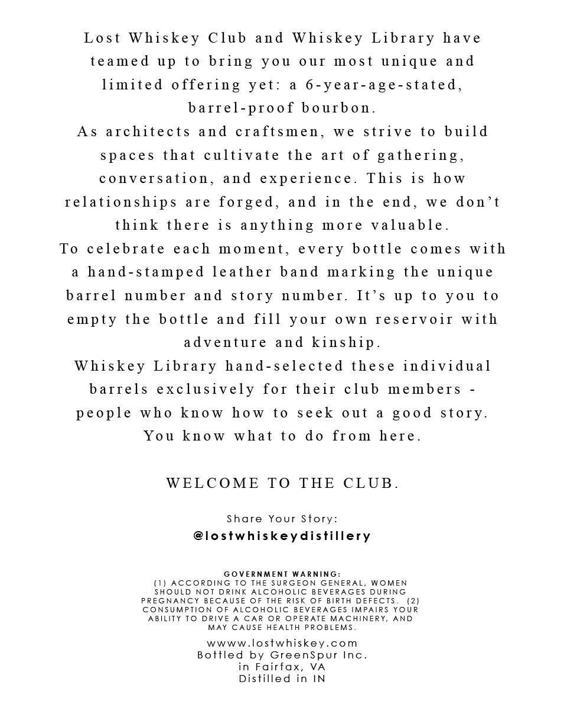
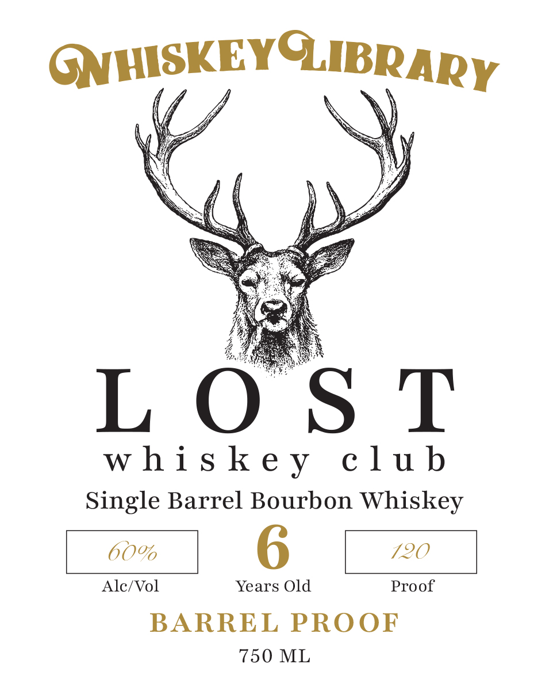

# TTB COLA Label Images - TTBID 26147001000495

**Brand Name:** LOST WHISKEY CLUB

**Issue Date:** 06/09/2026

**Origin Code:** 05

**Product Class/Type:** 141

**Source:** [TTB Public COLA Registry](https://ttbonline.gov/colasonline/viewColaDetails.do?action=publicFormDisplay&ttbid=26147001000495)

## Label Images

### Back Label

### Front Label

## Extracted Label Text

*Text extracted via OCR - may contain errors*

**Detected Proof:** 120

### Back Label

Lost Whiskey Club and Whiskey Library have

teamed up to bring you our most unique and

limited offering yet: a 6-year-age-stated,

barrel-proof bourbon.

As architects and craftsmen, we strive to build

spaces that cultivate the art of gathering,

conversation, and experience. This is how

relationships are forged, and in the end, we don’t

think there is anything more valuable.

To celebrate each moment, every bottle comes with

a hand-stamped leather band marking the unique

barrel number and story number. It’s up to you to

empty the bottle and fill your own reservoir with

adventure and kinship.

Whiskey Library hand-selected these individual

barrels exclusively for their club members -

people who know how to seek out a good story.

You know what to do from here

WELCOME TO THE CLUB.

Share Your Story:

@lostwhiskeydistillery

GOVERNMENT WARNING:

SHOULD NOT DRINK ALCOHOLIC BEVERAGES DURING

(1) ACCORDING TO THE SURGEON GENERAL, WOMEN

PREGNANCY BECAUSE OF THE RISK OF BIRTH DEFECTS

(2)

CONSUMPTION OF ALCOHOLIC BEVERAGES IMPAIRS YOUR

ABILITY TO DRIVE A CAR OR OPERATE MACHINERY, AND.

MAY CAUSE HEALTH PROBLEMS

wwww.lostwhiskey.com

Bottled by GreenSpur Inc.

in Fairfax, VA

Distilled in IN

### Front Label

GqHISKEG,

NERY

Ke

i) \

LOST

whiskey club

Single Barrel Bourbon Whiskey

60%

720

Alc/Vol

Years Old

Proof

BARREL PROOF

750 ML
