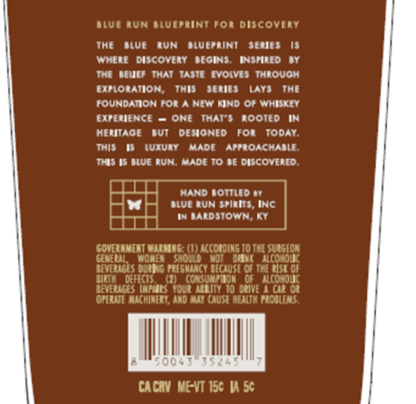
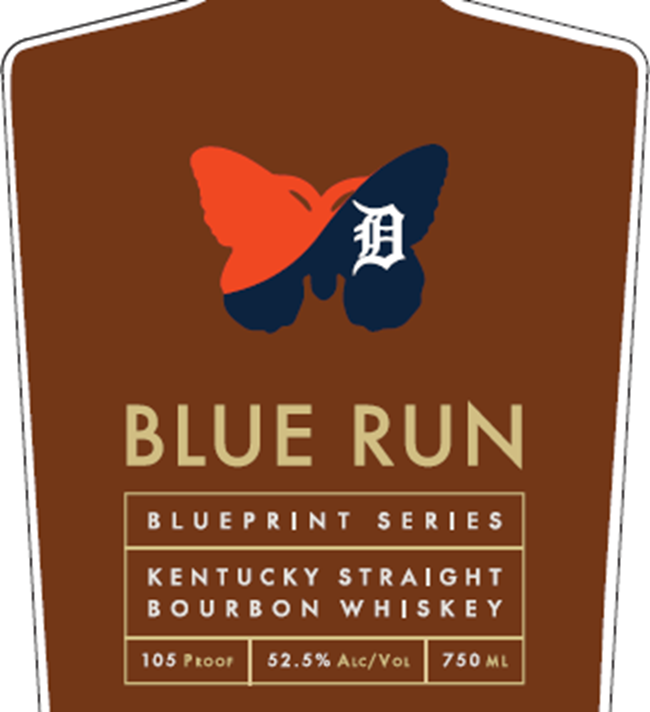

# TTB COLA Label Images - TTBID 26147001000506

**Brand Name:** BLUE RUN

**Issue Date:** 06/01/2026

**Origin Code:** 22

**Product Class/Type:** 101

**Source:** [TTB Public COLA Registry](https://ttbonline.gov/colasonline/viewColaDetails.do?action=publicFormDisplay&ttbid=26147001000506)

## Label Images

### Back Label

### Label 1

### Label 3

### Label 4

## Extracted Label Text

*Text extracted via OCR - may contain errors*

*1 image(s) excluded: text did not meet readability threshold*

### Back Label

BLUE RUN BLUEPRINT FOR DISCOVERY
THE BLUE RUN BLUEPRINT SERIES IS
WHERE DISCOVERY BEGINS. INSPIRED BY
THE BEWEF THAT TASTE EVOLVES THROUGH
EXPLORATION, THIS SERIES LAYS THE
FOUNDATION FOR A NEW KIND OF WHISKEY
EXPERIENCE = ONE THAT'S ROOTED IN
HERITAGE BUT DESIGNED FOR TODAY.
THIS IS LUXURY MADE APPROACHABLE.
THIS IS BLUE RUN. MADE TO BE DISCOVERED.

a HAND BOTTLED ay

He 4 BLUE RUN SPirits, INC

IN BARDSTOWN, KY

CITT
GOVERNMENT WARNING: (1) ACCORDING 10 THE SURGEON
GENERAL, WOMEN SHOULD NOT DFENK ALCOHOLIC
BEVERAGES DURING PREGKANCY BECAUSE OF THE RISK OF
BIRTH DEFECTS. (2) CONSUMPTION OF ALCOMOLIC
BEVERMGES IMPIRS YOUR AEBITY 10 ORIVE A CAR OR
OPERATE MACHINERY, ANO AMMY CAUSE HEALTH PROBLEMS

CACRY ME-VT 15¢ IA 5¢

### Label 1

Wn

BLUE RUN

BLUEPRINT SERIES

KENTUCKY STRAIGHT

BOURBON WHISKEY

105 Proor

52.5% Arc/Vou

750ML

### Label 4

125
Jice
Duai
YEars
125" AmtD[KSAIT mNE [uton TtLS
