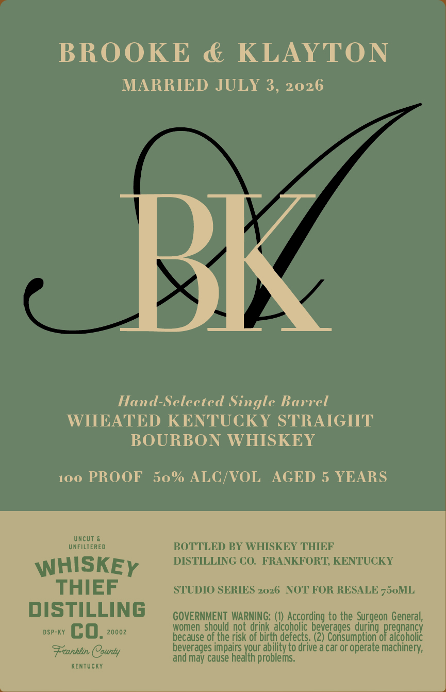
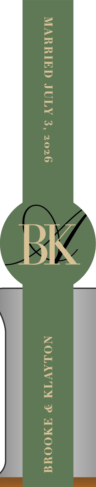

# TTB COLA Label Images - TTBID 26147001000575

**Brand Name:** WHISKEY THIEF DISTILLING CO.

**Fanciful Name:** BROOKE AND KLAYTON

**Issue Date:** 06/01/2026

**Origin Code:** 22

**Product Class/Type:** 101

**Source:** [TTB Public COLA Registry](https://ttbonline.gov/colasonline/viewColaDetails.do?action=publicFormDisplay&ttbid=26147001000575)

## Label Images

### Label 1

### Label 2

## Extracted Label Text

*Text extracted via OCR - may contain errors*

*1 image(s) excluded: text did not meet readability threshold*

**Detected Proof:** 100
**Detected Age:** 5 Years

### Label 1

BROOKE & KLAYTON

MARRIED JULY 3, 2026

Hand-Selected Single Barrel
WHEATED KENTUCKY STRAIGHT
BOURBON WHISKEY

100 PROOF 50% ALC/VOL AGED 5 YEARS

WHISKEy
THIEF

DISTILLING
DSP-KY G 0. 20002
Franklin County

KENTUCKY

BOTTLED BY WHISKEY THIEF
DISTILLING CO. FRANKFORT, KENTUCKY

STUDIO SERIES 2026 NOT FOR RESALE 750ML

GOVERNMENT WARNING: (1) According to the Surgeon General,
women should not drink alcoholic beverages during pregnancy
because of the risk of birth defects. (2) Consumption of alcoholic
beverages impairs ae ability to drive a car or operate machinery,
and may cause health problems.
