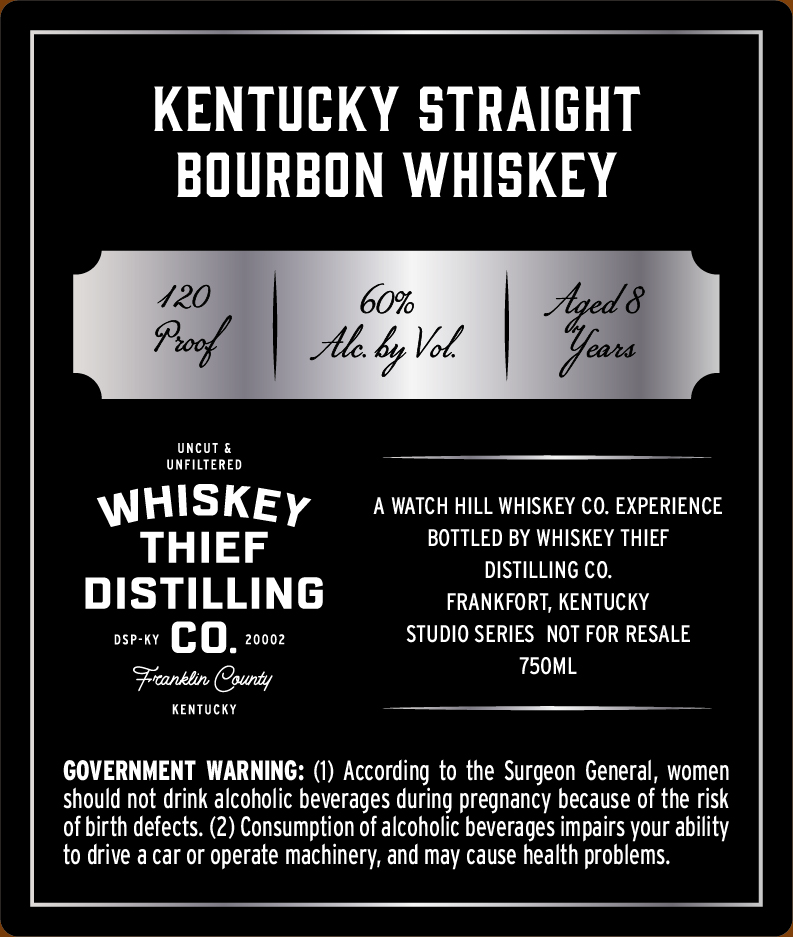
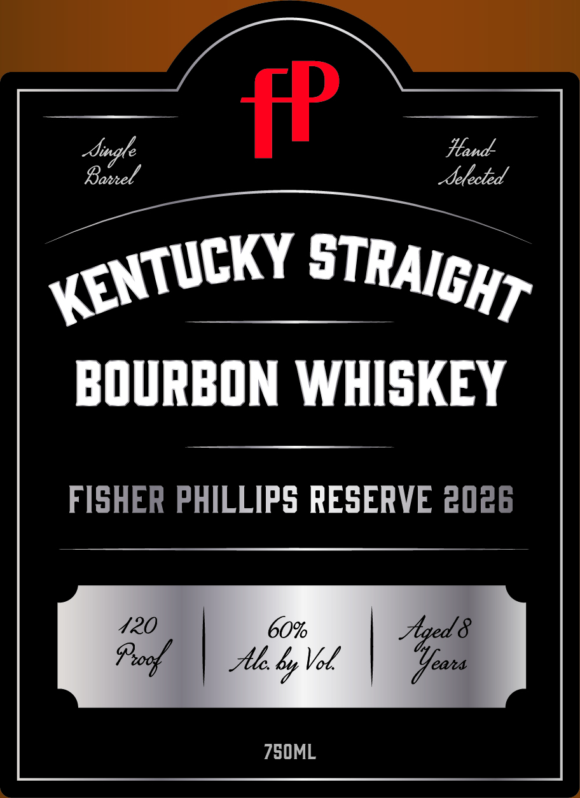

# TTB COLA Label Images - TTBID 26147001000583

**Brand Name:** WHISKEY THIEF DISTILLING CO.

**Fanciful Name:** FISHER PHILLIPS

**Issue Date:** 06/01/2026

**Origin Code:** 22

**Product Class/Type:** 101

**Source:** [TTB Public COLA Registry](https://ttbonline.gov/colasonline/viewColaDetails.do?action=publicFormDisplay&ttbid=26147001000583)

## Label Images

### Back Label

### Front Label

## Extracted Label Text

*Text extracted via OCR - may contain errors*

### Back Label

KENTUCKY STRAIGHT
BOURBON WHISKEY

UNFILTERED

WHISKEy A WATCH HILL WHISKEY CO. EXPERIENCE
THIEF BOTTLED BY WHISKEY THIEF

DISTILLING CO.

DISTI LLI NG FRANKFORT, KENTUCKY

ose-cy (OQ, 20002 STUDIO SERIES NOT FOR RESALE
Fiankin Oqunty 750ML

KENTUCKY

GOVERNMENT WARNING: (1) According to the Surgeon General, women
should not drink alcoholic beverages during pregnancy because of the risk
of birth defects. (2) Consumption of alcoholic beverages impairs your ability
to drive a car or operate machinery, and may cause health problems.

### Front Label

fP
BOURBON WHISKEY
FISHER PHILLIPS
ESERVE 2026
420
60
Aaed &
Proof
Alc
"
eaa
KENTUCKY
STRAIGHT
