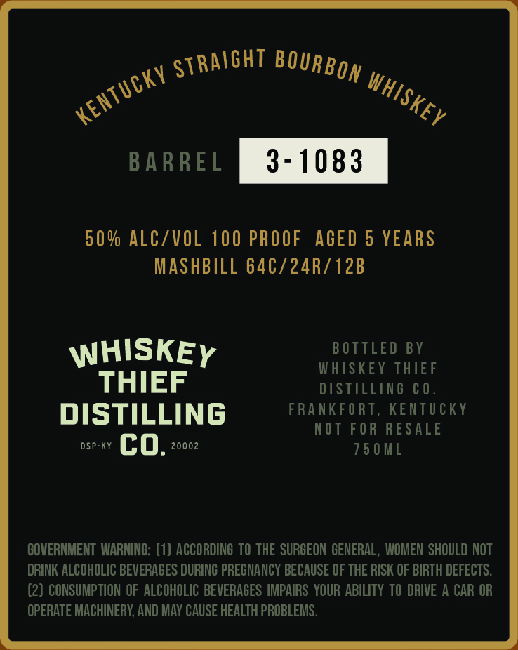
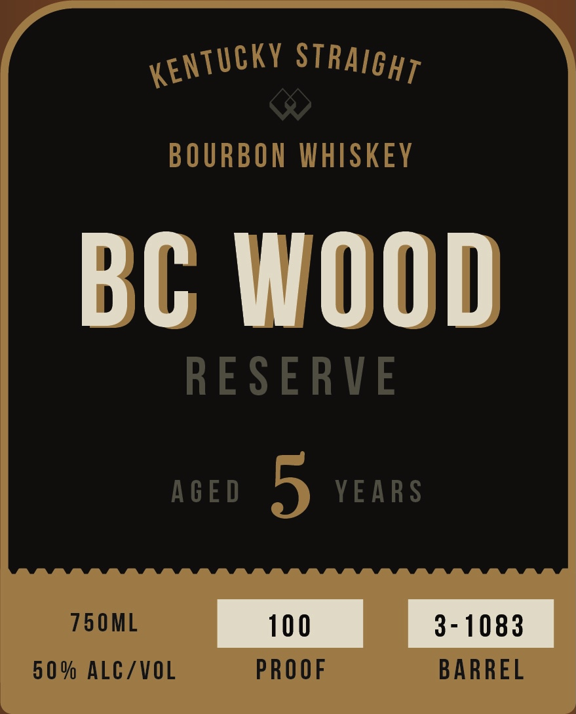

# TTB COLA Label Images - TTBID 26147001000591

**Brand Name:** WHISKEY THIEF DISTILLING CO.

**Fanciful Name:** BC WOOD

**Issue Date:** 06/01/2026

**Origin Code:** 22

**Product Class/Type:** 101

**Source:** [TTB Public COLA Registry](https://ttbonline.gov/colasonline/viewColaDetails.do?action=publicFormDisplay&ttbid=26147001000591)

## Label Images

### Back Label

### Front Label

## Extracted Label Text

*Text extracted via OCR - may contain errors*

**Detected Proof:** 100
**Detected Age:** 5 Years

### Back Label

BARREL
3 - 1083
50 % ALCZVOL 100 PROOF
AGED 5 YEARS
MASHBILL 64C/24R/12B
WHISKEY
B OTTLED BY
WHISKEY THIEF
THIEF
DISTILLING € 0
DISTILLING
FRANKF ORT, KENTUCKY
NOT FOR RESALE
DSP-KY
co.
20002
75 0 ML
COVERNMENT  WARNING: (1) ACCORDING TO THE SURGEON GENERAL,  WOMEN SHOULD NOT
DRINK ALCOHOLIC BEVERAGES DURING PRECNANCY BECAUSE OF THE RISK OF BIRTH DEFECTS:
(2) CONSUMPTION OF ALCOHOLIC BEVERAGES IMPAIRS YOUR ABILITY TO DRIVE A CAR OR
OPERATE MACHINERY; AND MAY CAUSE HEALTH PROBLEMS .
STRAIGHT
BOURBON
KenTucKV
WHISKEV

### Front Label

BOURBON WHISKEY
BC WOOD
RESERVE
AcE D
5
YEARS
750ML
100
3 - 1083
5 0 % ALCZVOL
PROOF
BARREL
KEnTUCKY
STRAIGHT
