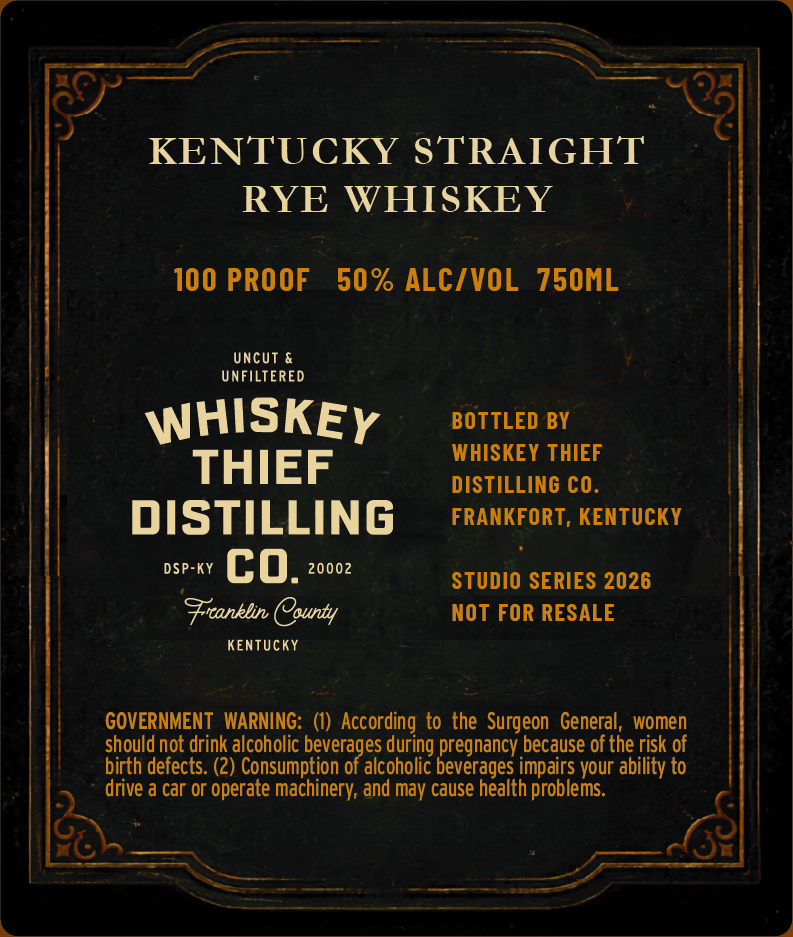
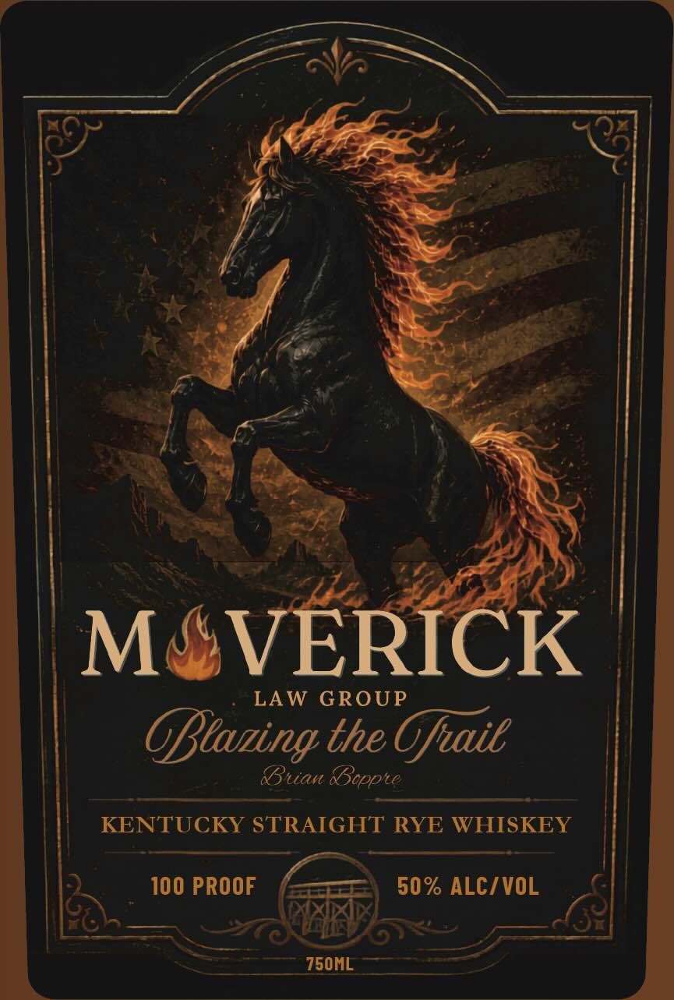

# TTB COLA Label Images - TTBID 26147001000595

**Brand Name:** WHISKEY THIEF DISTILLING CO.

**Fanciful Name:** MAVERICK

**Issue Date:** 06/01/2026

**Origin Code:** 22

**Product Class/Type:** 102

**Source:** [TTB Public COLA Registry](https://ttbonline.gov/colasonline/viewColaDetails.do?action=publicFormDisplay&ttbid=26147001000595)

## Label Images

### Back Label

### Front Label

## Extracted Label Text

*Text extracted via OCR - may contain errors*

**Detected Proof:** 100

### Back Label

KENTUCKY STRAIGHT
RYE WHISKEY
100 PROOF
50 % ALCIVOL
750ML
UncUt
UNFiLTERED
WHISKEY
BOTTLED BY
WHISKEY THIEF
THIEF
DISTILLING CO
DISTILLING
FRANKFORT, KENTUCKY
DSP-KY
co_
20002
STUDIO SERIES 2026
Frcanklin County
NOT FOR RESALE
KEnTUCKY
GOVERNMENT   WARNING:
According
the  Surgeon   General
women
should not drink alcoholic beverages during pregnancy because of the risk of
birth defects. (2) Consumption of alcoholic beverages impairs your ability to
drive a car or operate machinery; and may cause health problems

### Front Label

MAVERICK
LAW GROUP
OBtaning the Ofaie
RBuan &cppte
KENTUCKY STRAIGHT RYE WHISKEY
100 PROOF
50% ALCZVOL
750ML
