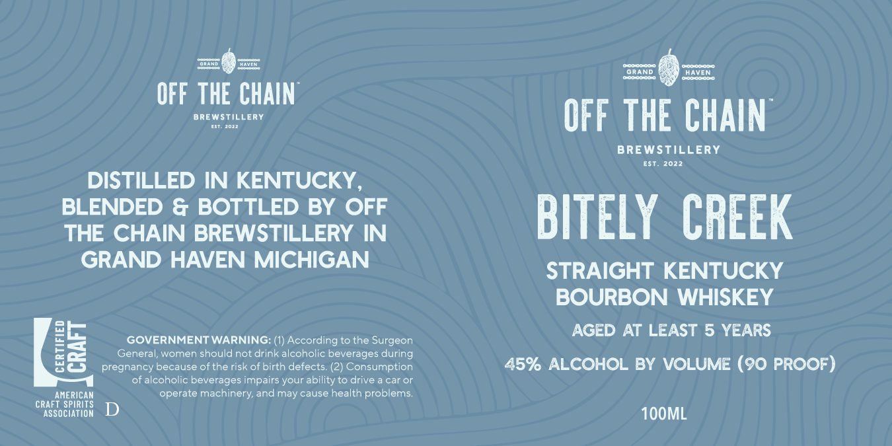

# TTB COLA Label Images - TTBID 26147001000628

**Brand Name:** BITLEY CREEK

**Issue Date:** 06/01/2026

**Origin Code:** 06

**Product Class/Type:** 141

**Source:** [TTB Public COLA Registry](https://ttbonline.gov/colasonline/viewColaDetails.do?action=publicFormDisplay&ttbid=26147001000628)

## Label Images

### Label 1

## Extracted Label Text

*Text extracted via OCR - may contain errors*

**Detected Proof:** 90
**Detected Age:** 5 Years

### Label 1

OMNd
I
E=
EDeaoaa
GRANd
HAVEN
Eeaea
OFF THE CHAIN
BREWSTIL
LERY
OFF THE CHAIN
BREWSTILLERY
EST
2022
DISTILLED IN KENTUCKY
BLENDED & BOTTLED BY OFF
BITELY  CREEK
THE CHAIN BREWSTILLERY IN
GRAND HAVEN MICHIGAN
STRAIGHT KENTUCKY
BOURBON
WHISKEY
AGED AT LEAST 5 YEARS
GOVERNMENT WARNING:
According to the Surgeon
05
General; women should not drink alcoholic beverages during
pregnancy because of the risk of birth defects: (2)
Consumption
45% ALCOHOL BY VOLUME (90 PROOF)
of alcoholic beverages impairs your ability to drive
caror
ANERICAN
operate machinery; and may cause health problems:
CRAFT SPIRITS
D
ASSOCIATION
1OOML
