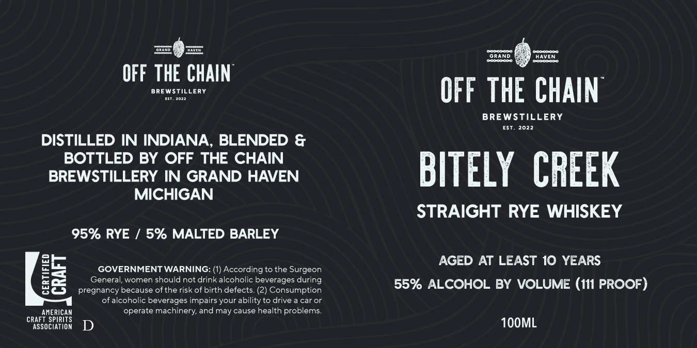

# TTB COLA Label Images - TTBID 26147001000634

**Brand Name:** BITLEY CREEK

**Issue Date:** 06/01/2026

**Origin Code:** 06

**Product Class/Type:** 102

**Source:** [TTB Public COLA Registry](https://ttbonline.gov/colasonline/viewColaDetails.do?action=publicFormDisplay&ttbid=26147001000634)

## Label Images

### Label 1

## Extracted Label Text

*Text extracted via OCR - may contain errors*

**Detected Proof:** 110
**Detected Age:** 10 Years

### Label 1

E=
Tee
GRAND
HAVEN
Tet=
Eeaeaa
OFF THE CHAIN
BREWSTILLERY
OFF THE CHAIN
BREWSTILLERY
EST
2022
DISTILLED IN INDIANA
BLENDED &
BOTTLED BY OFF THE CHAIN
BREWSTILLERY IN GRAND HAVEN
BITELY  CREEK
MICHIGAN
STRAIGHT RYE WHISKEY
95% RYE
5% MALTED BARLEY
AGED AT LEAST 10 YEARS
8
GOVERNMENT WARNING:
According to the Surgeon
General, women should not drink alcoholic beverages during
55% ALCOHOL BY VOLUME (111 PROOF)
pregnancy because of the risk of birth defects: (2) Consumption
of alcoholic beverages impairs your ability to drive
car Or
operate machinery; and may cause health problems.
RASSOCPARIOS
D
1OOML
FD
craf] PrICAN
