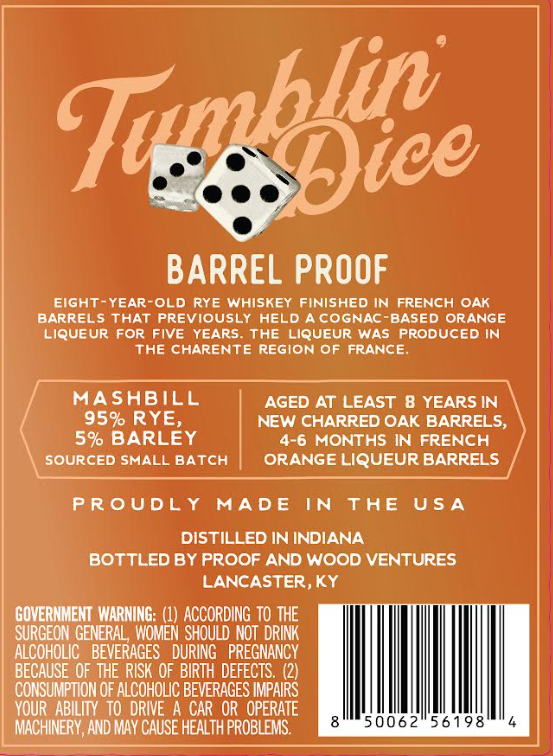
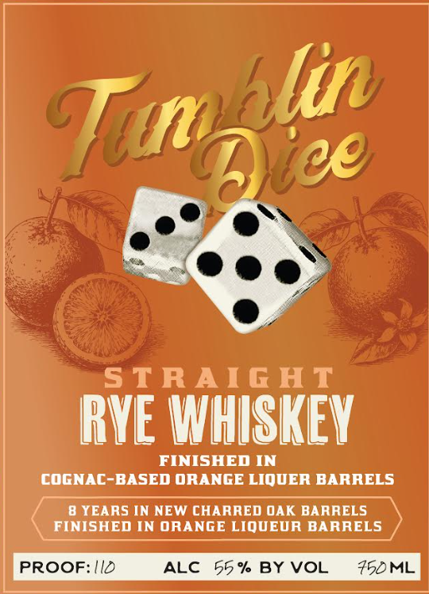

# TTB COLA Label Images - TTBID 26147001000659

**Brand Name:** TUMBLIN DICE

**Issue Date:** 06/01/2026

**Origin Code:** 22

**Product Class/Type:** 102

**Source:** [TTB Public COLA Registry](https://ttbonline.gov/colasonline/viewColaDetails.do?action=publicFormDisplay&ttbid=26147001000659)

## Label Images

### Back Label

### Front Label

## Extracted Label Text

*Text extracted via OCR - may contain errors*

**Detected Age:** 8 Years

### Back Label

Teepe

BARREL PROOF

EIGHT-YEAR-OLD RYE WHISKEY FINISHED IN FRENCH OAK
BARRELS THAT PREVIOUSLY HELD A COGNAC-BASED ORANGE
LIQUEUR FOR FIVE YEARS. THE LIQUEUR WAS PRODUCED IN
THE CHARENTE REGION OF FRANCE.

MASHBILL AGED AT LEAST 8 YEARS IN
95% RYE, NEW CHARRED OAK BARRELS,
5% BARLEY 4-6 MONTHS IN FRENCH

SOURCED SMALL BATCH | ORANGELIQUEUR BARRELS

PROUDLY MADE IN THE USA

DISTILLED IN INDIANA
BOTTLED BY PROOF AND WOOD VENTURES
LANCASTER, KY
GOVERNMENT WARNING: (1) ACCORDING TO THE
SURGEON GENERAL, WOMEN SHOULD NOT DRINK
ALCOHOLIC BEVERAGES DURING PREGNANCY
BECAUSE OF THE RISK OF BIRTH DEFECTS. (2)
CONSUMPTION OF ALCOHOLIC BEVERAGES IMPAIRS

YOUR ABILITY TO DRIVE A CAR OR OPERATE
MACHINERY, AND MAY CAUSE HEALTH PROBLEMS.

### Front Label

STRAIG HT
RvE WhSkEV
FINISHED IN
COGNAC-BASED ORANGE LIQUER BARRELS
8 YEARS IN NEW CHARRED OAK BARRELS
FINISHED IN ORANGE LIQUEUR BARRELS
PROOF: IID
ALC
55 % BY VOL
75DML
Tualic
