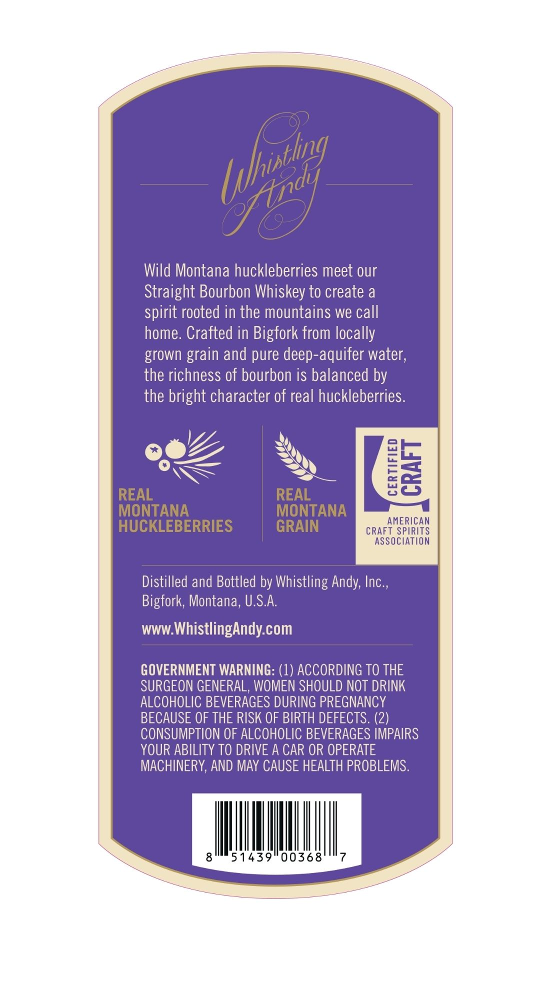
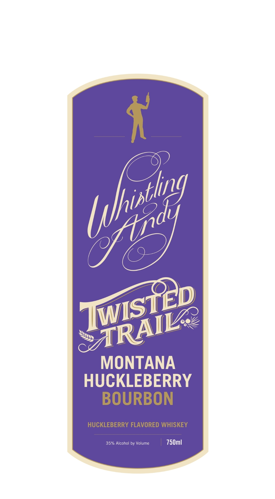
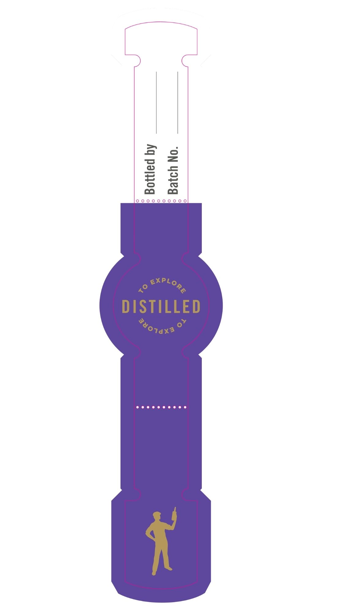

# TTB COLA Label Images - TTBID 26147001000714

**Brand Name:** WHISTLING ANDY

**Fanciful Name:** TWISTED TRAIL

**Issue Date:** 06/01/2026

**Origin Code:** 30

**Product Class/Type:** 149

**Source:** [TTB Public COLA Registry](https://ttbonline.gov/colasonline/viewColaDetails.do?action=publicFormDisplay&ttbid=26147001000714)

## Label Images

### Back Label

### Front Label

### Label 3

## Extracted Label Text

*Text extracted via OCR - may contain errors*

*1 image(s) excluded: text did not meet readability threshold*

**Detected Proof:** 70

### Back Label

dy
Wild Montana huckleberries meet our
Straight Bourbon Whiskey to create a
rooted in the mountains we call
home. Crafted in Bigfork from locally
grown
and pure deep-aquifer water,
the richness of bourbon is balanced by
the bright character of real huckleberries.
REAL
REAL
8a
MONTANA
MONTANA
AMERICAN
HUCKLEBERRIES
GRAIN
CRAFT SPIRITS
association
Distilled and Bottled by Whistling Andy; Inc ,
Bigfork; Montana, U.SA
WWW Whistlingandy com
GOVERNMENT WARNING: (1) ACCORDING TO THE
SURGEON GENERAL, WOMEN SHOULD NOT DRINK
ALCOHOLIC BEVERAGES DURING PREGNANCY
BECAUSE OF THE RISK OF BIRTH DEFECTS: (2)
CONSUMPTION OF ALCOHOLIC BEVERAGES IMPAIRS
YOUR ABILITY TO DRIVE A CAR OR OPERATE
MACHINERY, AND May CAUSE HEALTH PROBLEMS:
8
51439"00368
7
thhisthng
spirit
grain

### Front Label

MONTANA
HUCKLEBERRY
BOURBON
HUCKLEBERRY FLAVORED WHISKEY
35% Alcohol by Volume
750ml
[xthisthng
Ztdy
TWISTED
~RAIL
