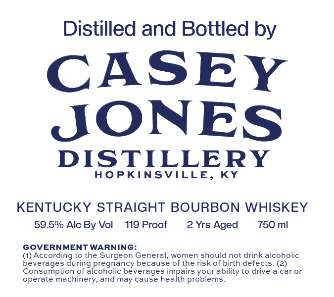
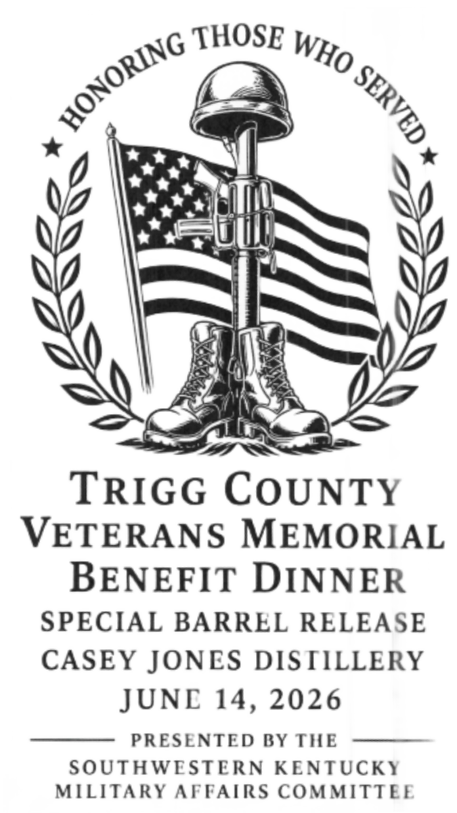

# TTB COLA Label Images - TTBID 26147001000781

**Brand Name:** CASEY JONES DISTILLERY

**Issue Date:** 06/02/2026

**Origin Code:** 22

**Product Class/Type:** 101

**Source:** [TTB Public COLA Registry](https://ttbonline.gov/colasonline/viewColaDetails.do?action=publicFormDisplay&ttbid=26147001000781)

## Label Images

### Back Label

### Front Label

## Extracted Label Text

*Text extracted via OCR - may contain errors*

**Detected Proof:** 119
**Detected Age:** 2 Years

### Back Label

Distilled and Bottled by
CASEY
JONES
DISTILLERY
HOPKINSVILLE,
KY
KENTUCKY STRAIGHT BOURBON WHISKEY
59.5% Alc By Vol
119 Proof
2 Yrs Aged
750 ml
GOVERNMENTWARNING:
(1) According to the Surgeon General, women should not drink alcoholic
beverages
pregnancy because of the risk of birth defects. (23
Consumption of alcoholic beverages impairs your ability to drive a car or
operate machinery; and may cause health problems
during

### Front Label

TRIGG COUNTY
VETERANS MEMORIAL

BENEFIT DINNER
SPECIAL BARREL RELEASE
CASEY JONES DISTILLERY

JUNE 14, 2026

PRESENTED BY THE
SOUTHWESTERN KENTUCKY
MILITARY AFFAIRS COMMITTEE
