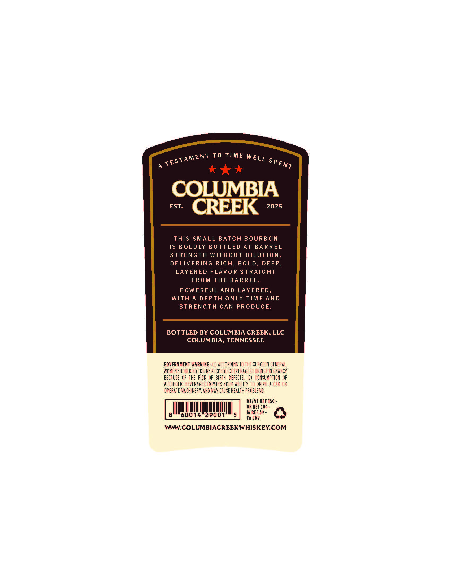
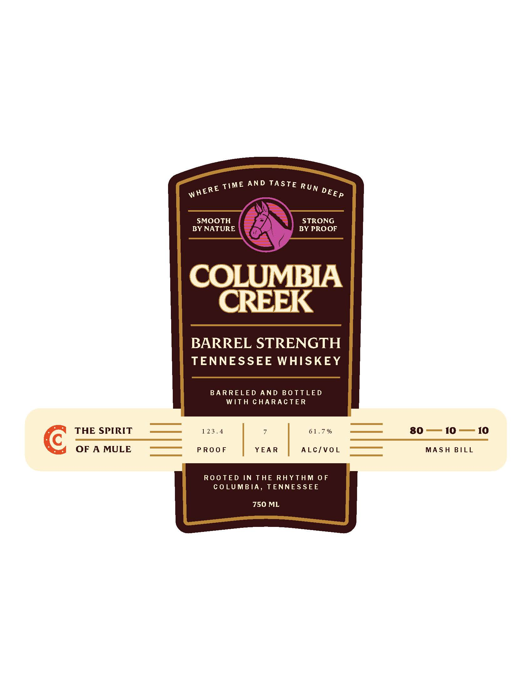

# TTB COLA Label Images - TTBID 26147001000794

**Brand Name:** COLUMBIA CREEK

**Fanciful Name:** COLUMBIA CREEK BARREL STRENGTH TENNESSEE WHISKEY

**Issue Date:** 06/01/2026

**Origin Code:** 43

**Product Class/Type:** 140

**Source:** [TTB Public COLA Registry](https://ttbonline.gov/colasonline/viewColaDetails.do?action=publicFormDisplay&ttbid=26147001000794)

## Label Images

### Back Label

### Front Label

### Label 2

## Extracted Label Text

*Text extracted via OCR - may contain errors*

### Back Label

To TIME
COLUMBIA
EST:
CREEK
2025
ThIS SMALL BATCH BOURBON
IS BOLDLY BOTTLED AT BARREL
STRENGTH Without DILUTION
DELIVERING RICH, BOLD, DEEP,
LAYERED FLAVOR STRAIGHT
FROM THE BARREL_
POWERFUL AND LAYERED ,
WITH A DEPTH ONLY TIME AND
STRENGTH CAN PRODUCE.
BOTTLED BY COLUMBIA CREEK, LLC
COLUMBIA, TENNESSEE
GOVERNMENT WARNING: (1) ACCORDING TO the SURGEON GENERAL,
WOMEN SHOULD NOT DRINKAlcoholicbeverages DURINGPREGNANCY
BECAUSE   OF ThE RISK OF BIRTH  defects, (2)   CONSUMPTION OF
Alcoholic BEVERAGES VMPAIRS YOUR ABILITY to DRIVE A CAR OR
opeRate MAChNERY, AND MAY cause health PROBLeMS.
MEIVT REF I5c -
OR REF 10c_
IA REF 5c
8
60014"29001
5
ca CRV
WCOLUMBIACREEKWHISKEYCOM
TESTAMENT
WELL
SPENT

### Front Label

AND
TASTE
SMOOTH
STRONG
BY NATURE
BY PROOF
COLUMBIA
CREEK
BARREL STRENGTH
TENNESSEE WHISKEY
BARRELED AND BO TTLED
WITH
CHARACTER
THE SPIRIT
1 23.4
61 . 7 %
80
I0
10
OF A MULE
PROoF
YEA R
ALC/VO L
MAs H
BILL
Roo TED IN THE RHYTHM 0 F
COLUMB IA ,
TENNES SEE
750 ML
TIME
RUN
WHERE
DEEP

### Label 2

COLUMBIA CREEK
LET
IT RUN
DEEP
TENNESSEE WHISKEY
