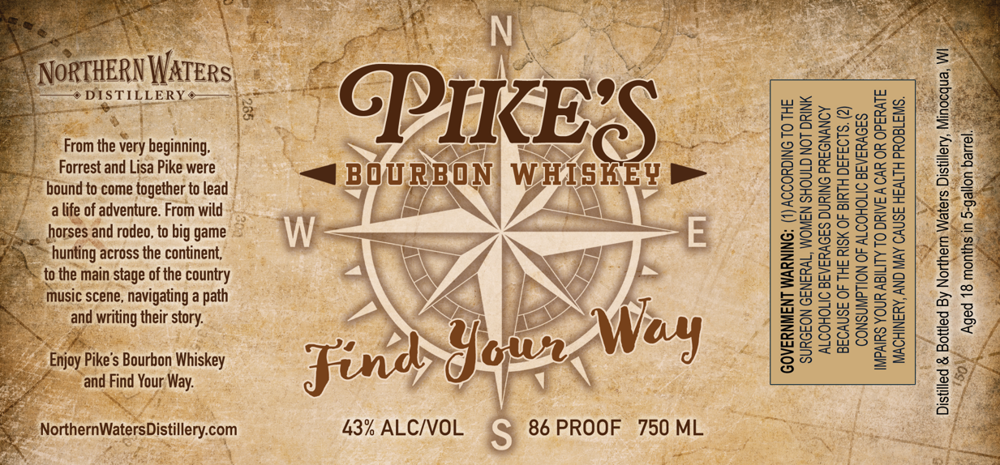

# TTB COLA Label Images - TTBID 26147001000816

**Brand Name:** PIKE'S

**Issue Date:** 06/01/2026

**Origin Code:** 48

**Product Class/Type:** 141

**Source:** [TTB Public COLA Registry](https://ttbonline.gov/colasonline/viewColaDetails.do?action=publicFormDisplay&ttbid=26147001000816)

## Label Images

### Label 1

## Extracted Label Text

*Text extracted via OCR - may contain errors*

### Label 1

“ * Chace
From the very beginning,
Forrest and Lisa Pike were
jound to come together to lead |
a life of adventure. From wild
horses and rodeo, to big game
hunting across the continent,
= to the main stage of the country
pass. ee
lusic scene, navigating a path
and writing their story.

SURGEON GENERAL, WOMEN SHOULD NOT DRINK |.
ALCOHOLIC BEVERAGES DURING PREGNANCY
BECAUSE OF THE RISK OF BIRTH DEFECTS. (2)

CONSUMPTION OF ALCOHOLIC BEVERAGES
IMPAIRS YOUR ABILITY TO DRIVE A CAR OR OPERATE
MACHINERY, AND MAY CAUSE HEALTH PROBLEMS.

GOVERNMENT WARNING: (1) ACCORDING TO THE

Wjoy Pike's Bourbon Whiskey
and Find Your Way.

NorthernWat
,
