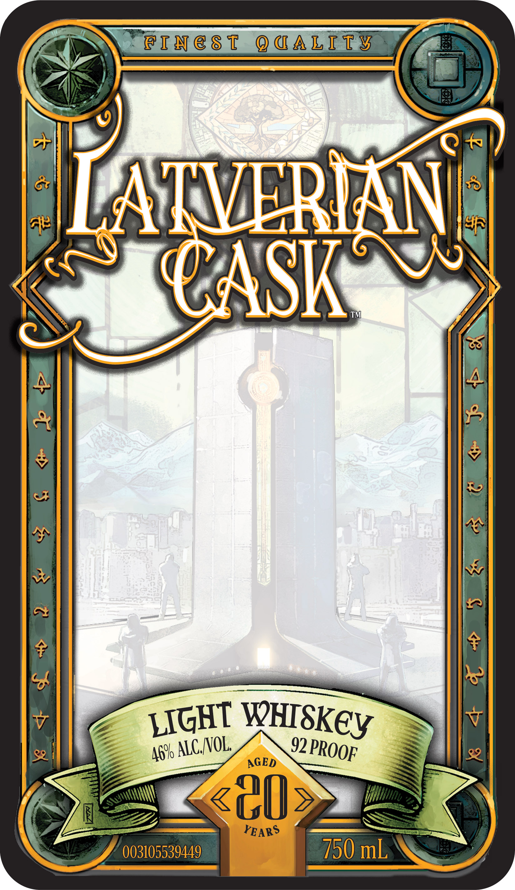
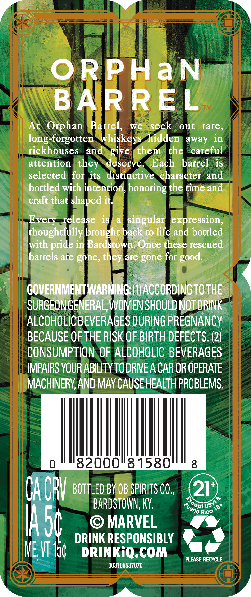
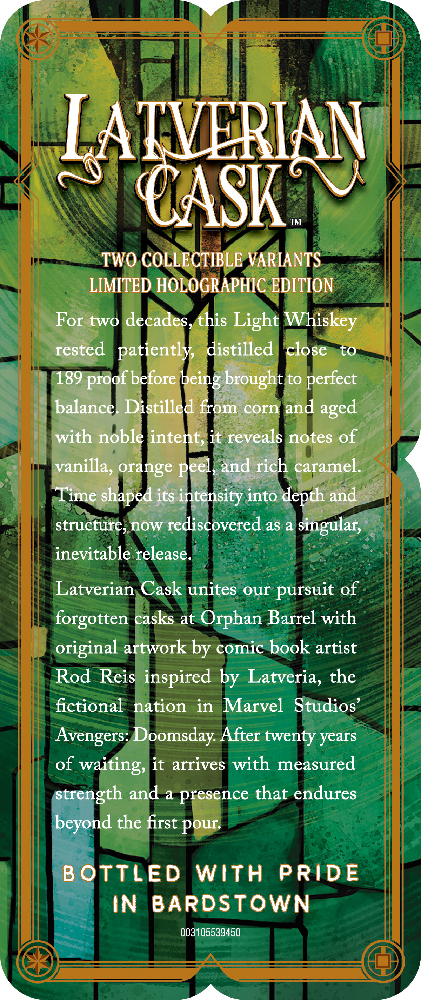
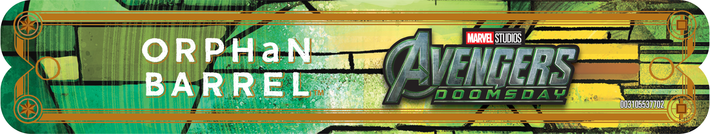

# TTB COLA Label Images - TTBID 26147001000851

**Brand Name:** LATVERIAN CASK

**Fanciful Name:** ORPHAN BARREL

**Issue Date:** 06/02/2026

**Origin Code:** 22

**Product Class/Type:** 144

**Source:** [TTB Public COLA Registry](https://ttbonline.gov/colasonline/viewColaDetails.do?action=publicFormDisplay&ttbid=26147001000851)

## Label Images

### Front Label

### Label 2

### Label 3

### Label 4

## Extracted Label Text

*Text extracted via OCR - may contain errors*

*1 image(s) excluded: text did not meet readability threshold*

**Detected Proof:** 92

### Front Label

@iN e 8 1
Q @A LITy
8s
T4
LATVERMNI
CASK
TM
4
4
~
1
8
V
92
AGED
YEARS
003105539449
750 mL
LIGHT
WHISKey
ALC NOL
PROOF
46%

### Label 2

ORPPHaN
BAR REL
TM
At
Orphan
Barrel
we
seek
out
fare,
-forgotten 'whiskeys hidden
away in
Iickhouses
and
give
them
the
careful
attention
deserve
Each
barrel
is
selected
for its distinctive
character and
bottled with intention} honoring the time and
craft that shaped it
Every -release
is
a
singular  expression;
thoughtiully brought back to life and bottled
with
in  Bardstown; Once these rescued
barrels are gone,
are' gone for
COVERNMENTWARNING (HACCORDING TO THE
SURGEON GENERAL, WOMEN SHOULD NOTDRINK
ALCOHOLICBEVERAGES DURING PREGNANCY
BECAUSE OF THE RISK OF BIRTH DEFECTS: (2)
CONSUMPTION OF ALCOHOLIC BEVERAGES
IMPAIRS YOUR ABILITY TODRIVE A CAR OR OPERATE
MACHINERY,AND MAY CAUSE HEALTH PROBLEMS
82000"81580"
8
Oa CRV
BOTTLED BY OB SPIRITS CO ,
21
9
BARDSTOWN;, KY;
Rico
IAsc
MARVEL
DRINK RESPONSIBLY
ME VT I5
DRINKiQ.COM
PLEASE RECYCLE
003105537070
long-
they
pride
they
good.
excepi [
'UsV
Puerto
18+

### Label 3

LATVERIAN
CASK
TM
TWO COLLECTIBLE VARIANTS
LIMITED HOLOGRAPHIC EDITION
For two decades,this Light Whiskey
rested  patiently
distilled
close
to
189
'before
brought to
balance. Distilled from
corn
and
with nobleintent;it reveals notes of
vanilla, orange
and rich caramel:
Time shaped its intensity into depth and
structure
now rediscovered as a
Singular
inevitable release_
Latverian Cask unites our pursuit of
forgotten casks at Orphan Barrel with
original artwork by comic book artist
Rod
Reis inspired by Latveria, the
fictional
nation
in
Marvel
Studios
Avengers: Doomsday After twenty years
of
waiting, it arrives with measured
strength and a presence that endures
beyond the first pour
B OTTLED
With
PRIdE
IN
BARDSTOWN
003105539450
proof =
peing
perfect
aged
Peel
