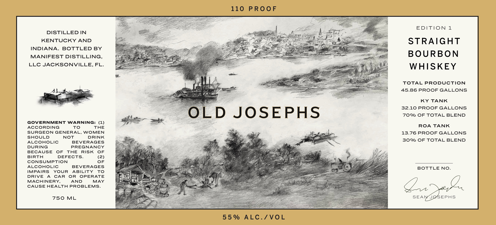

# TTB COLA Label Images - TTBID 26147001000877

**Brand Name:** OLD JOSEPHS

**Fanciful Name:** EDITION 1

**Issue Date:** 06/16/2026

**Origin Code:** 16

**Product Class/Type:** 101

**Source:** [TTB Public COLA Registry](https://ttbonline.gov/colasonline/viewColaDetails.do?action=publicFormDisplay&ttbid=26147001000877)

## Label Images

### Front Label

### Label 2

## Extracted Label Text

*Text extracted via OCR - may contain errors*

*1 image(s) excluded: text did not meet readability threshold*

**Detected Proof:** 110

### Front Label

110
PROoF
EDITION 1
DISTILLED IN
KENTUCKY AND
STRAIGHT
INDIANA.
BOTTLED BY
MANIFEST DISTILLING,
BOURBON
LLC JACKSONVILLE,
FL_
WHISKEY
TOTAL
PRODUCTION
45.86 PROOF GALLONS
KY
TANK
32.10 PROOF GALLONS
OLD
JOSEPHS
70% OF TOTAL BLEND
GOVERNMENT WARNING:
(1)
ACCORDING
To
THE
ROA
TANK
SURGEON GENERAL, WOMEN
13.76PROOF GALLONS
SHOULD
NOT
DRINK
30%/ OF TOTAL BLEND
ALCOHOLIC
BEVERAGES
DURING
PREGNANCY
BECAUSE
OF
THE
RISK
OF
BIRTH
DEFECTS_
(2)
CONSUMPTION
OF
ALCOHOLIC
BEVERAGES
BOTTLE NO_
IMPAIRS
YOUR
ABILITY
To
DRIVE
A
CAR
OR
OPERATE
MACHINERY,
AND
MAY
CAUSE HEALTH PROBLEMS
750
ML
SEANJOSEPHS
5 5 %
ALC./VOL
