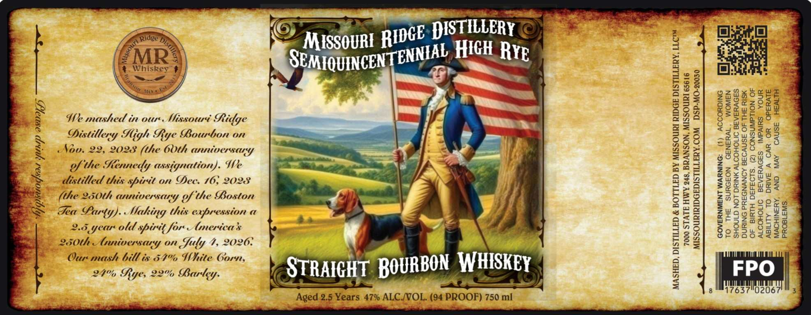

# TTB COLA Label Images - TTBID 26147001000893

**Brand Name:** SEMIQUINCENTENNIAL HIGH RYE STRAIGHT BOURBON WHISKEY

**Issue Date:** 06/02/2026

**Origin Code:** 29

**Product Class/Type:** 101

**Source:** [TTB Public COLA Registry](https://ttbonline.gov/colasonline/viewColaDetails.do?action=publicFormDisplay&ttbid=26147001000893)

## Label Images

### Label 1

## Extracted Label Text

*Text extracted via OCR - may contain errors*

**Detected Proof:** 94
**Detected Age:** 2.5 Years

### Label 1

aN
yx

~

8
S

He
Ss
mS

We mashed in our. Missout Ridge
Distillery High Rye Bourbon on
Nov. 22, 2028 (the 60th anniversary
of the Kennedy assignation). We
distilled this spuct on Dee. 16; 2028
(the 250th anniversary of the Boston
Tea Party). Making this expression a
2.5 year old s spirit for. (mericas
250th Anniversars LY on Suly 4, 2026:
Our mash bill is 59% White Corn,
24% § hye, 22% Bar <Y-

“G> — > >
G*, M
sgoun! RIDE ICH
RSEMIQUINCENTE EMMA H RYE

@ RIGHT BOURBON WHISKEY ”

—— —

Aged 2.5 = 47% ALC/VOL. (94 PROOF) 750 mi

DEE DISTILLERY <

MASHED, DISTILLED & BOTTLED BY MISSOURI RIDGE DISTILLERY, LLC™

7000 STATE HWY 248, BRANSON, MISSOURI 65616
MISSOURIRIDGEDISTILLERY.COM DSP-MO-20030

8

WOMEN

(1) ACCORDING
IMPAIRS. YOUR
CAUSE | HEALTH

SHOULD NOT DRINK ALCOHOLIC BEVERAGES

DURING PREGNANCY BECAUSE OF THE RISK
OF BIRTH DEFECTS. (2) CONSUMPTION OF

ALCOHOLIC BEVERAGES
ABILITY TO DRIVE A CAR OR OPERATE
MACHINERY, AND MAY

TO THE SURGEON GENERAL
PROBLEMS.

GOVERNMENT WARNING:

17637°02067'

3
