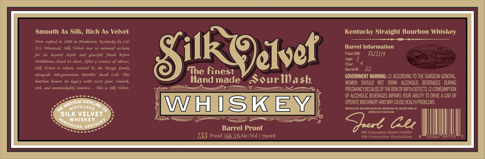

# TTB COLA Label Images - TTBID 26147001000944

**Brand Name:** SILK VELVET WHISKEY

**Fanciful Name:** BARREL PROOF

**Issue Date:** 06/01/2026

**Origin Code:** 22

**Product Class/Type:** 101

**Source:** [TTB Public COLA Registry](https://ttbonline.gov/colasonline/viewColaDetails.do?action=publicFormDisplay&ttbid=26147001000944)

## Label Images

### Label 1

### Label 2

## Extracted Label Text

*Text extracted via OCR - may contain errors*

**Detected Proof:** 133

### Label 1

Smooth As Silk; Rich As Velvet
Kentucky Straight Bourbon Whiskey
First crafted in 1880 in Henderson, Kentucky by
AS
Winstead, Silk Velvet
rose
to national acclaim
Barrel Information
for
its
layered   depth
and   graceful   finish
before
Silk (elset
Mash Bill:
75/21/4
Prohibition closed its doors After a century of silence,
Age:
7
Char:
4
Silk , Velvet
iS
reborn;  revived by the Hargis family
Barrel #:
52
alongside   Sth-generation
Distiller   Jacob   Call
This
TThe finest
GOVERNMENT WARNING: (1) ACCORDING TO THE SURGEON GENERAL,
bourbon  honors its legacy
every pour:
Smooth,
Hand made
SSouriash
WOMEN
SHOULD
NOT
DRINK
ALCOHOLIC
BEVERAGES
DURING
rich, and unmistakably timeless:
This is Silk Velvet.
PREGNANCY BECAUSE OFTHE RISK OF BIRTH DEfEcts (2) CONSUMPTION
OF ALCOHOLIC BEVERAGES IMPAIRS VOUR ABILITy TO DRIVE A CAR OR
WHISKEY
OPERATE MACHINERY AND May CAUSE HEALTh PROBLEMS.
4e
DiStiLLERS
Co
BOTTLED BY: WESTERN KENTUCKY DISTILLING CO, BEAVER DAM; KY
DISTILLED IN KENTUCKY
SILK VELVET
WHISKEY:
cul Gu
Barrel Proof
8th Generation Master Distiller
133 Proof |66.5%Alc/Vol
8th Generation Kentuckian
50062
09703
2
Col
with
DISTILLING
WINSTEAD
HENDE
KENTUCKY;
ERSON;
75oml

### Label 2

#VOLES44 F LHQUQR DEALER
6
CLiPPBr
01' -
''
. . .'
SAMUEL
. .
Maclit: Vi-Ie
Eovival on Caurd Steamor
Owonoboro_
Iaths
"l
mmvloMl;
Jlica
Ka
Ea Duattn
1v1a1
Iui
Mtoxey
7'M %
Rilk
#hi-ko
71,11'1
6"e
Ii-Filla.
T
I;-
0I-k /
Traauf (lic
Iolv J
"#l ~"
WWi "6l
1
uae
7 W
Mahlelnjal
J
still
hilitioni-l
(aj (
in.skaol.
GIXZxI
at
n HENDERSON Kx;
ISTEAD,
1'
Hovo
11
ive s
16
44
Inf
ll"''
