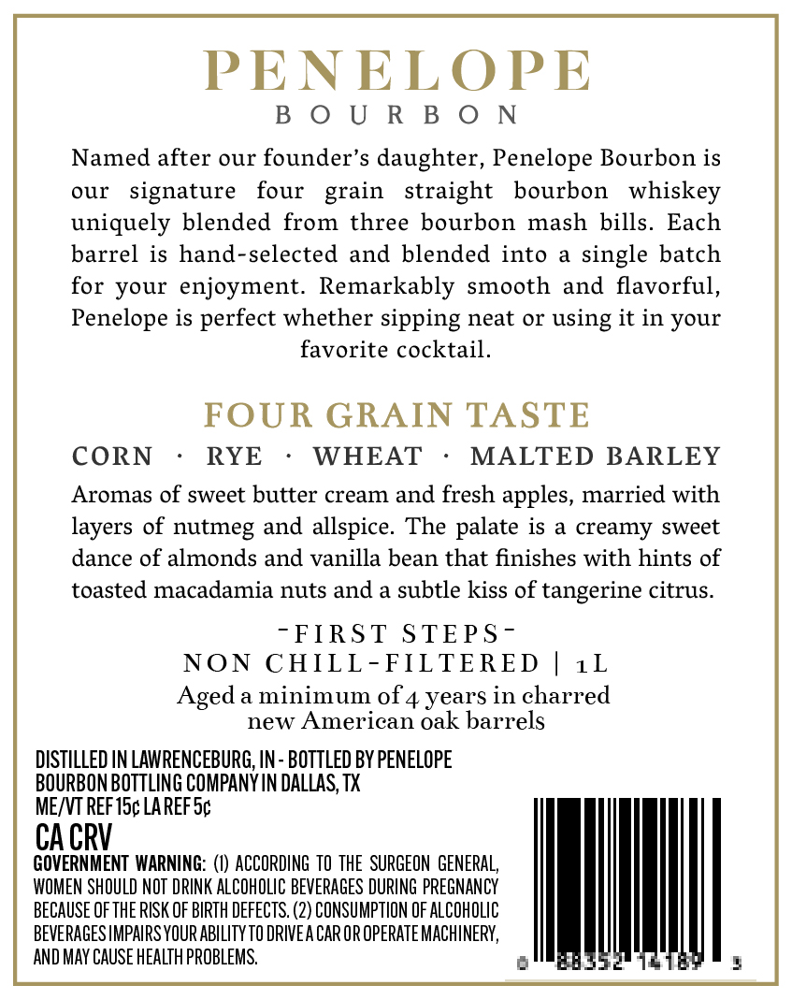
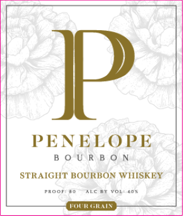

# TTB COLA Label Images - TTBID 26148001000184

**Brand Name:** PENELOPE

**Issue Date:** 06/08/2026

**Origin Code:** 43

**Product Class/Type:** 101

**Source:** [TTB Public COLA Registry](https://ttbonline.gov/colasonline/viewColaDetails.do?action=publicFormDisplay&ttbid=26148001000184)

## Label Images

### Back Label

### Label 1

### Label 2

## Extracted Label Text

*Text extracted via OCR - may contain errors*

*1 image(s) excluded: text did not meet readability threshold*

**Detected Age:** 4 Years

### Back Label

PENELOPE
B 0 U R B 0 N
Named after our founder's daughter, Penelope Bourbon is
our
signature
four
straight
bourbon
whiskey
uniquely blended from
three bourbon mash
bills.
Each
barrel
is hand-selected
and blended into
single batch
for your enjoyment.
Remarkably smooth
and
flavorful,
Penelope is perfect whether sipping neat Or using it in your
favorite cocktail.
FOUR GRAIN TASTE
CORN
RYE
WHEAT
MALTED BARLEY
Aromas of sweet butter cream and fresh apples, married with
layers of nutmeg and allspice. The palate is
creamy sweet
dance of almonds and vanilla bean that finishes with hints of
toasted macadamia nuts and
subtle kiss of tangerine citrus.
FIRST STEPS -
NON CHILL -FILTERED
1L
Aged
a minimum 0f 4 years in charred
new American oak barrels
DISTILLED IN LAWRENCEBURG, IN - BOTTLED BY PENELOPE
BOURBON BOTTLING COMPANY IN DALLAS, TX
MEJVT REFISc LA REF Sc
CA CRV
GOVERNMENT  WARNING: (V) ACCORDING  TO THE  SURGEON  GENERAL;
WOMEN SHOULD NOT DPINK ALCOHOLIC BEVERAGES DURING PREGNANCY
BECAUSE OF THE RISK OF BIRTH DEFECTS.
'2) CONSUMPTION OF AlCOhOlIC
BEVERAGES IMPAIRS YOUR AbiLITY TO DRIVEA CAR OR OPERATEMACHINERY,
AND MAY CAUSE HEALTH PROBLEMS.
grain

### Label 1

PENELOPE
BOURBON

STRAIGHT BOURBON WHISKEY
