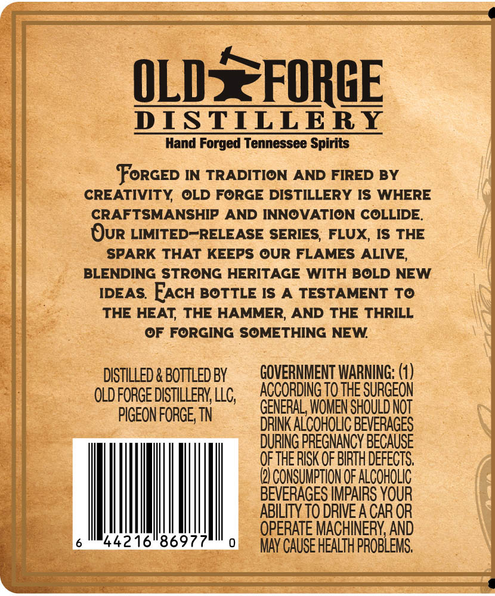
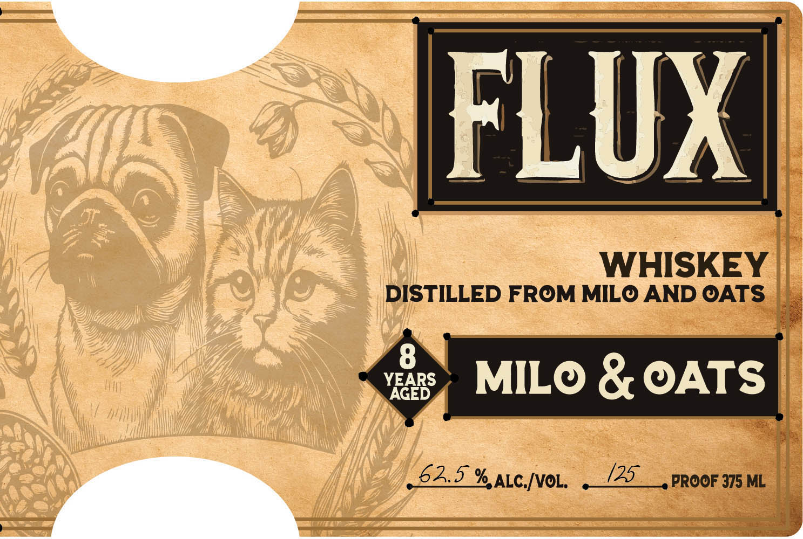
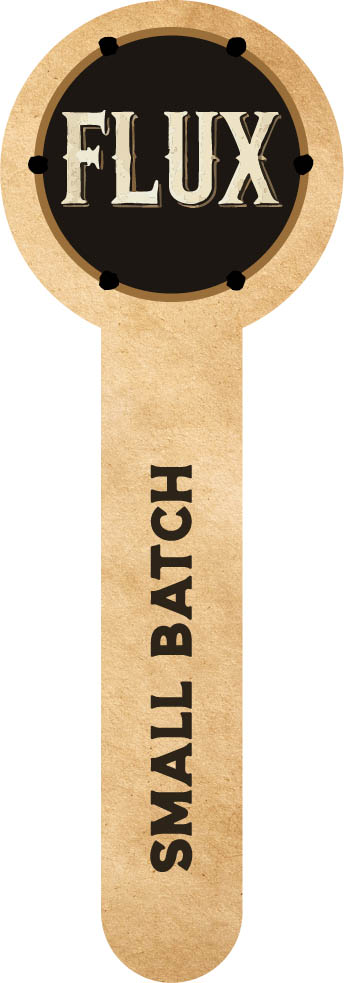

# TTB COLA Label Images - TTBID 26148001000244

**Brand Name:** FLUX

**Fanciful Name:** MILO & OATS

**Issue Date:** 06/11/2026

**Origin Code:** 43

**Product Class/Type:** 140

**Source:** [TTB Public COLA Registry](https://ttbonline.gov/colasonline/viewColaDetails.do?action=publicFormDisplay&ttbid=26148001000244)

## Label Images

### Back Label

### Front Label

### Label 2

## Extracted Label Text

*Text extracted via OCR - may contain errors*

*1 image(s) excluded: text did not meet readability threshold*

**Detected Proof:** 127

### Back Label

OLDSFORGE
DISTILLERY
Hand Forged Tennessee Spirits
FoRGED IN TRADITION
AND FIRED BY
CREATIVITY
OLD FORGE DISTILLERY IS WHERE
CRAFTSMANSHIP AND INNOVATION COLLIDE
Our LIMITED-RELEASE SERIES; FLUX, IS THE
SPARK THAT KEEPS OUR FLAMES ALIVE,
BLENDING STRONG HERITAGE WITH BOLD NEW
IDEAS
FACH BOTTLE IS A
TESTAMENT To
THE HEAT THE HAMMER, AND THE THRILL
OF FORGING SOMETHING NEW
DISTILLED & BOTTLED BY
GQVERNMENT WARNING:
OLD foRGE DISTILLERY LLC;
ACCORDING TO THE SURGEON
PIGEON FORGE; TN
GENERAL, WOMEN SHOULDNOT
DRINK ALCOHOLIC BEVERAGES
DURING PREGNANCY BECAUSE
OF THE RISK QF BIRTH DEFECTS
@) CoNSuMpTIoN OF ALCOHOlic
BEVERAGES IMPAIRS YOUR
ABILITY TO DRIVE A CAR OR
OPERATE MACHINERY AND
44216"8697
MAY CAUSE HEALTH PROBLEMS

### Front Label

FLUX
WHISKEY
DISTILLED FROM MILO AND OATS
YAGEDS
MILO & OATS
63.5 %ALC[voL;
(25
PROOF 375 ML
