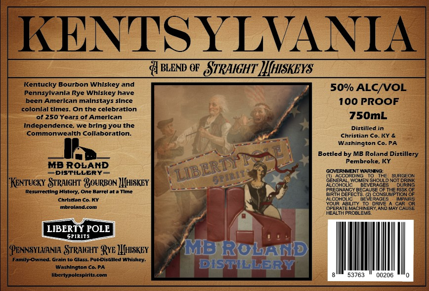

# TTB COLA Label Images - TTBID 26148001000370

**Brand Name:** KENTSYLVANIA

**Issue Date:** 06/08/2026

**Origin Code:** 22

**Product Class/Type:** 129

**Source:** [TTB Public COLA Registry](https://ttbonline.gov/colasonline/viewColaDetails.do?action=publicFormDisplay&ttbid=26148001000370)

## Label Images

### Label 1

## Extracted Label Text

*Text extracted via OCR - may contain errors*

**Detected Proof:** 100

### Label 1

KENTS YLVANIA
BLEND €F
STRAIGHT HIJHISKEYS
Kentucky Bourbon Whlskey and
50% ALCNVOL
Pennsylvanla Rye Whlskey have
been Amerlcan malnstays slnce
100 PROOF
colonlal tlmes
On the celebratlon
of 250 Years 0f Amerlcan
750mL
Independence; we
youthe
Distilled in
Commonwealth Collaboratlon:
Christian Co. KY &
Washington Co.PA
Bottled by MB Roland Distillery
Pembroke, KY
MB RoLAND
GOVERNMENT WARMNG:
DISTILLERY
ACCORDING
SUkSEOR
"Kentucky STRAIGHT BOURBON )HHISKEY
{eSRcoeoi v
JevEHRUL? NOTERING
Lesurrecuinc
#lstory; One =
Barrel at a Tme
BregideCCIE
BIRTH
ECAUSE
S285UHE
5318
Chrlstfan Co.KY
MLCOHSLC
#42i SASSU)
IMPAIRS
mbrelendcom
YOUR ABILITY
DRIVE
AASCRUSE
OPERATE MACHINERY, ANDE
CAUSE
HEALTH PROBLEMS:
LIBERTY POLE
SPIRITS
PENNSYLVANIA SrRAIGHT RyE  IQSKEY
'M: RoxLAKRHD
Fammilucaarrned
Grain
Glass: Pot-Distillcd whishcy.
Washlngton Co: PA
EISNLLERY
libcrtypolcspiritscom
53763
00206
brIng =
LIBERTYAS
PIBLT
