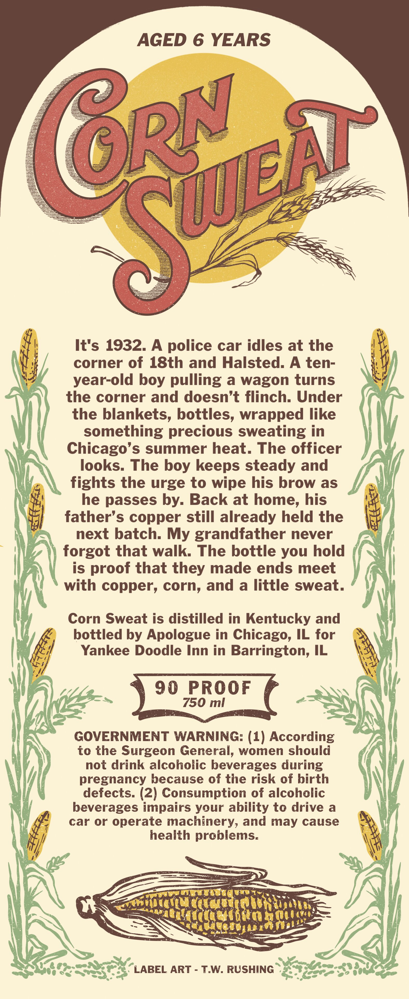
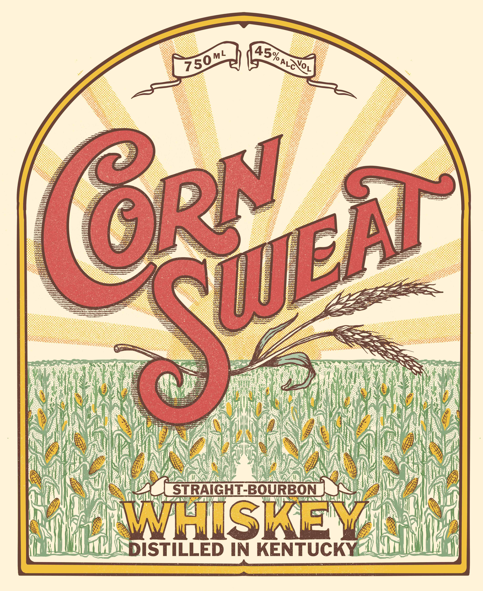

# TTB COLA Label Images - TTBID 26148001000657

**Brand Name:** CORN SWEAT

**Issue Date:** 06/08/2026

**Origin Code:** 04

**Product Class/Type:** 101

**Source:** [TTB Public COLA Registry](https://ttbonline.gov/colasonline/viewColaDetails.do?action=publicFormDisplay&ttbid=26148001000657)

## Label Images

### Back Label

### Front Label

## Extracted Label Text

*Text extracted via OCR - may contain errors*

*1 image(s) excluded: text did not meet readability threshold*

**Detected Proof:** 90
**Detected Age:** 6 Years

### Back Label

AGED 6 YEARS
@RN
It's 1932. A police car idles at the
corner of 18th and Halsted. A ten-
year-old boy pulling a wagon turns
the corner and doesn't flinch- Under
the blankets, bottles, wrapped like
something precious sweating in
Chicago'$ summer heat. The officer
looks. The boy keeps steady and
fights the urge to wipe his brow as
he passes by- Back at home, his
father' s copper still already held the
next batch: My grandfather never
forgot that walk. The bottle you hold
is proof that they made ends meet
with copper, corn, and a little sweat.
Corn Sweat is distilled in Kentucky and
bottled by Apologue in Chicago, IL for
Yankee Doodle Inn in Barrington; IL
90
PROOF
750 ml
GOVERNMENT WARNING: (1) According
to the Surgeon General, women should
not drink alcoholic beverages during
pregnancy because of the risk of birth
defects: (2) Consumption of alcoholic
beverages impairs your ability to drive a
car Or operate machinery, and may cause
health problems.
LABEL ART
TW: RUSHING
Te)
