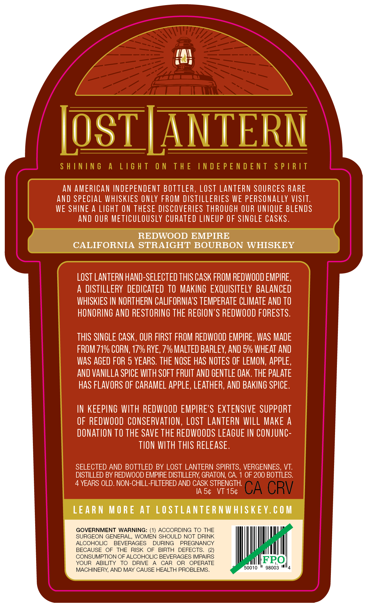
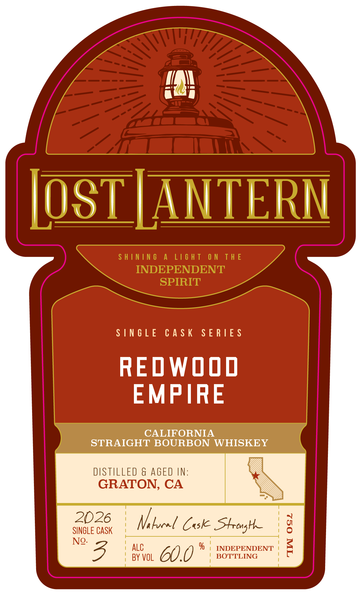

# TTB COLA Label Images - TTBID 26148001000804

**Brand Name:** LOST LANTERN

**Issue Date:** 06/02/2026

**Origin Code:** 46

**Product Class/Type:** 101

**Source:** [TTB Public COLA Registry](https://ttbonline.gov/colasonline/viewColaDetails.do?action=publicFormDisplay&ttbid=26148001000804)

## Label Images

### Back Label

### Front Label

### Label 3

## Extracted Label Text

*Text extracted via OCR - may contain errors*

**Detected Age:** 5 Years

### Back Label

LosTIANTERN
S H ININ 6
A
L16 H T
0 N
T H E
IN D E P E N D E N T
S P [R [T
AN AMERICAN INDEPENDENT BOTTLER, LOSt LANTeRN SOURCES RARE
And SPECLAL WHISKIES ONLY FROM DISTILLERLES WE PERSONALLY VISIT:
WE SHINE A LIGHT ON THESE DISCOVERIES THROUGH OUR UNIQUE BLENDS
AND OUR METICULOUSLY CURATED LINEUP OF SINGLE CASks.
REDWOOD EMPIRE
CALIFORNIA STRAIGHT BOURBON WHISKEY
LOST LANTERN HaND-SELECTED THIS CASK FROM REDWOOD EMPIRE ,
A DISTILLERY DEDICATED TO MAKING EXQUISITELY BALANCED
WHISKIES IN NORTHERN CALIFORNLAS TEMPERATE CLIMATE AND TO
HONORING AND RESTORING THE REGLON'S REDWOOD FORESTS.
THIS SINGLE CaSK , OUR FIRST FROM REDWOOD EMPIRE , WAS MADE
FROM 71% CORN, 17% RYE, 7% MALTED BARLEY, AND 5% WHEAT AND
wAS AGED FOR 5 YEARS. THE NOSE HaS NOTES OF LEMON, APPLE,
AND VanIlLA SPICE WITH SOFT FRUIT AND GENTLE OAK. THE PALATE
HaS FLAVORS OF CARAMEL AppLE, LEAThER; AND BAKING SPICE.
IN KEEPING WITH REDWOOD EMPIRE'S EXTENSIVE SUPPORT
OF REDwOOD CONSERVATION , LOSt  LANTERN wILL MAKE a
DONATION TO THE SAVE THE REDWOODS LEAGUE IN CONJUnC
TION WITH THIS RELEASE .
SELECTED AND BOTTLED BY LOST LANTERN SPIRITS, VERGENNES, VT.
DISTILLED BY REDWOOD EMPIRE DISTILLERY; GRATON; CA:
OF 200 BOTTLES:
YEARS OLD. NON-CHILL-FILTERED AND CASK STRENGTH
IA 54
VT 154
CA CRV
LEARN
M O RE At LOSTLANTER NWHISKEY.€ 0 M
GOVERNMENT WARNING: (1) ACCORDING TO THE
SURGEON GENERAL, WOMEN SHOULD NOT DRINK
ALCOHOLIC
BEVERAGES
DURING
PREGNANCY
BECAUSE
OF
THE RISK
OF
BIRTH
DEFECTS_
CONSUMPTION OF ALCOHOLIC BEVERAGES IMPAIRS
YOUR
ABILITY
TO
DRIVE
CAR
OR
OPERATE
FPO
MACHINERY AND MAY CAUSE HEALTH PROBLEMS
50010
98003

### Front Label

IOSTJANTERN

SINGLE CASK SERIES

REOWOOD
EMPIRE

CALIFORNIA
STRAIGHT BOURBON WHISKEY

DISTILLED & AGED IN:
GRATON, CA

2026 | Ni local Coke Strong |

SINGLE CASK

No. i 1 1
\ ALC % | INDEPENDENT
| BY VOL 60.0 | BOTTLING '

### Label 3

SHINING A LIGHT ON THE INDEPENDENT SPIRIT —— ene ~~ Li¥idS LNJON3Jd SONI JHL NO LHSIT V SNINIHS
camel
ci =
Se
