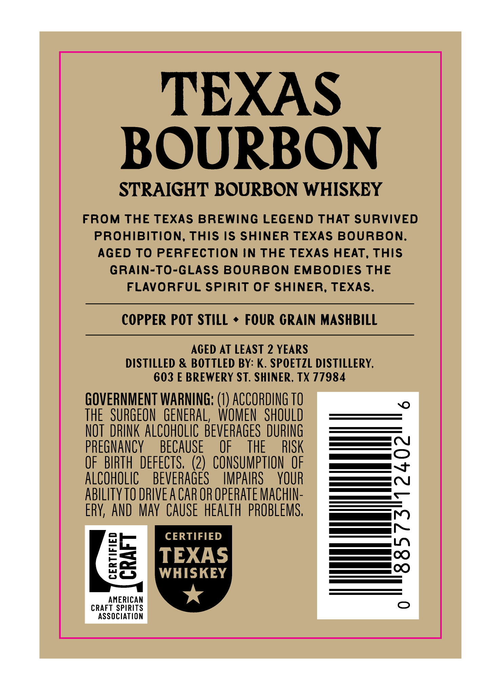
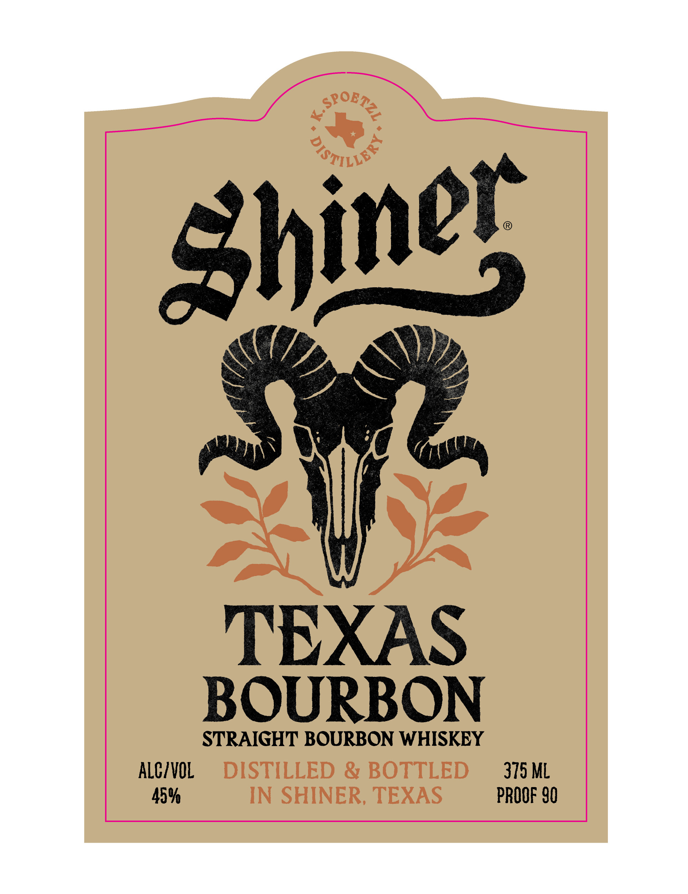

# TTB COLA Label Images - TTBID 26148001000828

**Brand Name:** SHINER

**Fanciful Name:** TEXAS BOURBON

**Issue Date:** 06/02/2026

**Origin Code:** 44

**Product Class/Type:** 101

**Source:** [TTB Public COLA Registry](https://ttbonline.gov/colasonline/viewColaDetails.do?action=publicFormDisplay&ttbid=26148001000828)

## Label Images

### Back Label

### Front Label

## Extracted Label Text

*Text extracted via OCR - may contain errors*

**Detected Proof:** 90
**Detected Age:** 2 Years

### Back Label

TEXAS
BOURBON
STRAIGHT BOURBON WHISKEY
FroM THE TEXAS BREWING LEGEND THAT SURVIVED
PRoHIBiTiON, This IS SHINER TEXAS BOURBON.
AGED To PERFECTiON in THE TEXAS HEAT, THIS
GRAiN-TO-GLASS BOURBON EMBODIES THE
FLAVORFUL SPiRIT OF ShINER, TEXAS.
COPPER POT STILL
FOUR GRAIN MASHBILL
ACED AT LEAST 2 YEARS
DISTILLED & BOTTLED BY: K. SPOETZL DISTILLERY,
603 E BREWERY ST. SHINER; TX 77984
GOVERNMENT WARNING; (1) ACCORDING TO
thE   SURGEON  GENERAL,  WOMEN  SHOULD
NOT   DRINK ALCOHOLIC BEVERAGES DURING
PREGNANCY
BECAUSE
OF
THE
RISK
OF   BIRTH  defECTS,  (2)   CONSUMPTION  OF
AlCohOLIC
BEVERAGES
IMPAIRS
YOUR
abiLITyTO DRIVE A CAR OR OPERAte MAChIN-
ERY, AND  May CAUSE heAlTh  PROBLEMS.
1
CERTIFIED
8i
THSKS
AMERICAN
CRAFT SPIRITS
AssOciATiON

### Front Label

971LoF
TEXAS
BOURBON
STRAIGHT BOURBON WHISKEY
ALCZVOL
DISTILLED & BOTTLED
375 ML
459
IN SHINER, TEXAS
PROOF 90
SoBTez
Shiner
