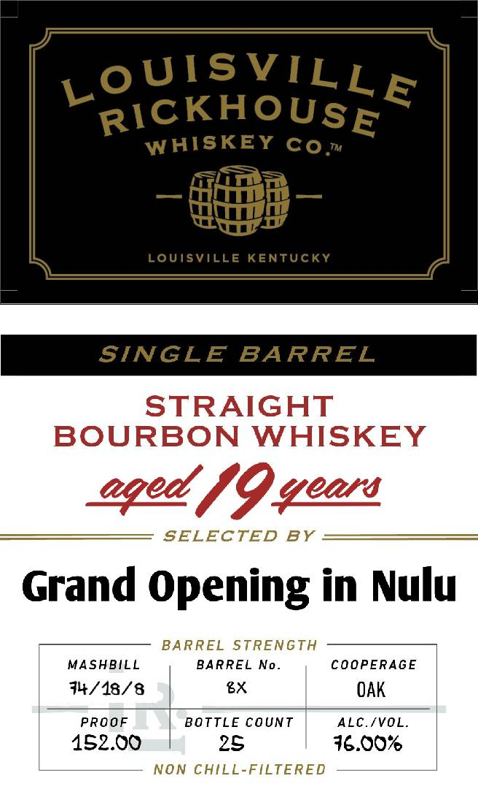

# TTB COLA Label Images - TTBID 26148001000831

**Brand Name:** LOUISVILLE RICKHOUSE

**Issue Date:** 06/02/2026

**Origin Code:** 22

**Product Class/Type:** 101

**Source:** [TTB Public COLA Registry](https://ttbonline.gov/colasonline/viewColaDetails.do?action=publicFormDisplay&ttbid=26148001000831)

## Label Images

### Back Label

### Front Label

## Extracted Label Text

*Text extracted via OCR - may contain errors*

### Back Label

DISTILLED AND BOTTLED IN KENTUCKY

BOTTLED BY
LOUISVILLE RICKHOUSE
LOUISVILLE, KY DSP-KY-20181

730 ML LOUISVILLERICKHOUSE.COM

GOVERNMENT WARNING: (1) ACCORDING TO THE
SURGEON GENERAL, WOMEN SHOULD NOT DRINK
ALCOHOLIC BEVERAGES DURING PREGNANCY BECAUSE
OF THE RISK OF BIRTH DEFECTS. (2) CONSUMPTION OF
ALCOHOLIC BEVERAGES IMPAIRS YOUR ABILITY TO
DRIVE A CAR OR OPERATE MACHINERY, AND MAY CAUSE
HEALTH PROBLEMS. 8

5

IA.S¢, ME-VT 15¢

98

CA CRV

0057

8

### Front Label

LoUISVILLE
RICKHOUSE
WAISKEY Co m
LoUisville KenTUcky
SINGLE
BARREL
STRAIGHT
BOURBON WHISKEY
eqed /9gear
SELECTED
BY
Grand Opening in Nulu
BARREL
STRENGTH
MASHBILL
BARREL No_
COOPERAGE
74/18/8
gx
OAK
PROOF
BOTTLE COUNT
ALC.[VOL
152.00
25
16.007
NON CHILL-FILTERED
