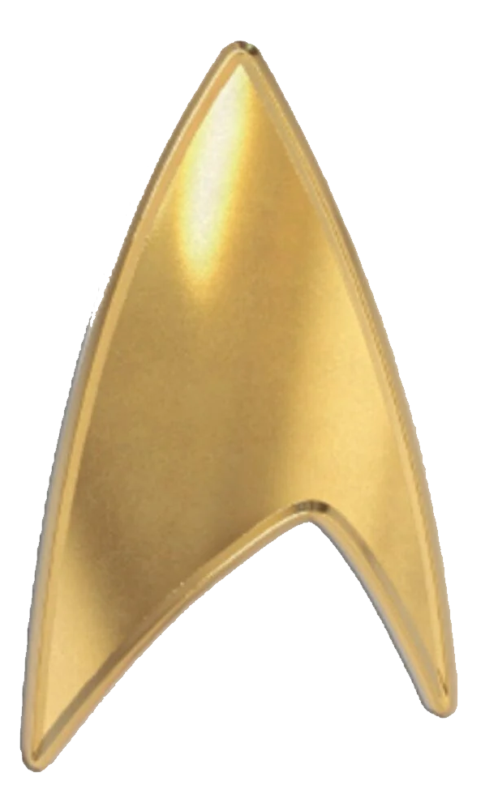
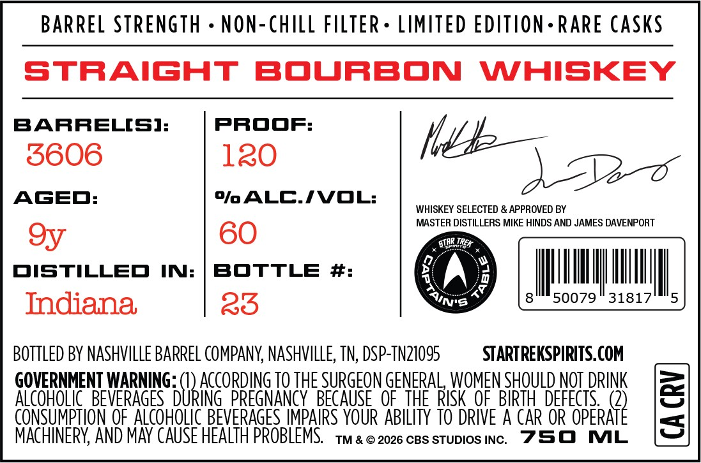

# TTB COLA Label Images - TTBID 26148001000841

**Brand Name:** STAR TREK CAPTAINS TABLE

**Issue Date:** 06/02/2026

**Origin Code:** 43

**Product Class/Type:** 101

**Source:** [TTB Public COLA Registry](https://ttbonline.gov/colasonline/viewColaDetails.do?action=publicFormDisplay&ttbid=26148001000841)

## Label Images

### Label 1

### Label 2

## Extracted Label Text

*Text extracted via OCR - may contain errors*

*1 image(s) excluded: text did not meet readability threshold*

### Label 2

BARREL STRENGTH - NON-CHILL FILTER+ LIMITED EDITION-RARE CASKS

STRAIGHT BOURBON WHISKEY

BARRELS]

PROOF

5606

120

We—

ABO

AGED

% ALC./VOL

WHISKEY SELECTED & APPROVED BY

MASTER DISTILLERS MIKE HINDS AND JAMES DAVENPORT

oy

60

AR They

DISTILLED IN: | BOTTLE #

ag

ll

su,

Indiana,

25

Unis

1079

31817

BOTTLED BY NASHVILLE BARREL COMPANY, NASHVILLE, TN, DSP-TN21095

STARTREKSPIRITS.COM

GOVERNMENT WARNING

ACCORDING TO THE SURGEON GENERAL, WOMEN SHOULD NOT DRINK

ALCOHOLIC BEVERAGES

th

|

P

ECAUSE OF THE RISK OF BIRTH DEFECTS,

MPTION OF ALCOHOLIC BEVERAGES IMPAIRS YOUR ABILITY TO DRIVE A CAR OR OPERA

f

MACHINERY, AND MAY CAUSE HEALTH PROBLEMS. 1m & © 2026 ces sTupios Inc

750 ML
