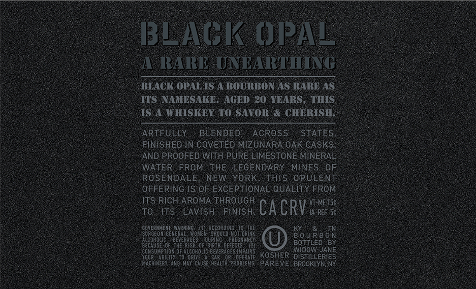
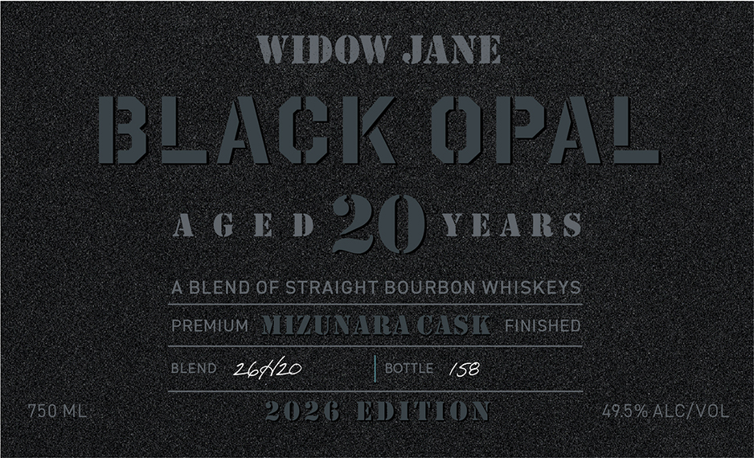

# TTB COLA Label Images - TTBID 26148001000852

**Brand Name:** WIDOW JANE

**Fanciful Name:** BLACK OPAL

**Issue Date:** 06/10/2026

**Origin Code:** 02

**Product Class/Type:** 121

**Source:** [TTB Public COLA Registry](https://ttbonline.gov/colasonline/viewColaDetails.do?action=publicFormDisplay&ttbid=26148001000852)

## Label Images

### Back Label

### Front Label

## Extracted Label Text

*Text extracted via OCR - may contain errors*

**Detected Age:** 20 Years

### Back Label

BBLACK OPAL
RARE
UNLARTTNG
BLACK OPAL IS A BOURBON AS RARE AS
ITS NAMESAKE.
AGED 20 YEARS
THIS
IS A WHISKEY TO SAVOR
CHERISH
ARTFULLY
BLENDED
AcROSS
'STATES,
FINISHED IN COVETED MIZUNARA OAK CASKS;
AND PROOFED WITH PURE LIMESTONE MINERAL
WATER
FROM THE LEGENDARY
MINES
OF
ROSENDALE;
NEW YORK
This
OPULENT
OFFERING IS OF EXCEPTIONAL QUALITY FROM
ITS RICH AROMA THROUGH
T-ME 15c
To
ITS
LAVISH
FINISH
CaCRV
Ja REF 5c
GOVERNMENT
RXiHIG
MGOnen ASCo8OgnGoT ORIhe
SurgeoMGEwERAE
Should'Kot dRING
B 0 U RB 0 N
LcoholC
BEVERAGES
'QurIne
PREGHT"
BOTTLED
DEcAUSE Of, the  .RIST  0F-BiRTM DEFECTS:
consuuption 0F
(cohOLIC BevERAGES IMIPAIR
WIDOW JANE
QUP;
BlLITY. T0
Ap
CaR
KOSHER
DISTILLERIES
MACHIMERY, ANd  May CauSE  Health problens
'PAREVE BROOKLYN, NY

### Front Label

CE Se SOS EER PRIN GG
ee
- AGED ZU YEARS
Ce ee ee
|) | A BLEND OF STRAIGHT BOURBON WHISKEYS =. oo
| prewuM MIZUNARACASK puicneD :
ere
eee ee
POM 2026 EDITION tam atcivol
ee
