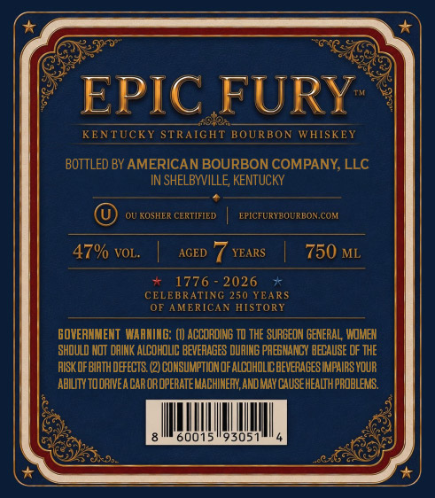
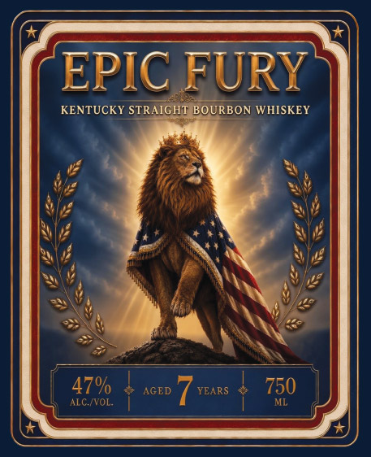

# TTB COLA Label Images - TTBID 26148001000900

**Brand Name:** EPIC FURY

**Issue Date:** 06/02/2026

**Origin Code:** 22

**Product Class/Type:** 101

**Source:** [TTB Public COLA Registry](https://ttbonline.gov/colasonline/viewColaDetails.do?action=publicFormDisplay&ttbid=26148001000900)

## Label Images

### Back Label

### Front Label

## Extracted Label Text

*Text extracted via OCR - may contain errors*

**Detected Proof:** 94

### Back Label

EPIC FURY
452a
KENTUCKY STRAIGHT BOURBON WHISKEY
BOTTLED BY AMERICAN BOURBON COMPANY, LLC
IN SHELBYVILLE KENTUCKY
QU KOSHER CERTIFIED
EPICFURYBOURBON COM
47% VOL.
AGED
YEARS
750 ML
1776
2026
CELEBRATING 250 YEARS
OF AMERICAN HISTORY
GOVERNMENT  WARMING: (I) ACCORDING TO THE SUAGEON GENERAL WOMex
SHDULD NOT DAINK ALCOHOLC beveAAGES DURING PAEENANCY BECAUSE OF THE
AISK OF BIRTH DEFECTS: (2) CONSUMPTIONOF ALCohOLIC bevefAGES MMPAIRS VOUR
ABILITY TOOAIVEA CAR OROPERATEMACHINERV, AND MAY CAUSEHEALTHPROBLEMS.
001
93051

### Front Label

EPIC FURY
KENTUCKY STRAIGHT BOURBON WHISKEY
47%
AGED
YEARS
750
ALC {VOL
ML
