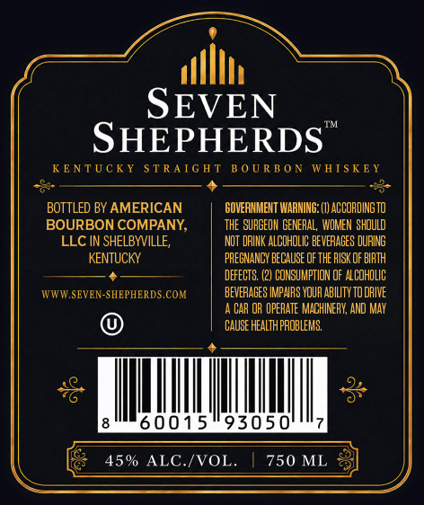
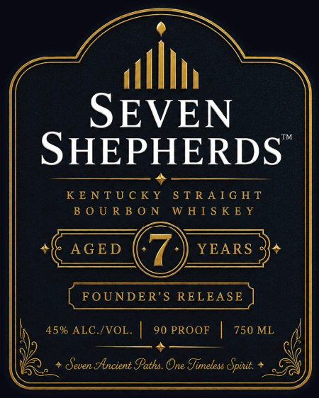

# TTB COLA Label Images - TTBID 26148001000903

**Brand Name:** SEVEN SHEPHERDS

**Issue Date:** 06/02/2026

**Origin Code:** 22

**Product Class/Type:** 101

**Source:** [TTB Public COLA Registry](https://ttbonline.gov/colasonline/viewColaDetails.do?action=publicFormDisplay&ttbid=26148001000903)

## Label Images

### Back Label

### Front Label

## Extracted Label Text

*Text extracted via OCR - may contain errors*

**Detected Proof:** 90

### Back Label

SEVEN
SHEPHERDS
KE NTUCKY
S TRA [G H T
B 0 UR B 0 N
WHIS K EY
8
BOTTLED BY AMERICAN
GOVERHMEHT IARNING: (I) ACCORDINGTO
BOURBON COMPANY,
thE SURGEOH GENERAL, WOMEN should
LLC IN SHELBYVILLE;
NOT DRIHK ALCOHOLIC BEveRAgES DURING
KENTUCKY
PREGNANCY BECAUSE Of thE RISK OF BIRTH
DEFECTS (2) CONSUMPTION OF ALCOhOLIc
VWWSEVEN-SHEPHERDS COM
bevERAGES IMPARS YOUR ABILITY To dRIVE
CAR OR opeRATE MACHINERY; AND May
CAUSE HEALTH PROBLEHS;
60015
93050'
45% ALC /VOL_
750 ML

### Front Label

C)
tlh
SEVEN
SHEPHERDS

KENTUCKY STRAIGHT

BOURBON WHISKEY

+¢ AGED YEARS je
([ounans eaLESE)

|, 45% ALC./voL. | 90PROoF | 750ML |
p , (
PRn + Seven Ancient Paths. One Timeless Split: *
