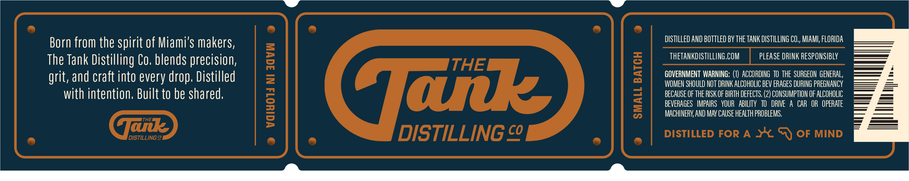
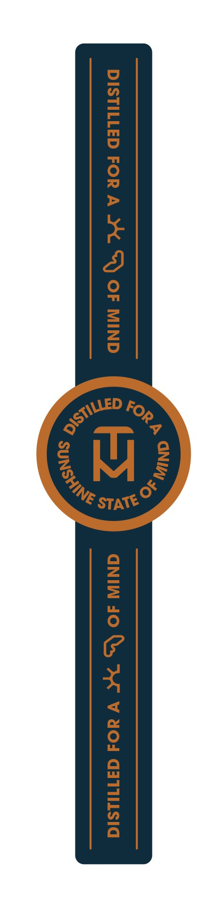
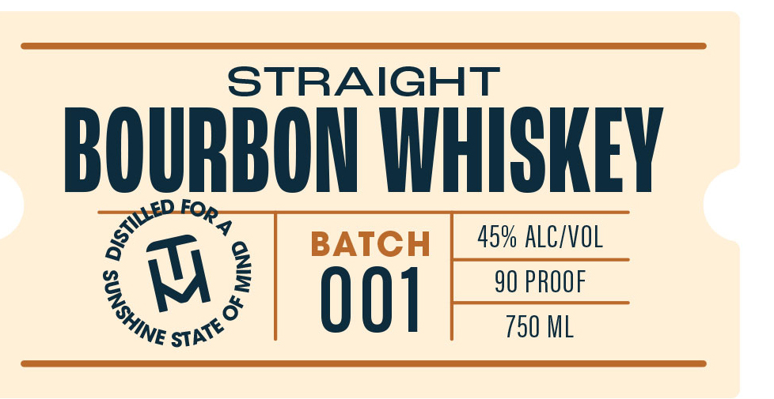

# TTB COLA Label Images - TTBID 26149001000286

**Brand Name:** THE TANK DISTILLING CO.

**Issue Date:** 06/10/2026

**Origin Code:** 16

**Product Class/Type:** 101

**Source:** [TTB Public COLA Registry](https://ttbonline.gov/colasonline/viewColaDetails.do?action=publicFormDisplay&ttbid=26149001000286)

## Label Images

### Label 1

### Label 2

### Label 3

## Extracted Label Text

*Text extracted via OCR - may contain errors*

**Detected Proof:** 90

### Label 1

Born from the spirit of Miami's makers,
DISTILLED ANd bottled BY the TANK DISTILLING CO,, MIAMI; FLORIDA
The Tank Distilling Co. blends precision;
g
thETaNkdISTILLING,COM
PLEaSE DRINK RESPONSIBLY
grit, and craft into every drop. Distilled
=
3
GOVERNMENT WARNING: (1) ACCORDING  TO The  SURGEON GENERAL,
WOMEN SHOULD NOT DRINK ALCOHOLIC BEV ERAGES DURING PREGNANCY
with intention, Built to be shared;
Tak
BECAuSE OF THE RISK OF BIRTH DEFECTS.
CONSUMPTION OF ALCOHOLIC
1
1
BEVERAGES   IMPAIRS   VOUR   ABILITY   TO   DRIVE
A CAR   OR   OpeRATe
MACHINERY; AND MAY CAuse HEALTH PROBLEMS.
HE
DISTILLING c
@ue
DISTILLING co_
DISTILLED FOR A
OF MIND

### Label 2

DISTILLED FOR A Y¥. XY) OF MIND GNIW 40 & dW V AO GITILSIG

### Label 3

STRAIGHT
aN 9
EY BATCH 45% ALCIVOL
2 W E 001 90 PROOF
hye aie 750 ML
