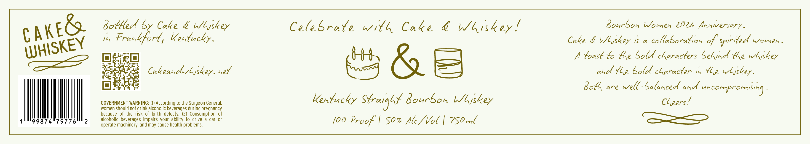

# TTB COLA Label Images - TTBID 26149001000301

**Brand Name:** CAKE & WHISKEY

**Issue Date:** 06/02/2026

**Origin Code:** 22

**Product Class/Type:** 101

**Source:** [TTB Public COLA Registry](https://ttbonline.gov/colasonline/viewColaDetails.do?action=publicFormDisplay&ttbid=26149001000301)

## Label Images

### Label 1

### Label 2

## Extracted Label Text

*Text extracted via OCR - may contain errors*

*1 image(s) excluded: text did not meet readability threshold*

### Label 1

Bollled By Cake & Wyskey
Celebrate Witl Cake
WUiskey !
BonrSon Women 202L Anniversary -
Ih
Frankfort , Kentucky-
Cake & Wlskey
C
collboration cf spiritedl women-
67$
Ro
toast %o {Le Soldl cLaracters Seyindl {Le wLiskey
CakeandlwLiskey_ het
{Le Boldl cLaracter 1n {Le wliskey -
BoL are well_Balanced unu
mhcompromisin]
GOVERNMENT WARNING:
According to the Surgeon General,
Kextucky Sfraiglf Bowrbon WLskey
CGeers _
women should not drink alcoholic beverages during pregnancy
because of the risk of birth defects
(2) Consumption   of
alcoholic beverages impairs your ability to drive
car
or
100 Procf
So% Alc / Vol
7S0 m(
operate machinery; and may cause health problems:
cake&
WHISKEY
ahe
